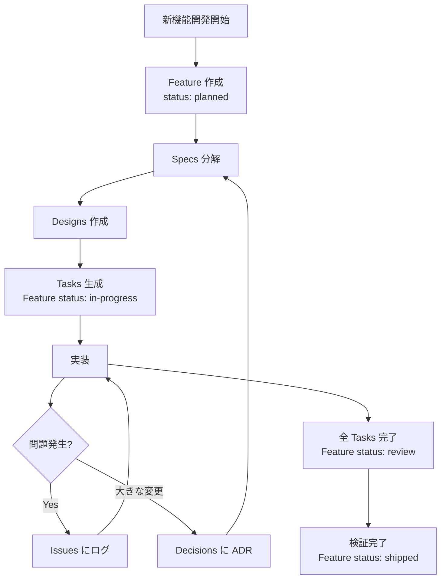

# Development Flow with VAULT

このドキュメントでは、VAULT を使った設計駆動開発（Spec-Driven Development）のワークフローを説明します。

## 概要

```
Feature (意図) → Specs/Designs (定義) → Tasks (実行) → Code
```

## Step 0: Feature 作成

新しい機能開発を始めるとき、まず **Feature** を作成します。

1. `Features/` に新しいノートを作成
2. テンプレート `Feature.md` を使用
3. ID を付与: `FEAT-{MODULE}-{NUMBER}`
4. Status を `planned` に設定

```yaml
---
id: FEAT-CORE-001
title: Support New Effect Type
module: core
status: planned
---
```

**Feature は意図のコンテナ** — 関連する Specs, Designs, Tasks をすべてリンクします。

## Step 1: Specs 分解

Feature の要件を **Specs** に分解します。

1. `Specs/` にノートを作成
2. テンプレート `Spec.md` を使用
3. ID を付与: `SPEC-{MODULE}-{NUMBER}`
4. Feature にリンクを追加: `[[SPEC-CORE-101]]`

```yaml
---
id: SPEC-CORE-101
title: Effect Execution Semantics
related-feature: "[[FEAT-CORE-001]]"
---
```

## Step 2: Designs 作成

実装方法を **Designs** で定義します。

1. `Designs/` にノートを作成
2. テンプレート `Design.md` を使用
3. ID を付与: `DES-{MODULE}-{NUMBER}`
4. Feature にリンクを追加

設計ドキュメントには以下を含めます：
- Mermaid 図（クラス図、シーケンス図、フローチャート）
- コンポーネント間のインターフェース
- 代替案の比較

## Step 3: Tasks 生成

実装作業を **Tasks** に分解します。

1. `Tasks/` にノートを作成
2. テンプレート `Task.md` を使用
3. ID を付与: `TASK-{MODULE}-{NUMBER}`
4. `related-spec` と `related-feature` を設定
5. Feature status を `in-progress` に更新

```yaml
---
id: TASK-CORE-301
title: Implement effect handler
related-spec: "[[SPEC-CORE-101]]"
related-feature: "[[FEAT-CORE-001]]"
status: todo
---
```

## Step 4: 実装

1. `code_path` に従って実装
2. PR の説明欄に ID を記載:
   ```
   Implements FEAT-CORE-001
   - SPEC-CORE-101: Effect execution semantics
   - TASK-CORE-301: Effect handler implementation
   ```
3. 実装と仕様がズレた場合は Spec または Task を更新

## Step 5: 完了

1. 全 Tasks を `done` に更新
2. Feature status を `review` に更新
3. レビュー・検証後、`shipped` に更新

## Issues / Decisions の扱い

### Issues

問題が発生した場合：

1. `Issues/` にノートを作成
2. `related-spec`, `related-task`, `related-feature` を設定
3. 調査内容と解決策を記録

### Decisions (ADR)

大きな設計変更の場合：

1. `Decisions/` に ADR を作成
2. 背景、選択肢、決定理由を記録
3. Feature にリンク

## AI 活用

Cursor/Claude への指示例：

> "Implement FEAT-CORE-001 according to its linked Specs and Tasks."

AI は Feature → Specs → Designs → Tasks を辿り、構造化された情報で実装可能。

## Base を使ったステータス管理

Obsidian の **Bases** プラグインを使って、各カテゴリをテーブルビューで管理できます：

1. `Bases/Features.base` — Feature 一覧とステータス
2. `Bases/Tasks.base` — Task のカンバンビュー
3. `Bases/Issues.base` — 未解決の Issue 一覧

## ワークフロー図



## ID システム

| Type | Format | 例 |
|------|--------|-----|
| Feature | FEAT-{MOD}-{NUM} | FEAT-CORE-001 |
| Spec | SPEC-{MOD}-{NUM} | SPEC-CORE-101 |
| Design | DES-{MOD}-{NUM} | DES-CORE-201 |
| Task | TASK-{MOD}-{NUM} | TASK-CORE-301 |
| Issue | ISSUE-{MOD}-{NUM} | ISSUE-CORE-401 |
| Decision | DEC-{MOD}-{NUM} | DEC-CORE-001 |

### Module 略称

| Module | 略称 |
|--------|------|
| core | CORE |
| effects | EFF |
| handlers | HAND |
| linter | LINT |
| cli | CLI |
| gemini | GEM |
| openai | OAI |
| pinjected | PINJ |
| seedream | SEED |


