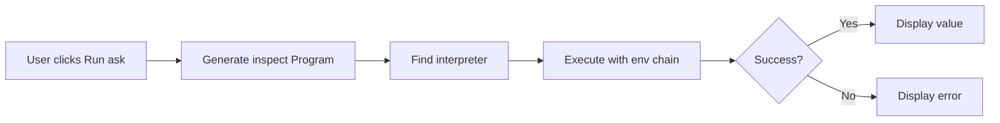

# SPEC-VSCODE-001 — Implicit Environment Inspector

## 1. Overview

VSCode doeff-runner プラグインに暗黙的環境 (implicit env) のインスペクション機能を追加する。Program エントリーポイントがどのような環境チェーンで実行されるかを可視化し、特定の key に対してどの値がロードされるかをクエリできるようにする。

## 2. Background / Motivation

### 2.1 Current State

doeff の CLI は `# doeff: default` マーカーが付いた環境を自動的に発見し、モジュール階層に従ってマージする。さらに、ユーザーレベルのデフォルト環境として `~/.doeff.py` もロードされる:

```
~/.doeff.py              ← user-level defaults (log_level: DEBUG, user: "john")
  ↓
base_env (root)          ← db_host: localhost, timeout: 10
  ↓
feature_env (feature)    ← api_key: xxx, timeout: 20
  ↓
module_env (leaf)        ← oauth_provider: google, timeout: 30
  ↓
Final merged env         ← user: "john", log_level: DEBUG, db_host: localhost,
                           api_key: xxx, timeout: 30, oauth_provider: google
```

`~/.doeff.py` は最初にロードされ、プロジェクトの env によってオーバーライドされる。

### 2.2 Problem

- Program を実行する際、どの env がロードされるか不明瞭
- `ask("key")` を使用する際、どの env から値が来るか追跡困難
- 値がオーバーライドされている場合、どこでオーバーライドされたか分からない
- デバッグ時に env chain の確認に時間がかかる

### 2.3 Solution

Entrypoint Inspector に env chain 表示を統合し、key ごとの値解決を可視化する。さらに、単一の ask effect を実行して実際のランタイム値を取得できるオプションを提供する。

## 3. Requirements

### 3.1 Functional Requirements

#### FR-1: Env Chain Visualization in Entrypoint Inspector

TreeView で Program エントリーポイントを選択した際に、その Program が実行時にロードする env chain を表示する。env chain には以下が含まれる:

1. **~/.doeff.py** (ユーザーレベル設定、存在する場合)
2. **プロジェクト env** (`# doeff: default` マーカー付き、モジュール階層順)

```
doeff Programs
├── src/features/auth
│   └── login_program: Program[User]
│       ├── ▶ Run
│       ├── ▶⚙ Options
│       ├── 🔗 with_logging
│       └── 📦 Environment Chain
│           ├── 🏠 ~/.doeff.py (2 keys)
│           ├── src/__init__.py::base_env (3 keys)
│           ├── src/features/__init__.py::features_env (2 keys)
│           └── src/features/auth/__init__.py::auth_env (4 keys)
```

- 各 env ノードをクリックすると該当ファイルの env 定義にジャンプ
- env ノードを展開すると提供される key の一覧を表示
- オーバーライドされた key にはマーカー表示 (`↑ overrides base_env`)

#### FR-2: Implicit Env Inspector Panel

サイドパネルまたは QuickPick で任意の key を入力し、解決結果を表示:

```
┌─────────────────────────────────────────────┐
│ 🔍 Query Environment Key                     │
├─────────────────────────────────────────────┤
│ Entrypoint: src.features.auth.login_program │
│ Key: [timeout________________]              │
│                                             │
│ Resolution:                                 │
│   ✓ Final value: 30                         │
│   ├─ src.base_env::timeout = 10             │
│   ├─ src.features.features_env::timeout = 20│
│   └─ src.features.auth.auth_env::timeout = 30 ★ │
│                                             │
│ [Run ask("timeout")] [Copy value]           │
└─────────────────────────────────────────────┘
```

- 静的解析で env Program の定義から key-value を抽出
- オーバーライドチェーンを時系列で表示
- 最終的な解決値をハイライト

#### FR-3: Runtime Ask Execution

選択した key に対して実際に `ask` effect を実行し、ランタイム値を取得:

```python
# 内部的に以下のような Program を生成・実行
@do
def _inspect_ask():
    value = yield ask("timeout")
    return value

# 通常の interpreter で実行し、結果を表示
```

- ボタンクリックで単一の ask effect を実行
- 結果をパネルに表示
- エラー時はスタックトレースを表示

### 3.2 Non-Functional Requirements

- **NF-1**: Env chain の取得は indexer を使用し、100ms 以内で完了
- **NF-2**: 静的解析の精度は Program.pure({...}) パターンで 90% 以上
- **NF-3**: Runtime ask execution は通常の Program 実行と同じセキュリティモデル

## 4. Detailed Specification

### 4.1 Data Model

#### 4.1.1 EnvChainEntry

```typescript
interface EnvChainEntry {
  qualifiedName: string;       // e.g., "src.features.auth.auth_env" or "~/.doeff"
  filePath: string;
  line: number;
  keys: string[];              // Keys provided by this env
  staticValues?: Record<string, unknown>;  // Static analysis results
  isUserConfig?: boolean;      // true for ~/.doeff.py
}
```

#### 4.1.2 KeyResolution

```typescript
interface KeyResolution {
  key: string;
  finalValue: unknown | null;  // null if not statically resolvable
  chain: Array<{
    envQualifiedName: string;
    value: unknown | null;
    isOverridden: boolean;
  }>;
  runtimeValue?: unknown;      // After ask execution
  runtimeError?: string;
}
```

### 4.2 Indexer Extensions

#### 4.2.1 New Command: `find-env-chain`

```bash
doeff-indexer find-env-chain \
  --root /path/to/project \
  --program src.features.auth.login_program
```

Output:
```json
{
  "program": "src.features.auth.login_program",
  "envChain": [
    {
      "qualified_name": "~/.doeff",
      "file_path": "/Users/john/.doeff.py",
      "line": 1,
      "is_user_config": true,
      "keys": ["log_level", "user"],
      "static_values": {
        "log_level": "DEBUG",
        "user": "john"
      }
    },
    {
      "qualified_name": "src.base_env",
      "file_path": "/path/to/src/__init__.py",
      "line": 15,
      "keys": ["db_host", "timeout", "debug"],
      "static_values": {
        "db_host": "localhost",
        "timeout": 10,
        "debug": false
      }
    },
    {
      "qualified_name": "src.features.features_env",
      "file_path": "/path/to/src/features/__init__.py",
      "line": 8,
      "keys": ["api_key", "timeout"],
      "static_values": {
        "api_key": "secret123",
        "timeout": 20
      }
    }
  ]
}
```

#### 4.2.2 Static Value Extraction

静的解析で `Program.pure({...})` パターンから値を抽出:

```python
# 抽出可能
# doeff: default
base_env: Program[dict] = Program.pure({
    'db_host': 'localhost',
    'timeout': 10
})

# 部分的に抽出可能
# doeff: default
dynamic_env: Program[dict] = Program.pure({
    'static_key': 'value',
    'dynamic_key': os.environ.get('KEY')  # → null
})

# 抽出不可
# doeff: default
computed_env: Program[dict] = load_config_from_file()  # → keys: [], static_values: null
```

### 4.3 VSCode Extension Components

#### 4.3.1 EnvChainProvider

TreeView の entrypoint ノード配下に env chain を表示:

```typescript
class EnvChainProvider {
  async getEnvChain(entrypoint: IndexEntry): Promise<EnvChainEntry[]> {
    const indexerPath = await locateIndexer();
    return queryIndexer(indexerPath, 'find-env-chain', {
      root: workspacePath,
      program: entrypoint.qualifiedName
    });
  }
}
```

#### 4.3.2 EnvInspectorPanel

WebView または QuickPick ベースのインスペクタ:

```typescript
class EnvInspectorPanel {
  private currentEntrypoint: IndexEntry | null = null;

  async queryKey(key: string): Promise<KeyResolution> {
    // 1. Get env chain
    const chain = await this.getEnvChain();

    // 2. Resolve key through chain (static analysis)
    const resolution = this.resolveKeyStatically(chain, key);

    return resolution;
  }

  async resolveKeyAtRuntime(key: string): Promise<unknown> {
    // Generate and execute ask(key) Program
    // Uses default/specified interpreter
    const result = await this.executeAskProgram(key);
    return result;
  }
}
```

#### 4.3.3 Commands

| Command | Description |
|---------|-------------|
| `doeff-runner.showEnvChain` | Show env chain for selected entrypoint |
| `doeff-runner.inspectEnvKey` | Open key inspector for entrypoint |
| `doeff-runner.refreshEnvKeys` | Run env Program to discover available keys |
| `doeff-runner.resolveEnvKey` | Resolve single key by running `ask(key)` at runtime |

### 4.4 UI/UX Design

#### 4.4.1 TreeView Integration

```
doeff Programs
├── 🐛 Debug mode
├── src.features.auth
│   └── login_program: Program[User]
│       ├── ▶ Run
│       ├── ▶⚙ Options
│       ├── 🔗 with_logging (kleisli)
│       ├── 🔀 traced (transform)
│       └── 📦 Environment (7 keys, 4 sources)    ← NEW
│           ├── 🏠 ~/.doeff.py (user-level defaults)
│           │   └── 🔑 log_level = "DEBUG" ⚠️↓ overridden by base_env
│           │   └── 🔑 user = "john" ★
│           ├── 📄 src.base_env (db_host, timeout, debug)
│           │   └── 🔑 db_host = "localhost" ★
│           │   └── 🔑 timeout = 10 ⚠️↓ overridden by features_env
│           │   └── 🔑 debug = false ★
│           ├── 📄 src.features.features_env (api_key, timeout)
│           │   └── 🔑 api_key = "secret123" ★
│           │   └── 🔑 timeout = 20 ⚠️↓ overridden by auth_env
│           └── 📄 src.features.auth.auth_env (oauth, timeout)
│               └── 🔑 oauth_provider = "google" ★
│               └── 🔑 timeout = 30 ★
```

**Visual indicators:**
- ★ = Final value (not overridden, this is what `ask(key)` returns)
- ⚠️↓ = Overridden by a later env (shows which env overrides it)
- Overridden keys can be styled with strikethrough or dimmed text

**Collapsible structure:**
- 📦 Environment node is **collapsible** (collapsed by default to reduce noise)
- Each env source (🏠/📄) is also collapsible to hide individual keys
- Collapsed state shows summary, expanded shows full tree

```
# Collapsed (default) - clean view for running programs
│   └── login_program: Program[User]
│       ├── ▶ Run
│       ├── ▶⚙ Options
│       └── 📦 Environment (7 keys, 4 sources) ▶

# Expanded - for debugging env issues
│   └── login_program: Program[User]
│       ├── ▶ Run
│       ├── ▶⚙ Options
│       └── 📦 Environment (7 keys, 4 sources) ▼
│           ├── 🏠 ~/.doeff.py ▶              ← env source also collapsible
│           ├── 📄 src.base_env ▼             ← expanded env source
│           │   └── 🔑 db_host = "localhost" ★
│           │   └── 🔑 timeout = 10 ⚠️↓
│           └── ...
```

**Dynamic env with refresh and per-key resolve:**
```
│           └── 📄 src.config.dynamic_env [🔄 refresh keys]
│               └── 🔑 api_key = <dynamic> [▶ resolve]
│               └── 🔑 db_url = <dynamic> [▶ resolve]
│               └── 🔑 static_val = "hardcoded"
```

**Two-level refresh mechanism:**

1. **[🔄 refresh keys]** (per-env)
   - Env is `Program[dict]`, so must run it to discover available keys
   - Useful when keys are computed dynamically (e.g., loaded from config file)
   - Updates the key list under the env node

2. **[▶ resolve]** (per-key)
   - Each `<dynamic>` key has individual resolve button
   - Runs `ask(key)` with the default/specified interpreter
   - Resolved value replaces `<dynamic>` in the display
   - Static keys can show **[▶ verify]** to confirm runtime matches static analysis

#### 4.4.2 QuickPick Inspector

```
> Query env key for login_program
┌────────────────────────────────────────────┐
│ 🔍 Enter key name: timeout                  │
├────────────────────────────────────────────┤
│ $(check) timeout                            │
│   Final: 30 (from auth_env)                │
│   Chain: base_env(10) → features_env(20) → auth_env(30) │
│                                            │
│ $(play) Run ask("timeout")                  │
│ $(copy) Copy final value                    │
└────────────────────────────────────────────┘
```

#### 4.4.3 Hover Information

Program 変数にホバーした際に env 情報を表示:

```
login_program: Program[User]

Environment Chain:
• base_env (3 keys)
• features_env (2 keys)
• auth_env (4 keys)

Click to inspect environment →
```

### 4.5 Runtime Ask Execution

#### 4.5.1 Execution Flow



#### 4.5.2 Generated Program

```python
# Generated by VSCode extension
from doeff import do, ask

@do
def __doeff_inspect_key():
    """Internal: Inspect single key value."""
    value = yield ask("{key}")
    return value

# Result type annotation for display
__doeff_inspect_result_type = "Any"
```

#### 4.5.3 Execution Options

- **Default interpreter**: Auto-discovered interpreter
- **Env chain**: Same as the target entrypoint would use
- **Timeout**: 10 seconds (configurable)
- **Output**: JSON serialized result or error

## 5. Implementation Plan

### Phase 1: Indexer Extension (doeff-indexer)
1. Add `find-env-chain` command
2. Implement static value extraction from `Program.pure`
3. Add env markers to index output

### Phase 2: VSCode TreeView Integration
1. Add EnvChainNode to TreeView
2. Implement env chain fetching
3. Add key listing under env nodes

### Phase 3: Key Inspector
1. Create QuickPick-based inspector
2. Implement key resolution logic
3. Add "Run ask" functionality

### Phase 4: Polish
1. Add hover information
2. Improve static analysis accuracy
3. Add configuration options

## 6. Design Decisions

- **D1**: Runtime ask execution uses the default (or user-specified) interpreter
  - Reflects actual runtime behavior
  - Consistent with normal program execution

- **D2**: Two-level refresh mechanism
  - **Refresh keys**: Env is `Program[dict]`, so must run env Program to discover available keys
    - Per-env "🔄 refresh" button runs the env Program to get key list
    - Necessary when env computes keys dynamically (e.g., from config file)
  - **Resolve value**: Per-key "[▶ resolve]" runs `ask(key)` to get runtime value
    - Only for keys where static analysis shows `<dynamic>`
    - No global "resolve all values" - each key is resolved individually for safety

- **D3**: LSP-based key autocomplete is future work
  - Would require LSP integration
  - Interesting but out of scope for initial implementation

## 6.1 Open Questions

- **Q1**: How to handle `~/.doeff.py` parsing?
  - `~/.doeff.py` uses a different format (plain dict assignment `default_env = {...}`)
  - Need to determine exact variable name convention
  - Should we support multiple env definitions in user config?

- **Q2**: Should `~/.doeff.py` display be optional/toggleable?
  - Some users may want to focus only on project envs
  - Could add filter to hide user-level config

## 7. Examples

### Example 1: Basic Env Chain View

Given:
```python
# ~/.doeff.py (user config)
default_env = {
    'log_level': 'INFO',
    'user': 'john'
}

# src/__init__.py
# doeff: default
base_env: Program[dict] = Program.pure({'timeout': 10, 'log_level': 'DEBUG'})

# src/features/__init__.py
# doeff: default
feature_env: Program[dict] = Program.pure({'timeout': 20, 'api_key': 'xxx'})

# src/features/auth/__init__.py
p_login: Program[User] = login()
```

TreeView shows:
```
src.features.auth
└── p_login: Program[User]
    └── 📦 Environment (4 keys, 3 sources)
        ├── 🏠 ~/.doeff.py
        │   └── 🔑 log_level = "INFO" ⚠️↓ overridden by base_env
        │   └── 🔑 user = "john" ★
        ├── 📄 src.base_env
        │   └── 🔑 timeout = 10 ⚠️↓ overridden by feature_env
        │   └── 🔑 log_level = "DEBUG" ★
        └── 📄 src.features.feature_env
            └── 🔑 timeout = 20 ★
            └── 🔑 api_key = "xxx" ★
```

### Example 2: Key Query

Query for key `log_level`:
```
Key: log_level
Resolution:
  ✓ Final value: "DEBUG" (from src.base_env)

  Override chain:
  1. ~/.doeff.py::log_level = "INFO"
  2. src.base_env::log_level = "DEBUG" ★
```

Query for key `user`:
```
Key: user
Resolution:
  ✓ Final value: "john" (from ~/.doeff.py)

  Override chain:
  1. ~/.doeff.py::user = "john" ★
```

### Example 3: Refresh Keys (Env Program Execution)

Given a dynamic env that loads keys from a config file:
```python
# src/config/__init__.py
# doeff: default
dynamic_env: Program[dict] = load_config_from_yaml("config.yaml")
```

Initial static analysis (cannot determine keys):
```
│   └── 📄 src.config.dynamic_env [🔄 refresh keys]
│       └── (keys unknown - click refresh)
```

Click "[🔄 refresh keys]" to run the env Program:
```
Running src.config.dynamic_env...

Discovered 3 keys: api_key, db_url, cache_ttl
Execution time: 120ms
```

TreeView updates to show discovered keys:
```
│   └── 📄 src.config.dynamic_env [🔄 refresh keys]
│       └── 🔑 api_key = <dynamic> [▶ resolve]
│       └── 🔑 db_url = <dynamic> [▶ resolve]
│       └── 🔑 cache_ttl = <dynamic> [▶ resolve]
```

### Example 4: Resolve Single Key Value

Click "[▶ resolve]" on a specific key:
```
│   └── 🔑 api_key = <dynamic> [▶ resolve]
```

After resolve:
```
Resolving ask("api_key")...

Result: "sk-xxx-secret"
Type: str
Execution time: 45ms
```

TreeView updates:
```
│   └── 🔑 api_key = "sk-xxx-secret" (resolved)
```

## 8. References

- [[FEAT-VSCODE-002-entrypoint-explorer]]
- [CLI Auto-Discovery Documentation](docs/14-cli-auto-discovery.md)
- [Reader Effects](doeff/effects/reader.py)
- [[SPEC-LINTER-001-agents-antipatterns]] (for marker syntax)
