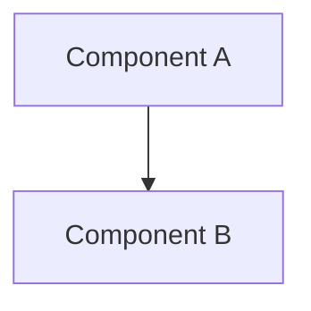

# {{id}} — {{title}}

## 1. Overview

この設計の概要と目的。

## 2. Context

### 2.1 Problem Statement

### 2.2 Constraints

## 3. Architecture

### 3.1 High-Level Design

### 3.2 Component Details

### 3.3 Data Flow

## 4. Interface Design

### 4.1 APIs

### 4.2 Events

## 5. Implementation Notes

## 6. Alternatives Considered

| Option | Pros | Cons |
|--------|------|------|
|        |      |      |

## 7. References

- Related Specs: 
- External Resources: 

