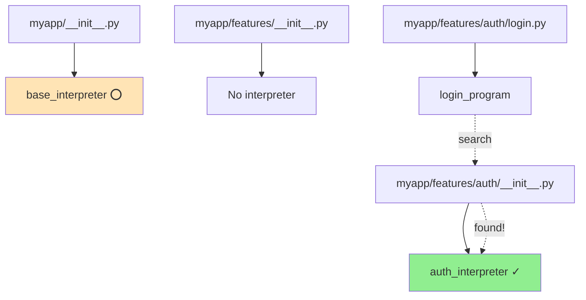
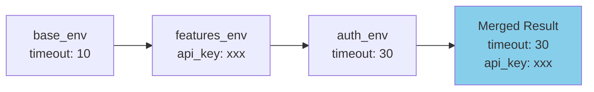
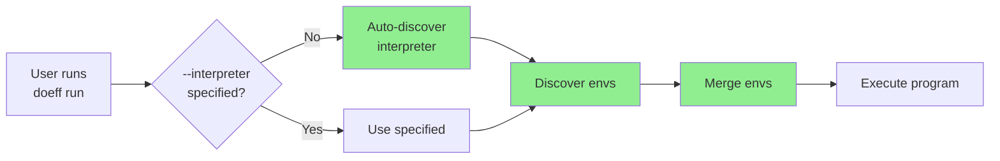
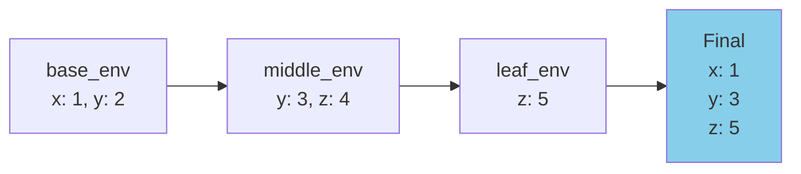
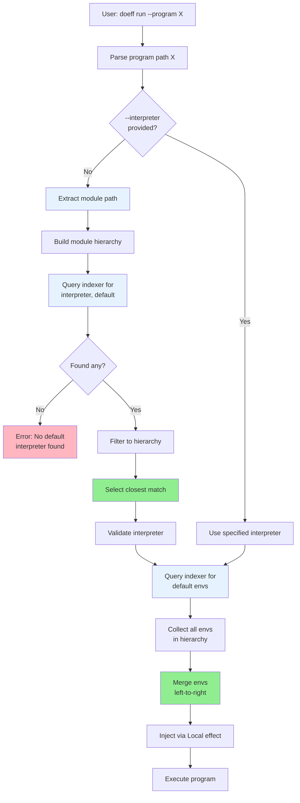
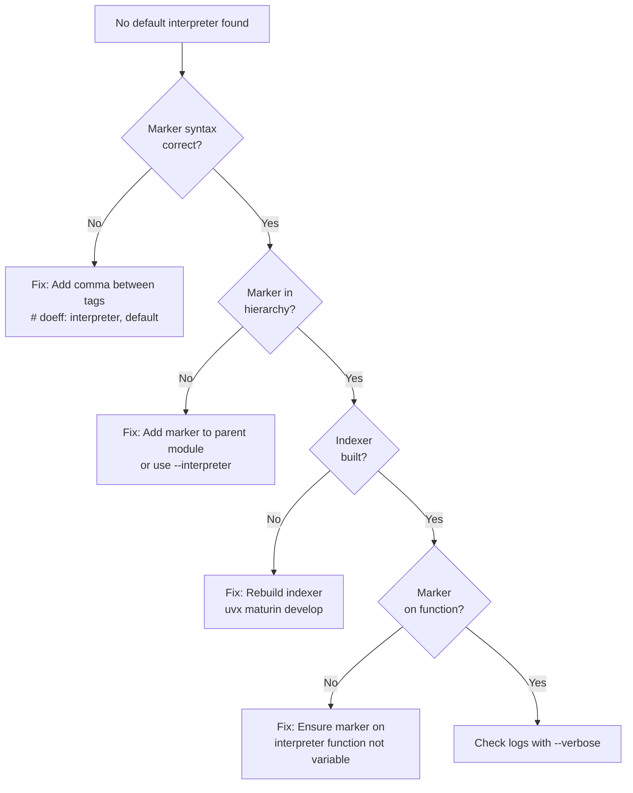

# 14. CLI Auto-Discovery

Automatically discover and use default interpreters and environments when running programs with the `doeff run` command.

## Table of Contents

1. [Overview & Motivation](#overview--motivation)
2. [Quick Start](#quick-start)
3. [Core Concepts](#core-concepts)
4. [Interpreter Discovery](#interpreter-discovery)
5. [Environment Discovery](#environment-discovery)
6. [Marker Syntax Guide](#marker-syntax-guide)
7. [Discovery Algorithm](#discovery-algorithm)
8. [Real-World Examples](#real-world-examples)
9. [Manual Overrides](#manual-overrides)
10. [Troubleshooting](#troubleshooting)
11. [Best Practices](#best-practices)
12. [Advanced Topics](#advanced-topics)
13. [Migration Guide](#migration-guide)
14. [Reference](#reference)

---

## Overview & Motivation

### The Problem

Before auto-discovery, running a doeff program required explicitly specifying the interpreter:

```bash
doeff run \
  --program myapp.features.auth.login_program \
  --interpreter myapp.features.auth.auth_interpreter
```

For large projects with many interpreters and environments, this became:
- **Verbose**: Long command lines
- **Error-prone**: Easy to use wrong interpreter
- **Tedious**: Repetitive typing for common scenarios

### The Solution

Auto-discovery eliminates manual specification by using **markers**:

```bash
# Just specify the program - everything else is automatic!
doeff run --program myapp.features.auth.login_program
```

The CLI automatically:
1. **Finds the closest interpreter** marked with `# doeff: interpreter, default`
2. **Discovers all environments** marked with `# doeff: default`
3. **Merges environments** from root → program (later values override)
4. **Executes** with discovered resources

### Benefits

✅ **Less typing** - Most commands need only `--program`
✅ **Self-documenting** - Markers make intent explicit
✅ **Hierarchical** - Natural project organization
✅ **Flexible** - Can still override manually when needed
✅ **Type-safe** - Discovers only marked resources

---

## Quick Start

### 5-Minute Example

**Step 1**: Mark your interpreter

```python
# myapp/interpreter.py
from doeff import Program, ProgramInterpreter

def my_interpreter(prog: Program) -> any:
    """
    Execute programs for myapp.
    # doeff: interpreter, default
    """
    engine = ProgramInterpreter()
    return engine.run(prog).value
```

**Step 2**: Mark your environment (optional)

```python
# myapp/config.py
from doeff import Program

# doeff: default
base_env: Program[dict] = Program.pure({
    'db_host': 'localhost',
    'timeout': 10
})
```

**Step 3**: Run your program

```bash
doeff run --program myapp.features.my_program
```

That's it! The CLI automatically:
- Uses `my_interpreter` (closest default)
- Injects `base_env` into the program
- Executes everything seamlessly

---

## Core Concepts

### 1. Markers

Special comments that mark functions and variables for auto-discovery:

```python
# For interpreters (functions)
def my_interpreter(prog: Program):
    """# doeff: interpreter, default"""
    ...

# For environments (variables)
# doeff: default
my_env: Program[dict] = Program.pure({...})
```

### 2. Interpreter Discovery: Closest Match



**Rule**: Selects the **closest** (rightmost in hierarchy) default interpreter.

### 3. Environment Discovery: Accumulation



**Rule**: Discovers **all** default environments, merges left-to-right (later overrides earlier).

### 4. Discovery Flow



---

## Interpreter Discovery

### How It Works

The CLI searches for functions marked with `# doeff: interpreter, default`:

1. **Extract module path** from program (e.g., `myapp.features.auth.login.my_program` → `myapp.features.auth.login`)
2. **Build hierarchy**: `["myapp", "myapp.features", "myapp.features.auth", "myapp.features.auth.login"]`
3. **Query indexer** for all default interpreters
4. **Filter to hierarchy**: Keep only interpreters in the module path
5. **Select closest**: Choose the rightmost (deepest) match

### Example: Closest Match Selection

```python
# myapp/__init__.py
def base_interpreter(prog: Program):
    """# doeff: interpreter, default"""
    return ProgramInterpreter().run(prog).value

# myapp/features/__init__.py
# (no interpreter)

# myapp/features/auth/__init__.py
def auth_interpreter(prog: Program):
    """# doeff: interpreter, default"""
    # Custom auth handling
    return custom_run(prog)

# myapp/features/auth/login.py
@do
def login_program():
    yield Log("Logging in...")
    return "success"
```

**Running the program:**

```bash
doeff run --program myapp.features.auth.login.login_program
```

**Discovery process:**

```
1. Module: myapp.features.auth.login
2. Hierarchy: [myapp, myapp.features, myapp.features.auth, myapp.features.auth.login]
3. Found interpreters:
   - myapp.base_interpreter (index 0)
   - myapp.features.auth.auth_interpreter (index 2)
4. Selected: auth_interpreter (index 2 > index 0, closest!)
```

### Validation

Interpreters must:
- Be callable (function or class with `__call__`)
- Accept exactly 1 positional parameter
- Be non-async (synchronous function)
- Have the marker `# doeff: interpreter, default`

**Valid:**
```python
def my_interpreter(prog: Program):
    """# doeff: interpreter, default"""
    return ProgramInterpreter().run(prog).value
```

**Invalid** (async not allowed):
```python
async def my_interpreter(prog: Program):  # ❌ async
    """# doeff: interpreter, default"""
    ...
```

---

## Environment Discovery

### How It Works

The CLI discovers **all** environments marked with `# doeff: default`:

1. **Build hierarchy** from program module path
2. **Query indexer** for all default variables
3. **Collect all envs** in hierarchy order (root → program)
4. **Merge** using Program composition (later overrides earlier)

### Example: Environment Accumulation

```python
# myapp/__init__.py
# doeff: default
base_env: Program[dict] = Program.pure({
    'db_host': 'localhost',
    'timeout': 10,
    'debug': False
})

# myapp/features/__init__.py
# doeff: default
features_env: Program[dict] = Program.pure({
    'api_key': 'secret123',
    'timeout': 20  # Override base
})

# myapp/features/auth/__init__.py
# doeff: default
auth_env: Program[dict] = Program.pure({
    'oauth_provider': 'google',
    'timeout': 30  # Override again
})

# myapp/features/auth/login.py
@do
def login_program():
    config = yield Ask('timeout')
    yield Log(f"Timeout: {config}")  # Will be 30!
    return "success"
```

**Discovery process:**

```
1. Hierarchy: [myapp, myapp.features, myapp.features.auth, ...]
2. Found envs:
   - myapp.base_env (timeout: 10, debug: False)
   - myapp.features.features_env (api_key: secret123, timeout: 20)
   - myapp.features.auth.auth_env (oauth_provider: google, timeout: 30)
3. Merge order: base → features → auth
4. Result: {
     'db_host': 'localhost',
     'timeout': 30,           # Overridden twice!
     'debug': False,
     'api_key': 'secret123',
     'oauth_provider': 'google'
   }
```

### Merge Strategy

**Key Principle**: Later values override earlier values



**Use cases:**
- **Base config** at root (sensible defaults)
- **Feature overrides** in feature modules
- **Specific config** at leaf modules

---

## Marker Syntax Guide

### Interpreter Markers

**Required tags**: `interpreter, default` (both tags required)

**Placement options:**

1. **Docstring** (recommended):
```python
def my_interpreter(prog: Program):
    """
    Execute programs with custom settings.
    # doeff: interpreter, default
    """
    return ProgramInterpreter().run(prog).value
```

2. **Inline comment**:
```python
def my_interpreter(prog: Program):  # doeff: interpreter, default
    return ProgramInterpreter().run(prog).value
```

3. **Multi-line signature**:
```python
def my_interpreter(  # doeff: interpreter, default
    prog: Program,
    verbose: bool = False
):
    ...
```

### Environment Markers

**Required tag**: `default`

**Placement options:**

1. **Preceding comment** (recommended):
```python
# doeff: default
my_env: Program[dict] = Program.pure({
    'key': 'value'
})
```

2. **Same line**:
```python
my_env: Program[dict] = Program.pure({'key': 'value'})  # doeff: default
```

### Syntax Rules

✅ **Correct**:
```python
# doeff: interpreter, default
# doeff: default
# doeff: interpreter,default  (no space after comma - also works)
```

❌ **Incorrect**:
```python
# doeff interpreter, default  (missing colon)
# doeff: interpreter default  (missing comma)
#doeff: default  (missing space after #)
```

---

## Discovery Algorithm

### Step-by-Step Process



### Internal Implementation

**Discovery service** (`doeff/cli/discovery.py`):

```python
from doeff_indexer import Indexer

# 1. Create indexer for module
indexer = Indexer.for_module("myapp.features.auth")

# 2. Find default interpreters
symbols = indexer.find_symbols(
    tags=["interpreter", "default"],
    symbol_type="function"
)

# 3. Filter to hierarchy
hierarchy = ["myapp", "myapp.features", "myapp.features.auth"]
candidates = [s for s in symbols if s.module_path in hierarchy]

# 4. Select closest
closest = max(candidates, key=lambda s: hierarchy.index(s.module_path))
```

**Env merging** (using `@do` composition):

```python
@do
def merge_envs(env_sources: list[str]) -> dict:
    merged = {}
    for env_path in env_sources:
        env = load_symbol(env_path)
        if isinstance(env, Program):
            env_dict = yield env  # Evaluate Program[dict]
        else:
            env_dict = env
        merged.update(env_dict)  # Later overrides earlier
    return merged
```

---

## Real-World Examples

### Example 1: Simple Single-Level Project

```
myapp/
  __init__.py          # base_interpreter, base_env
  program.py           # my_program
```

**Setup:**

```python
# myapp/__init__.py
def base_interpreter(prog):
    """# doeff: interpreter, default"""
    return ProgramInterpreter().run(prog).value

# doeff: default
base_env = Program.pure({'debug': True})

# myapp/program.py
@do
def my_program():
    debug = yield Ask('debug')
    yield Log(f"Debug mode: {debug}")
    return "done"
```

**Usage:**

```bash
doeff run --program myapp.program.my_program
# Uses: base_interpreter, base_env
```

### Example 2: Multi-Feature Project

```
myapp/
  __init__.py          # base_interpreter, base_env
  features/
    __init__.py        # features_env
    auth/
      __init__.py      # auth_interpreter, auth_env
      login.py         # login_program
    billing/
      __init__.py      # billing_interpreter, billing_env
      charge.py        # charge_program
```

**Setup:**

```python
# myapp/__init__.py
def base_interpreter(prog):
    """# doeff: interpreter, default"""
    return ProgramInterpreter().run(prog).value

# doeff: default
base_env = Program.pure({
    'db_host': 'localhost',
    'timeout': 10
})

# myapp/features/__init__.py
# doeff: default
features_env = Program.pure({
    'api_key': 'secret123'
})

# myapp/features/auth/__init__.py
def auth_interpreter(prog):
    """
    Custom auth interpreter with OAuth.
    # doeff: interpreter, default
    """
    return custom_auth_run(prog)

# doeff: default
auth_env = Program.pure({
    'oauth_provider': 'google',
    'timeout': 30
})

# myapp/features/billing/__init__.py
def billing_interpreter(prog):
    """# doeff: interpreter, default"""
    return stripe_run(prog)

# doeff: default
billing_env = Program.pure({
    'stripe_key': 'sk_test_...'
})
```

**Usage:**

```bash
# Auth program
doeff run --program myapp.features.auth.login.login_program
# Uses: auth_interpreter
# Envs: base_env + features_env + auth_env
# Result: {db_host: localhost, timeout: 30, api_key: secret123, oauth_provider: google}

# Billing program
doeff run --program myapp.features.billing.charge.charge_program
# Uses: billing_interpreter
# Envs: base_env + features_env + billing_env
# Result: {db_host: localhost, timeout: 10, api_key: secret123, stripe_key: sk_test_...}
```

### Example 3: Microservices Architecture

```
services/
  __init__.py          # common_interpreter, common_env
  users/
    __init__.py        # users_interpreter, users_env
    api.py             # user_api_program
  orders/
    __init__.py        # orders_interpreter, orders_env
    api.py             # order_api_program
  payments/
    __init__.py        # payments_interpreter, payments_env
    api.py             # payment_api_program
```

Each service has:
- **Shared base**: Common timeout, logging, database config
- **Service-specific**: Custom interpreter with service logic
- **Service environment**: API keys, service-specific config

**Benefits:**
- No repetition of common config
- Service isolation through interpreters
- Clear override hierarchy

---

## Manual Overrides

### When to Override

Use manual flags when:
- **Testing**: Use a test interpreter
- **Debugging**: Use a verbose interpreter
- **One-off runs**: Temporary config override
- **Multiple envs**: Add extra environment layers

### Override Flags

#### 1. `--interpreter` (overrides discovery)

```bash
# Force use of test interpreter
doeff run \
  --program myapp.program \
  --interpreter tests.test_interpreter
```

**Behavior**: Skips interpreter discovery, still discovers envs.

#### 2. `--env` (adds to discovered envs)

```bash
# Add test environment (merges with discovered)
doeff run \
  --program myapp.program \
  --env tests.test_env
```

**Behavior**: Discovers default envs, then adds `test_env` (overrides all).

#### 3. Multiple `--env` flags

```bash
# Layer multiple environments
doeff run \
  --program myapp.program \
  --env myapp.dev_env \
  --env myapp.local_overrides
```

**Merge order**: discovered envs → dev_env → local_overrides

### Combined Usage

```bash
doeff run \
  --program myapp.features.auth.login_program \
  --interpreter tests.mock_interpreter \
  --env tests.mock_env
```

**Result**:
- Interpreter: `tests.mock_interpreter` (manual)
- Envs: `base_env` + `features_env` + `auth_env` + `mock_env` (auto + manual)

---

## Troubleshooting

### Error: "No default interpreter found"

**Full error:**
```
Error: No default interpreter found for 'myapp.program.my_program'.
Please specify --interpreter or add '# doeff: interpreter, default' marker.
```

**Diagnosis:**



**Solutions:**

1. **Add marker to a parent module:**
```python
# myapp/__init__.py
def base_interpreter(prog):
    """# doeff: interpreter, default"""
    return ProgramInterpreter().run(prog).value
```

2. **Or specify manually:**
```bash
doeff run --program myapp.program --interpreter myapp.base_interpreter
```

3. **Verify marker syntax:**
```python
# ✅ Correct
"""# doeff: interpreter, default"""

# ❌ Wrong (missing comma)
"""# doeff: interpreter default"""

# ❌ Wrong (missing colon)
"""# doeff interpreter, default"""
```

### Error: Wrong Interpreter Selected

**Symptom**: Program runs but uses unexpected interpreter.

**Cause**: Multiple default interpreters, closest match not what you expected.

**Debug:**

```bash
# Show discovered interpreter
doeff run --program myapp.program --format json | jq '.interpreter'
```

**Solution:**

1. **Remove unwanted marker** from closer module
2. **Or specify explicitly:**
```bash
doeff run --program myapp.program --interpreter myapp.desired_interpreter
```

### Error: Environment Values Not Applied

**Symptom**: `Ask('key')` returns None or wrong value.

**Debug:**

```bash
# Show discovered envs
doeff run --program myapp.program --format json | jq '.envs'
```

**Common causes:**

1. **Marker syntax error:**
```python
# ❌ Wrong
doeff: default  # Missing #
my_env = {...}

# ✅ Correct
# doeff: default
my_env = {...}
```

2. **Override order confusion:**
```python
# Later overrides earlier!
# myapp/__init__.py
base_env = {'timeout': 10}

# myapp/features/__init__.py
features_env = {'timeout': 20}  # This wins!
```

3. **Not a Program[dict]:**
```python
# ❌ Won't be indexed
my_env = {'key': 'value'}

# ✅ Will be indexed
my_env: Program[dict] = Program.pure({'key': 'value'})
```

### Debugging Discovery

**Enable verbose output:**

```bash
# (Future feature - not yet implemented)
doeff run --program myapp.program --verbose
```

**Manual verification:**

```python
# Test indexer directly
from doeff_indexer import Indexer

indexer = Indexer.for_module("myapp")

# Find interpreters
interps = indexer.find_symbols(
    tags=["interpreter", "default"],
    symbol_type="function"
)
print(f"Found interpreters: {[i.full_path for i in interps]}")

# Find envs
envs = indexer.find_symbols(
    tags=["default"],
    symbol_type="variable"
)
print(f"Found envs: {[e.full_path for e in envs]}")
```

---

## Best Practices

### 1. Interpreter Organization

**Recommended structure:**

```python
# Option A: One interpreter per feature
myapp/
  __init__.py          # base_interpreter (fallback)
  features/
    auth/__init__.py   # auth_interpreter (auth-specific)
    billing/__init__.py # billing_interpreter (billing-specific)

# Option B: One interpreter at root
myapp/
  __init__.py          # shared_interpreter (used by all)
  features/
    auth/__init__.py   # (no interpreter)
    billing/__init__.py # (no interpreter)
```

**Guideline**: Use **Option A** when features need different execution logic, **Option B** for uniform behavior.

### 2. Environment Layering

**Best practice hierarchy:**

```
base_env (root)          ← Shared config, sensible defaults
  ↓
feature_env (feature)    ← Feature-specific overrides
  ↓
module_env (leaf)        ← Module-specific config
```

**Example:**

```python
# myapp/__init__.py - Base defaults
# doeff: default
base_env = Program.pure({
    'db_host': 'localhost',
    'db_port': 5432,
    'timeout': 10,
    'debug': False,
    'log_level': 'INFO'
})

# myapp/features/__init__.py - Feature overrides
# doeff: default
features_env = Program.pure({
    'api_base_url': 'https://api.example.com',
    'timeout': 30  # Features need longer timeout
})

# myapp/features/auth/__init__.py - Specific config
# doeff: default
auth_env = Program.pure({
    'oauth_provider': 'google',
    'oauth_callback': '/auth/callback',
    'debug': True  # Auth debugging enabled
})
```

### 3. Naming Conventions

**Interpreters:**
```python
# Pattern: <feature>_interpreter
base_interpreter       # Base/default
auth_interpreter       # Authentication
billing_interpreter    # Billing
test_interpreter       # Testing
```

**Environments:**
```python
# Pattern: <scope>_env
base_env               # Base config
dev_env                # Development
prod_env               # Production
test_env               # Testing
auth_env               # Auth-specific
```

### 4. Marker Placement

**Recommended: Docstrings for interpreters**

```python
def my_interpreter(prog: Program):
    """
    Execute programs with custom error handling.

    # doeff: interpreter, default
    """
    return ProgramInterpreter().run(prog).value
```

**Recommended: Preceding comment for envs**

```python
# doeff: default
my_env: Program[dict] = Program.pure({
    'key': 'value'
})
```

**Why?**
- Clear visual separation
- Easy to search (`grep "# doeff: default"`)
- Works with formatters/linters

### 5. Testing Discovery

**Always test discovery in CI:**

```bash
# Verify auto-discovery works
doeff run --program myapp.test_program --format json

# Verify manual override works
doeff run --program myapp.test_program \
  --interpreter tests.test_interpreter \
  --format json
```

---

## Advanced Topics

### Custom Discovery Strategies

**(Future feature - not yet implemented)**

Extend discovery with custom strategies:

```python
from doeff.cli.discovery import InterpreterDiscovery

class ProductionOnlyDiscovery(InterpreterDiscovery):
    """Only discover interpreters marked 'production'."""

    def find_default_interpreter(self, program_path: str):
        # Custom logic: filter by 'production' tag
        ...
```

### Performance Optimization

**Discovery overhead**: < 100ms for typical projects

**When it matters**:
- Very large projects (1000+ modules)
- Frequent CLI invocations (build scripts)

**Solutions**:
1. **Cache discovery results** (future feature)
2. **Use manual flags** in performance-critical scripts
3. **Pre-build index** as part of deployment

### IDE Integration

**PyCharm Plugin** already uses doeff-indexer for:
- Function navigation
- Type checking
- Quick documentation

**Auto-discovery compatibility**:
- IDE shows all interpreters (broad view)
- CLI selects default (narrow view)
- Same underlying indexer, different filtering

### Programmatic Usage

**Use discovery in your code:**

```python
from doeff.cli.discovery import IndexerBasedDiscovery

discovery = IndexerBasedDiscovery()

# Find interpreter for a program
interpreter_path = discovery.find_default_interpreter(
    "myapp.features.auth.login.login_program"
)

print(f"Would use: {interpreter_path}")
# Output: myapp.features.auth.auth_interpreter
```

---

## Migration Guide

### Adding Discovery to Existing Projects

**Step 1: Audit existing interpreters**

```bash
# Find all interpreter functions
grep -r "def.*interpreter" --include="*.py"
```

**Step 2: Add markers**

```python
# Before
def my_interpreter(prog: Program):
    return ProgramInterpreter().run(prog).value

# After
def my_interpreter(prog: Program):
    """# doeff: interpreter, default"""
    return ProgramInterpreter().run(prog).value
```

**Step 3: Test discovery**

```bash
# Test that discovery works
doeff run --program your.program --format json

# Verify discovered interpreter
doeff run --program your.program --format json | jq '.interpreter'
```

**Step 4: Remove explicit flags**

```bash
# Before
doeff run --program myapp.program --interpreter myapp.interpreter

# After
doeff run --program myapp.program
```

### Gradual Adoption

**Phase 1**: Add markers, keep using explicit flags
```bash
doeff run --program X --interpreter Y  # Still works!
```

**Phase 2**: Test auto-discovery in development
```bash
doeff run --program X  # Try without flags
```

**Phase 3**: Update CI/CD to use auto-discovery
```bash
# Update scripts to remove --interpreter flags
```

**Phase 4**: Remove explicit flags from documentation

### Backward Compatibility

✅ **All existing commands still work**

```bash
# This will ALWAYS work (no breaking changes)
doeff run --program X --interpreter Y
```

✅ **Discovery is opt-in**

Without markers, behavior is unchanged:
- No markers → Error asking for `--interpreter`
- With markers → Auto-discovery works

---

## Reference

### Marker Syntax

| Marker | Purpose | Syntax | Example |
|--------|---------|--------|---------|
| `interpreter, default` | Default interpreter | `# doeff: interpreter, default` | Function that executes programs |
| `default` | Default environment | `# doeff: default` | Variable with config dict |

### CLI Flags

| Flag | Description | Example |
|------|-------------|---------|
| `--program` | Program to execute (required) | `--program myapp.program` |
| `--interpreter` | Override interpreter discovery | `--interpreter myapp.interpreter` |
| `--env` | Add environment (can repeat) | `--env myapp.dev_env` |
| `--format` | Output format (text or json) | `--format json` |

### Error Messages

| Error | Cause | Solution |
|-------|-------|----------|
| No default interpreter found | No markers in hierarchy | Add marker or use `--interpreter` |
| Multiple default interpreters | Ambiguous selection | Check marker placement |
| Invalid interpreter signature | Wrong function signature | Ensure single param, sync function |
| Environment not found | Symbol load error | Check env path and syntax |

### JSON Output Format

```json
{
  "status": "ok",
  "interpreter": "myapp.features.auth.auth_interpreter",
  "envs": [
    "myapp.base_env",
    "myapp.features.features_env",
    "myapp.features.auth.auth_env"
  ],
  "result": "success"
}
```

### Links

- **Marker Specification**: See [MARKERS.md](MARKERS.md) for general marker usage
- **Implementation Specs**: See `specs/cli-auto-discovery/` for technical details
- **PyO3 Indexer**: See `packages/doeff-indexer/` for indexer internals

---

## See Also

- **[MARKERS.md](MARKERS.md)** - General marker system for IDE plugins
- **[01-getting-started.md](01-getting-started.md)** - Getting started with doeff
- **[13-api-reference.md](13-api-reference.md)** - Complete API reference

---

**Questions or issues?** File an issue on [GitHub](https://github.com/proboscis/doeff/issues).
