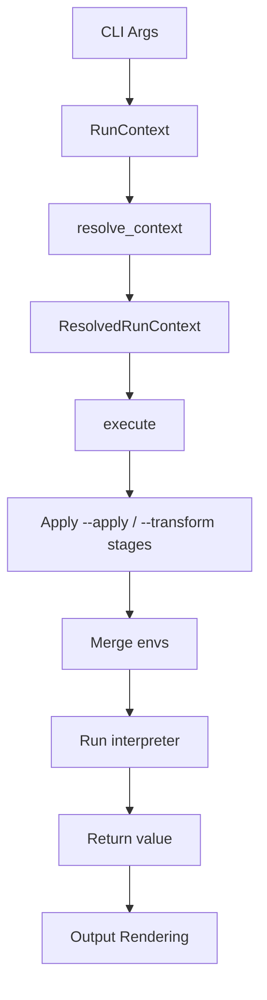
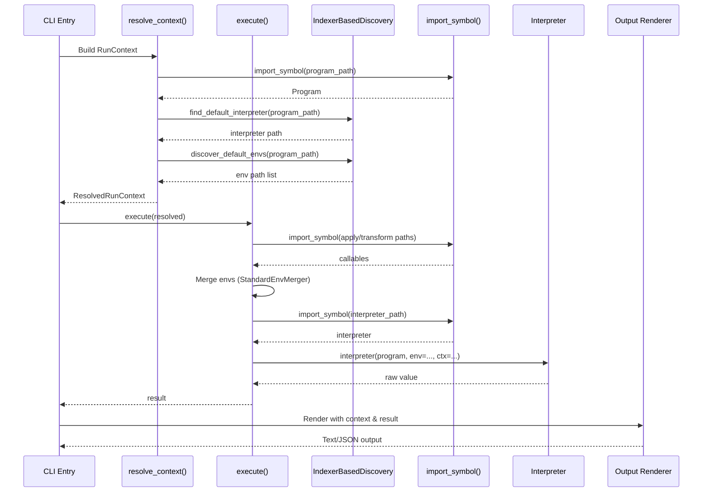

# doeff run Command Architecture

This note captures the structure of the `doeff run` command pipeline. Use it as a map when navigating or extending the workflow.

## Execution Flow

- **RunContext**
  - Collects the raw CLI arguments into a single data object (`program_path`, `interpreter_path`, `env_paths`, `set_vars`, `apply_paths`, `transformer_paths`, `output_format`).
- **resolve_context(ctx: RunContext) -> ResolvedRunContext**
  - Loads the target program via `import_symbol()`.
  - Auto-discovers the interpreter (via `IndexerBasedDiscovery`) if none was specified.
  - Auto-discovers default envs if none were specified.
  - Falls back to `default_interpreter` when no interpreter is found.
- **execute(resolved: ResolvedRunContext) -> Any**
  - Applies `--apply` (Kleisli) and `--transform` stages sequentially.
  - Merges environment sources (from `~/.doeff.py`, discovered, and explicit `--env` paths) via `StandardEnvMerger`.
  - Applies `--set KEY=VALUE` overrides on top.
  - Builds a `DoeffRunContext` for interpreters that support remote execution.
  - Runs the interpreter, passing `env` and `ctx` kwargs if the interpreter's signature accepts them.
- **default_interpreter(program)**
  - Composes the standard handler stack (`lazy_ask`, `state`, `writer`, `try_handler`, `slog_handler`, `listen_handler`, `await_handler`).
  - Wraps with `scheduled()` and calls `run()`.
- **Output Rendering**
  - Emits user-facing output in text or JSON format.

## Supporting Classes

- **DoeffRunContext** — Frozen dataclass capturing the original CLI invocation (program ref, interpreter ref, env refs, set overrides, apply/transform refs) for interpreters that need to reconstruct the `doeff run` command remotely (e.g. k3s Jobs, Docker).
- **RunnerContext** — Captures every source form (Python symbol path, inline `-c` Python, inline `--hy` Hy) plus `raw_argv` for remote backends.

## Mermaid Overview

## Communication Diagram

## Key Implementation Details

- The implementation lives in `doeff/cli/run_services.py`.
- `import_symbol()` supports both colon-separated (`module:attr`) and dotted (`module.attr`) paths.
- Hy import hook is activated at module load so `.hy` files can be resolved.
- `default_interpreter` composes handlers individually (there is no `default_handlers()` function).
- `run(doexpr)` takes a single argument and returns the raw value.

## Extension Guidance

- Add new pre-run manipulations as additional `--apply` or `--transform` stages.
- Extend auto-discovery logic via `IndexerBasedDiscovery` so dependent subsystems remain injectable.
- New output formats should be funneled through the output rendering layer.
- `import_symbol()` is the single importer to avoid redundant module loads.
