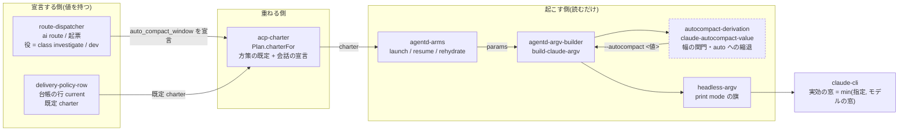
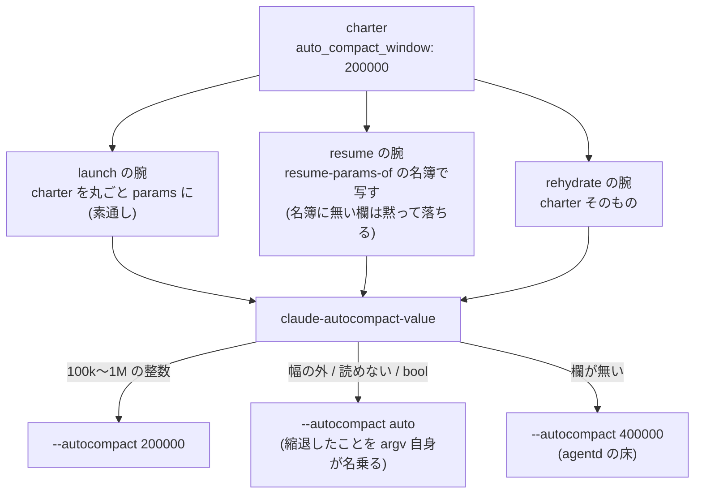

# 会話の圧縮の閾値を、起こす側が必ず名乗る

対象版: doeff origin/main `14f1a783` / agent-control-plane・dotfiles は 2026-09-18 の作業 checkout。
記録: `docs/design/auto-compact-window/index.json`(observed = 現状 / target = 本書)。
**版 b(2026-09-18)** — 版 a からの差: 検証で成立した反例 E7(既にある `compactAt` を覆う)を受けて、
「選択 4」を足し、引き継ぎと変更への備えを直した。版 a は `artifacts/target-2026-09-18/design.md`。

## 何をどう設計することにしたか

**agentd が claude 席を起こす argv に `--autocompact <auto|tokens>` を必ず載せる。値は charter の
`auto_compact_window` を読む。会話が名乗らない拍だけ、agentd の床(400,000)を名乗る。**
役(計画席 lead / 実装席 worker)ごとの値は **起票側が charter に載せて運ぶ** — agentd は役の表を持たない。

いま欠けているのは「誰も名乗っていない」という一点で、その結果 CLI は自分の窓(1M)いっぱいまで
畳まずに伸びる。1 手番の値段は毎手番読み直す文脈の大きさでほぼ決まるので、これは枠の消費に直結する。

実測(2026-09-18・全 profile の会話記録 3.68 GB / 119,085 手番):

| 見たもの | 値 |
| --- | --- |
| 直近 24 時間の Fable の疑似コスト | 15,996u / 15,783 手番 |
| そのうち cache_read(文脈の読み直し)が占める割合 | **77%**(出力は 10%) |
| 1 手番の平均の文脈 | **550k** token(普通の開発席は 100〜150k) |
| 600k を超える手番 | 手番の 42% ・ 費用の **59%** |
| 観測した最大の文脈 | 967k token |
| 日次の Fable 消費 | 09-15 4,697u → 09-16 13,913u → 09-17 **16,976u** |

## 構造



現状との差は 1 つだけ — `autocompact-derivation` が無く、`ARGV → CLI` の辺に閾値が乗っていない。

## 契約が働く様子(腕ごとの運び方)



**resume の腕が名簿で写す**のがこの設計で一番落ちやすい点。同じ形の実弾が 2026-09-15 にあり
(添付が resume の腕だけ落ちた)、そこで付いた註「足した欄は名簿にも足す」に従う。
長く続いている会話ほど resume の腕を通るので、漏れると**いちばん太い席から先に**窓の上限任せへ戻る。

## この系には既に圧縮の仕組みがもう 1 つある

設計の途中で見つけた(検証 E7)。会話は `status.agent.compactAt` を宣言できる —
**文脈の使用率の % **で、`ai conv open --agent compactAt=<0..100>` の閉語彙
(`model` / `profile` / `effort` / `compactAt` の 4 欄)の 1 つ。宣言があると agentd は
直前の手番の使用率がそれ以上の時、温かい session を**片付けて記録の service の履歴から再開**する
(段 10f 便 2・agora-redesign #82・operator 2026-09-14「that routing agent should compact itself
with some threshold」・計器 `agentd_compactions_total`)。

つまり**輪が 2 つ**ある。

| | 内側の輪(本設計で足すもの) | 外側の輪(既にあるもの) |
| --- | --- | --- |
| 宣言 | `auto_compact_window`(token の絶対値) | `compactAt`(窓に対する %) |
| 畳む主体 | claude CLI 自身(その場で要約) | agentd(session を捨てて記録から再開) |
| 温かい session | 残る | 捨てる |
| 要約を書く主体 | CLI | 記録の service の履歴 |
| 値の届き方 | charter に載る(起動 params) | agentd が会話の行を直接読む(**charter には載せない**と契約が明記) |

**干渉する**: 使用率の分母は `judgment.context-percent-of` が使う
`result.modelUsage[model].contextWindow` = **モデルの窓**(1M)であって、畳む閾値ではない。
内側の輪が 400k で畳むと使用率は約 40% で頭打ちになり、**40 より上の `compactAt` を宣言した
会話では外側の輪が二度と撃たない**(ACP の検が使っている宣言値は 70 と 80)。実測は evidence E7。

## 重要な選択

### 選択 1 — 閾値の宣言はどこが持つか

| 案 | 利点 | 代償 |
| --- | --- | --- |
| A. agentd の code に役 → 値の表を置く | 1 repo で完結・すぐ効く | agentd が役を知らない(charter に役の欄が無い)。「charter の値だけを読む」立場を壊す |
| B. 配達方策の行の既定 charter に 1 つの値 | code 0 行・台帳の 1 行 | 方策の行は `current` の 1 つだけ。全席共通にしかならず、役で分けられない |
| **C. 会話の宣言として起票側が charter に載せる** | model / effort と同じ道。役を知っている側が値を持つ | 起票側(dotfiles)と重ねる側(ACP)にも手が要る |
| D. `session_env` で `CLAUDE_CODE_AUTO_COMPACT_WINDOW` を配る | 新しい語彙が要らない | 同じことをする第 2 の道ができる。env は席の `/autocompact` も封じる |

**採用 = C。ただし段を 2 つに分ける。**

- **段 1(agentd だけ)**: `--autocompact` を必ず載せ、値は charter の欄、無ければ床 400k。
  これで「1M 任せ」が全席から消える。**どの席も今より窮屈にならない**(観測した平均は 550k なので、
  400k は畳む回数を増やすが、いま 967k まで伸びている席の暴走だけを止める)。
- **段 2(起票側 + 重ねる側)**: 役ごとの値を宣言する。lead 400k / worker 200k を初期値にする。

段を分ける理由は、段 1 だけで消費の主因(600k 超が費用の 59%)が落ち、段 2 を待たずに効くため。
段 1 の床を worker の値(200k)ではなく lead の値(400k)にしてあるのは、**段 1 の時点では役が
区別できないから** — 狭い方を全席に配ると、長い設計を持つ席が段 2 まで不利になる。

*覆る条件*: 配達方策の行が役ごとに分かれたら、B が C より安くなる(台帳の 2 行で済む)。

### 選択 2 — 会話が名乗らない拍に旗を出すかどうか

| 案 | 利点 | 代償 |
| --- | --- | --- |
| A. 旗を出さない(`--effort` と同じ) | 「系が選ばない」を素直に表す | 圧縮では「誰も選ばない」が**窓の上限任せ**に落ちる。これが直そうとしている欠陥そのもの |
| **B. 必ず名乗る(床の定数)** | 上限任せが構造的に消える | agentd の code に値が 1 つ載る(R3 との緊張) |

**採用 = B。** R3(agentd は charter の値だけを読み、code に既定を置かない)との緊張は認める。
解き方は、**床は「方策」ではなく「幅の外を argv に載せないための安全な既定」**と位置づけること。
値の方策(役ごとにいくつ)は charter が持ち、床は charter が沈黙した時に手番を殺さないための値。
dotfiles の走行係が同じ問いを同じ側で解いている(ADR-DOTFILES-012 R-4484fd43 —
`law headless-compaction-threshold-declared-by-the-runner`)ので、系として判断が揃う。

*覆る条件*: charter が必ず欄を持つと保証できる(重ねる側が既定を必ず入れる)なら、床は要らなくなる。

### 選択 3 — 幅の外の値が来た時

| 案 | 利点 | 代償 |
| --- | --- | --- |
| A. 例外にして手番を落とす | 誤りが早く出る | 台帳の打ち間違い 1 つで席が起きなくなる |
| **B. `auto` へ縮退する** | 手番は生きる。縮退は `ps` の argv に出るので外から読める | 誤った値が黙って効かない(気づくのが遅れうる) |

**採用 = B。** 幅の外の値を argv に載せることは**手番を殺す**(CLI が argv 解釈の段で死に、
stream-json を 1 行も吐かない)。縮退先を `auto` にすると、少なくとも CLI 自身の窓に合わせた
調整が働く。縮退したことを第 2 の申告先ではなく argv 自身に名乗らせる。

### 選択 4 — 既にある `compactAt` との関係

| 案 | 利点 | 代償 |
| --- | --- | --- |
| a. 内側の輪を優先し、`compactAt` は宣言が低い時だけ撃つ backstop にする | 安い方(その場で要約・session を残す)が常に先に効く。#82 の目的(会話を伸ばし続けない)は満たす | 出荷済みで operator が要求した機能の効き方が変わる。記録から作り直す要約は出なくなる |
| b. `compactAt` を宣言した会話には床を当てず `auto` を名乗る | 既存の会話の振る舞いが 1 bit も変わらない。「会話の宣言が方策の既定を置き換える」という既存の規則(work_dir と同じ)に素直 | `compactAt` を宣言した会話は今のまま伸びる(700k まで走る = いちばん高い帯がそのまま残る) |
| c. `compactAt` を退役させ、輪を 1 つにする | 圧縮の方策が 1 か所になる | 出荷済みの機能の削除。記録からの作り直しという腕を失う |

**推奨 = a。ただしこれは operator の目的を変える判断なので、配備の前に戻す**(合意の記録なし)。
理由: 外側の輪が撃つ 700k 付近は、実測で費用の 59% を占める帯そのもの。内側の輪はそこへ
届く前に、安く(その場で要約・session を残して)畳む。#82 の逐語「compact itself with some
threshold」の目的は満たし、変わるのは手段。

案 b は互換だが、**いちばん直したい席がそのまま残る**ので、今回の目的をほぼ達成しない。
案 c は出荷済み機能の削除で、今回の範囲を超える。

*実装上の置き場*: 案 b を採る場合、判断は **ACP 側**(`charterFor`)に置く — 会話が `compactAt` を
宣言していて `autoCompactWindow` を宣言していなければ charter に `"auto"` を載せる。agentd に
置くと「圧縮の方策」を agentd が知ることになり、R3(charter の値を読むだけ)を壊す。

*段 1 の露出*: 段 1(agentd の床だけ)は案 a と同じ振る舞いになる。現に `compactAt` を宣言して
いる会話が何本あるかは、この機体から control plane に届かず**数えられていない**(evidence U6)。

## 契約

### `launch-argv`(所有 = agentd-argv-builder)

正本 = `packages/doeff-agents/src/doeff_agents/sessionhost/impls/claude_code.hy`

```
build-claude-argv(params) -> argv
build-claude-resume-argv(params) -> argv    ; 基礎の旗は build-claude-argv と共有

argv = ["claude" "--dangerously-skip-permissions"]
     + ["--settings" "{\"disableAllHooks\":true}"]   ; session_hooks != "inherit" の時だけ
     + ["--effort" <語>]                              ; 宣言があれば
     + ["--model" <名>]                               ; 宣言があれば
     + ["--autocompact" <auto|100000..1000000>]       ; ★ 常に載る
     + ["--mcp-config" <json> "--strict-mcp-config"]  ; server があれば
     + ["--session-id" <id>]                          ; fresh だけ
```

不変条件:
- 凍結接頭 4 語と `--effort` の index 4 を動かさない(conformance S13 の pin)。
- `--autocompact` は `--model` の後・`--mcp-config` の前。
- 値は必ず `auto` か 100k〜1M の 10 進整数の文字列。**それ以外の文字列を出さない。**
- prompt を argv に載せない。print mode の旗は headless の家だけ。

失敗の意味: 幅の外の値が argv に出た時点で、その席の手番は 1 行も吐かずに死ぬ。
だから幅の関門は argv を組む側が持ち、宣言する側の誤りを通過させない。

### `autocompact-derivation`(所有 = agentd-argv-builder の内側)

```
claude-autocompact-value(params) -> str      ; 純粋
  params["auto_compact_window"] が
    無い / 空文字        -> 床(400000)を同じ関門に通す
    "auto"(大小問わず)  -> "auto"
    int / 整数の float   -> 幅の中なら 10 進の文字列、外なら "auto"
    10 進の文字列        -> 同上
    bool / その他        -> "auto"
```

**既定も宣言も同じ関門を通す** — 定数を誰かが幅の外へ動かした日に、その値がそのまま argv へ
乗って手番が死ぬ形を作らないため。導出点はこの 1 つだけで、第 2 の導出を作らない。

### `charter-object`(所有 = acp-charter)

正本 = `agent-control-plane/src/Acp/App/Messaging/Plan.hs`・綴りの定義点 =
`packages/doeff-agents/src/doeff_agents/sessionhost/acp/effects.py` `CHARTER_AUTO_COMPACT_WINDOW_KEY`。

- 欄 `auto_compact_window`: token の整数、または `"auto"`。無い = 宣言なし(agentd の床)。
- launch / rehydrate の腕は charter を丸ごと params にする(素通し)。
- **resume の腕は `judgment.resume-params-of` の名簿が写す** — 名簿に無い欄は落ちる。
- agentd はこの欄を読むだけで、役(lead / worker)を知らない。

## 変更への備え

| シナリオ | 変わる責務 | 維持する契約 | 検証 |
| --- | --- | --- | --- |
| CC1 役ごとに別の値を配る | route-dispatcher(値を宣言)・acp-charter(重ねる) | `launch-argv` の凍結接頭。agentd は charter を読むだけ | 同じ agentd に別の charter を渡し、argv の値だけが変わる |
| CC2 値そのものを調整する | delivery-policy-row / 起票側の宣言だけ | `charter-object` の綴り | 台帳の値を変えて起こし直し、argv が追随する |
| CC3 CLI の綴り・幅が変わる | autocompact-derivation の定数 1 点 | 幅の外を argv に載せない | 定数を動かして反例検が赤にならない |
| CC4 起こす腕が増える | agentd-arms | どの腕でも同じ閾値が効く | 腕ごとに argv を組んで値を見る(resume は名簿の漏れを検で固定) |
| CC5 圧縮の輪をもう 1 つ足す / 片方を退役させる | acp-charter(輪の関係を決める点) | agentd は輪の関係を知らない(charter の値を読むだけ) | 2 つの輪の閾値を並べて、どちらが先に撃つかを純関数で確かめる |

## 引き継ぎ

**ここで決めたこと(下位で変えない)**
- 閾値は起こす側が**必ず**名乗る。名乗らない拍は agentd の床。
- 幅の関門と `auto` への縮退は argv を組む側が持つ。導出は 1 点。
- 役ごとの値は**宣言する側**が持ち、agentd は役を知らない。
- 欄の綴りは `auto_compact_window`(charter・params で同じ語)。

**下位で自由に決めてよいこと**
- 床の具体値(400k は初期値。実測で動かしてよい)。
- 役ごとの値(lead 400k / worker 200k は初期値)。
- 起票側がその値をどの設定に書くか(dotfiles の route config の tier の欄など)。

**次に着手できること**
- 段 1: doeff-agents の実装と検(実装済み・焦点の検は緑)。開始条件 = 無し。
- **配備は operator の判断待ち** — 選択 4(既にある `compactAt` との関係)は目的を変える判断で、
  配備した瞬間に効く。合意を得てから入れ替える。
- 段 2: ACP の `charterFor` に欄を通し、起票側(`ai conv open --agent` の閉語彙に 5 欄目)が
  役ごとの値を宣言する。選択 4 で b を採るならその判断も `charterFor` に置く。
  開始条件 = 段 1 の着地 + 選択 4 の裁定。
