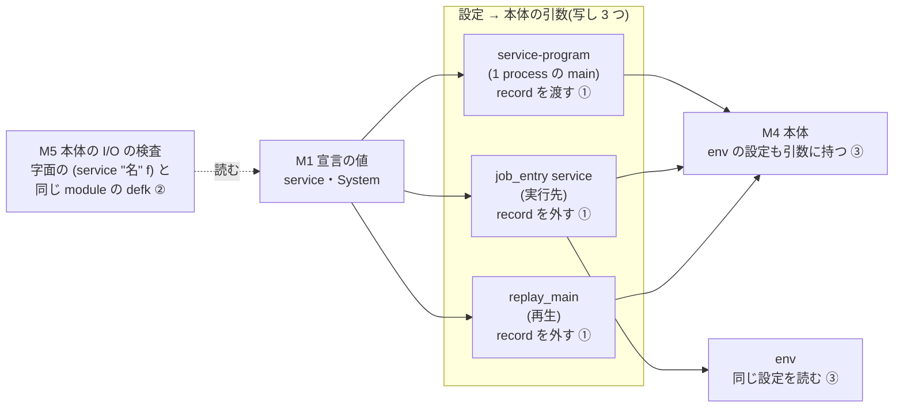
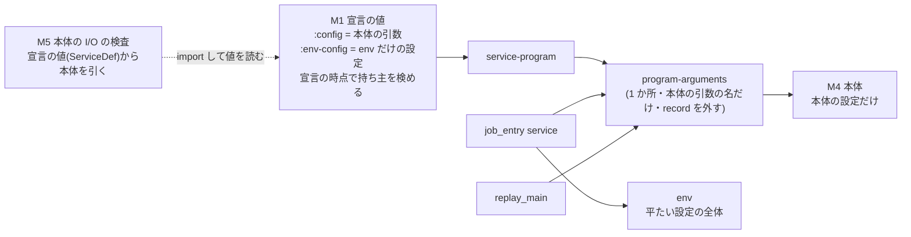

# service の宣言を値と関数で書く — 設計検証の記録(盲検の後)

依頼: lt-R5RQNYWQDEYZ1QXKMER5VRPQ3X(agora-redesign#639 実装依頼書 2)
著者: 会話 c-QKRSZM0HRE0G3K33RYKG1R622T・claude-opus-5-5(自己申告)
作成: 2026-09-26 JST
完了の範囲: **実装完了まで**。macro の削除(道 B)は本線に着地済み(doeff `0e7a5aa6`・`40378572`・`b0bd8acf`・`611f47cb`、
agora-controllers `4aefa59c`・`d3b7ef22`)。盲検の反例を受けた修正も本線に着地済み(doeff `ac38f799`〜`dfffc6d3`、agora-controllers
`3bf9db50`・`f08f0fab`・`659f05c3` — 9 節)。
基準の版: doeff `611f47cb15aa8b454fe312a546194b633297b088`・agora-controllers `d3b7ef22981a8dcb3a685fa15542defdf74c8b77`(盲検の断面)。

盲検の前に固定した主張は `design-before-blind.md`(sha256 `bcad6699158d54be3b221d8d6dab9cde33ced6240191490f67b7ba631905e0cf`)にあり、
書き換えていない。この文書はその後の結論で、主張・予想の範囲は上書きしない。

## 0. 全体の図(設計検証の前 ⇒ 後)

設計検証の前(盲検の断面)。番号は 3 節の反例。

設計検証の後。

## 1. 事前の主張(盲検の前に固定)

`design-before-blind.md` の要点: macro `defservice`・`defsystem` の責務を 1 つずつ挙げて持ち主を決め(道 B = 値と関数)、
M1〜M6 の責務・強制方法と、6 軸の変更シナリオ(S-DIST・S-CONC・S-HW・S-EFF・S-STORE・S-SIM)の予想の範囲を固定した。
盲検には「盲検の前に分かっている限界」の節を渡していない(`blind/blind-input.md`)。

## 2. 盲検 A・B

| | A(複数の責務へ変更が波及する反例) | B(検査を通りながら責務分離を破る反例) |
| --- | --- | --- |
| 入力 | `blind/blind-input.md`・`blind/prompt-a.md` | `blind/blind-input.md`・`blind/prompt-b.md` |
| 返答(未加工) | `blind/blind-a-return.md` | `blind/blind-b-return.md` |
| 起動 | Claude Code の Agent tool・subagent_type general-purpose・新しい文脈(fork でも resume でもない) | 同じ。A と同時に別の文脈で起動し、互いの返答を見ていない |
| モデル・effort | claude-opus-5-5・effort は起動口が受け付けない | 同じ |
| 識別子・時間 | agentId a5483ee884667f40f・503.7 秒・136,918 token・tool 33 回 | agentId a0e71599a91048088・1170.2 秒・193,754 token・tool 57 回 |
| 機体 | agentd-pool-1(pod) | 同じ |
| fallback の理由 | codex(gpt-6-astra)は起動口 `cx` が「この機体は宿名を宣言していない」で断った(`evidence/blind-launcher-cx-refused.log`) | 同じ |

## 3. 再現と修正

再現は盲検の file を使わず、設計者が同じ業務処理(doeff-cluster の公開の口・agora-controllers の本物の検査)で書き直した
(`evidence/repro/`)。修正前の doeff-cluster は `a492bd01` の source を `PYTHONPATH` の先頭に置いて走らせた(読んだ file の path を
log の先頭に印字)。

log の先頭の対象版は本線へ rebase する前の sha。rebase の後の commit との対応(`git patch-id --stable` で確かめた):
`26d88372` → `83937cd7`(台帳 `enforcement-ledger.json` の本数だけ衝突を解いたので patch-id は異なる)・`757daf3d` → `1ba7fcf7`・
`750af206` → `d9a42a41`・`e7cc592c` → `16f97f6a`・`6fc4d0c1` → `53193a83`(ここまで doeff の branch)。着地の時に本線の上へ当て直したので、
doeff の本線の sha は `83937cd7` → `ac38f799`・`1ba7fcf7` → `2595d452`・`d9a42a41` → `a871a475`・`16f97f6a` → `54495f5c`・`53193a83` →
`dfffc6d3`(patch-id はそれぞれ同じ)。agora-controllers の `3bf9db50`・`f08f0fab`・`659f05c3` はそのままの sha で本線に入った。

### 反例 ① 盲検 A — 組み立て側の欄 `record` の二重の扱い: 成立(修正前)→ 宣言の時点で拒否(修正後)

- **主張**: 実行先だけが知る記録の設定 `record` を宣言の `:config` に書くと、1 process の main と実行先で同じ宣言が食い違う。
- **再現(修正前)** `evidence/repro-a-before.log`・`evidence/scenarios-before.log`:
  - 宣言の `:config` に `record` を書いた service: 1 process の main は `TypeError: ... unexpected keyword argument 'record'`、
    実行先(`job_entry service` の子 process)は exit 0 で答え 2。
  - 本体が `record` という名の引数を取る service: 1 process の main は正常、実行先は
    `missing 1 required positional argument: 'record'` で exit 1。入口の検め(probe)は通る。
- **本物の repo でも起きていた**: agora-controllers の `scheduling-placement-program` は模擬の記録の dict を引数 `record` で受けており、
  実行先へ出すと毎回落ちる形だった(`evidence/closure-probe-scheduling-record.log` — 修正後の宣言の検めが 20 module の import で断った)。
- **原因**: 設定を本体の引数へ変える処理が `service_model.service-program`・`job_entry.run-service`・`replay_main` の 3 か所に写してあり、
  `record` を外すのが後の 2 か所だけだった。M3(実行先)の知識「`record` は組み立て側の欄」が、M1 が本体の引数と定めた `config` の
  名前空間に同居し、その予約を知る者と知らない者が混ざっていた。予想(S-DIST・S-SIM は M4 だけが変わる)に反し M1・M2・M3 の
  変更が要った — **知識の漏れ**で、公開契約の意図した拡張ではない。
- **修正**:
  - doeff `83937cd7`(検の先行): 宣言の検と semgrep 規則 `doeff-cluster-program-arguments-are-built-in-one-place`
    (doeff_cluster の中で `service_model.hy` の外の `hy.mangle` を ERROR)。修正前の src で `job_entry.hy:83`・`replay_main.hy:41` の
    2 件に発火(`evidence/semgrep-red-before-fix.log`)。
  - doeff `1ba7fcf7`: `program-arguments` を唯一の場所にし、3 つの道がそれを呼ぶ。`ASSEMBLY-KEYS`(= `record`)を外す。
    `service` の中の `check-program-arguments` が、設定の鍵と本体の引数の食い違い・`record` という名の引数を宣言の時点で
    `TypeError`(service の名と鍵を名指す)にする。
  - agora-controllers `3bf9db50`: `scheduling-placement-program` の引数を `journal` に改名(検の上書き 4 か所)。
- **再検証(修正後)** `evidence/repro-a-after.log`・`evidence/scenarios-after.log`: `record` を宣言した service は 1 process の main と
  実行先の両方で答え 3。`record` を引数に取る本体は宣言の時点で「引数 record は組み立て側の欄の名で、どの実行の道でも本体へ渡らない」。
  semgrep の発火は 0 件(`evidence/semgrep-after-fix.log`)。
- 盲検 A の細部の指摘「M2・S-SIM の『Program を組む時に失敗する』は正確には『走らせた時』」は正しかった。修正後は宣言の時点で失敗する。

### 反例 ② 盲検 B — 本体の特定が字面に頼っていた: 成立(修正前)→ 拒否(修正後)

- **主張**: 本体(`controllers/digest/keeper.hy` — cursor を worker の手元の file に直に読み書きする)と宣言(`cluster.hy`)を別の module に
  置くと、M5 は本体を 1 本も読まず、提示された検査がすべて通る。
- **再現(修正前)**:
  - 同じ本体を 4 つの宣言の形で置いた木(`evidence/repro-b-before.log`): 同じ module の時だけ赤。別の module・包む関数・名前の定数の
    3 形は読めた本体 0 で緑。
  - 本物の repo: 検査が読めた本体 90・宣言の値が名指す本体 94(`controllers/agora_sim/coordinator.hy` が包む関数 `sim-service` で宣言する
    4 本を読んでいなかった)。
  - 盲検 B の差分そのもの(`evidence/repro-b-digest.log` の before): `controllers/digest` の中で読めた本体 0・違反 0。
- **原因**: 「どの関数が service の本体か」は M1 の実行時の値が持つのに、M5 は字面から組み直し、「宣言は本体と同じ module にある」と
  仮定していた。macro `defservice` は本体と宣言を 1 つの form に置いていたので、この仮定は macro が暗黙に守っていた。
  **置き換えの表(`design-before-blind.md`)にこの責務の行が抜けていた** — 抜けた責務は持ち主を失った。
- **修正** agora-controllers `f08f0fab`: `service-body-report root bases` は、宣言を作りうる module(`doeff_cluster.service_model` を
  import する module と、それを import する module の閉包)を import し、生きている `ServiceDef` から本体の関数・定義の file・
  最上位の form を引く(form の範囲は今までどおり Hy の reader)。import できない宣言の module と、最上位の `defk` として読めない本体は
  `UncheckedDeclaration` に残り、repo の検が赤にする(読めない物を数から黙って落とさない)。ADR に R6 と law の反例を足した。
- **再検証(修正後)**: 4 形とも直の I/O の本体は赤・effect だけの本体は緑で本体を 1 本読む(`evidence/repro-b-after.log`・
  `evidence/m5-shapes-after.log`)。本物の repo は読めた本体 94・違反 0・検められない宣言 0(`evidence/repro-b-after.log` の末行。repo の検 1 本の緑は
  `evidence/m5-repo-after.log`)。
  盲検 B の差分は `keeper.hy` の `digest_keeper_program` の `(.read-text`・`(.write-text` の 2 件で赤(`evidence/repro-b-digest.log` の
  after — 盲検 B の対照と同じ語)。ADR の file の 10 本が緑(`evidence/m5-adr-file-after.log`)。

### 反例 ③ 盲検 B の副次の指摘 — env だけが読む設定が本体の引数に入る: 成立(修正前)→ 拒否(修正後)

- **主張(盲検 B は実走していない)**: `budget-writer-program` は env だけが使う設定(`token-file`・`lease-ttl`・`margin-ms`)を本体の
  引数と契約に持つ。S-STORE の「本体は変えない」とずれる。
- **実測**: 宣言の値が名指す本体 94 本のうち 5 本が、本体の中で使わない引数を持っていた(`evidence/unused-params-before.log`):
  budget・conversation の書き手(`token-file`・`lease-ttl`・`margin-ms`)、artifact の書き手(さらに `acp-url`・`http-timeout`)、
  lab の artifact-shadow(`http-timeout`)、模擬の messaging-stand-in(`namespace` — 誰も読まない)。修正前の doeff-cluster では、
  env だけが読む設定を `:config` に書くと本体が `unexpected keyword argument` で両方の道とも落ちる(`evidence/scenarios-before.log` の
  S-STORE)。つまり env の設定を足すたびに本体の公開の契約を変えるしかなかった。
- **原因**: 設定の名前空間 1 つ(`run.config`)を本体の引数と env が共有し、しかも「設定の鍵 = 本体の引数」を強制していた。
  置き場や外への口を env の handler で替える変更(S-STORE・S-EFF)が、使わない引数として本体へ漏れる。
- **修正**(決めたことは 7 節):
  - doeff `d9a42a41`(検の先行)・`16f97f6a`・`53193a83`(README): 宣言に `:env-config` を足す。本体の引数の名・`:config` の鍵・
    組み立て側の欄と重なる鍵は宣言の時点で `TypeError`。`program-arguments` は本体の引数の名の設定だけを渡す。coordinator へ渡る
    `run.config` は今までどおり平たい 1 つ(`:config` と `:env-config` を重ねた物)。上書き(テスト用の main と `declare --config`)は
    宣言した鍵と `record` だけを変えられる。実行先は起動の行に「本体へ渡さない設定」を印字する。
  - agora-controllers `659f05c3`: 5 本の本体から使わない引数を外し、4 本の宣言で `:env-config` へ移す。messaging-stand-in の
    `namespace` は宣言と上書きから消す。`controllers/worker/README.md` に設定の持ち主と、`record` を宣言の `:config` に書けることを書く。
- **再検証**: 使わない引数を持つ本体 5 → 0(`evidence/unused-params-after.log`)。`:env-config` の設定は env が読み本体へは渡らない
  (実行先の答え `'hi2'`・テスト用の main は差し替えた handler の `'sim2'` — `evidence/scenarios-after.log`)。変えた本体の検が緑
  (`evidence/agora-env-config-tests.log` — 1 本の赤は別件、8 節)。

## 4. 予測と実測の比較

| シナリオ | 予想の範囲(盲検の前) | 実測(修正前) | 差の原因 | 修正後 |
| --- | --- | --- | --- | --- |
| S-DIST | M4 だけ | `record` を宣言に書くと M1・M2・M3 の変更が要った(①) | M3 の知識の漏れ・写し 3 つ | 宣言と本体だけで両方の道が同じ答え |
| S-CONC | M4 だけ | 予想どおり(`:update handoff` が写り、語彙の外は ValueError) | — | 変更なし |
| S-HW | M4(条件の語が新しければ M3) | 予想どおり(`:requires` は解釈されずに写り、文字列でない鍵は TypeError) | — | 変更なし |
| S-EFF | M4 と env。直の I/O はどの dir でも M5 が赤 | 宣言を別の module に置くと M5 が本体を読まない(②)。外への口の設定(`acp-url`・`http-timeout`)が本体の引数に漏れる(③) | M5 の字面の仮定・設定の名前空間の共有 | M5 は宣言の値から本体を引く・env の設定は `:env-config` |
| S-STORE | env の module だけ(本体は変えない) | env の設定(資格の file・lease の時間)を足すと本体の引数が変わる(③)。本体の手元の file の状態を M5 が見逃す(②) | 同上 | env の設定は本体に触れずに足せる |
| S-SIM | 回す側の handler と上書きだけ | 食い違いは走らせた時に初めて落ちる。綴りの違う上書きは Python の文言で落ちる | 宣言の時点の検めが無かった | 宣言の時点と上書きの時点で service の名と鍵を名指して断る |

予想の範囲は広げていない。S-DIST・S-EFF・S-STORE の予想は反例で破れ、境界と検査を直して再検証した。

## 5. 置き換えた部品の責務(追記)

`design-before-blind.md` の表に、盲検が見つけた 2 行を足す。

| macro の責務 | 要否 | 置き換えた後の持ち主 |
| --- | --- | --- |
| 本体と宣言を 1 つの form に置く(= どの関数が本体かを字面で決められる) | 要る(M5 が本体を特定する) | M5 が宣言の値(`ServiceDef`)から引く — 字面の置き場に頼らない |
| (macro の外にも無かった)設定の持ち主の区別 | 要る(env の設定を本体の契約に入れない) | M1 の `:config` / `:env-config` と `check-program-arguments` |

## 6. 責務(修正後)

| id | 責務 | 持つ知識 | 隠す知識 | 公開の口 | effect | 寿命 | 不変条件 |
| --- | --- | --- | --- | --- | --- | --- | --- |
| M1 宣言の値 | service 1 本の宣言を、実行先で解ける関数の参照と、持ち主で分けた設定を持つ不変の値として組み、組めない宣言をその場で断る(`service_model`: `ServiceDef`・`System`・`service`・`program-reference`・`string-keyed`・`check-program-arguments`・`UPDATE-FORMS`・`ASSEMBLY-KEYS`) | 宣言の欄(name・factory・env・requires・config・env-config・readiness・update・base-from)・参照の導き方・組み立て側の欄の名 | 参照の導き方・欄の正規化・引数の名の読み方 | `(service name program :env E [:requires] [:config] [:env-config] [:readiness] [:update] [:base-from]) → ServiceDef`。失敗 = ValueError(入れ子の関数・未知の update)・TypeError(文字列でない鍵・設定と引数の食い違い・持ち主の重なり) | なし(module の読み込みの時に値を組むだけ) | module の最上位の不変の値。資源を持たないので解放は不要 | `:config` の鍵 = 本体の既定値の無い引数(組み立て側の欄を除く)・`:env-config` の鍵は本体の引数の名でも `:config` の鍵でも組み立て側の欄でもない・本体は組み立て側の欄の名を引数に取らない |
| M2 宣言の投影 | 同じ `System` から (a) 1 process の Program と (b) coordinator へ渡す JSON を導き、設定から本体の引数を作る唯一の場所を持つ(`program-arguments`・`config-of`・`service-program`・`system-main`・`system-declaration`) | coordinator の宣言の JSON の形・上書きの重ね方・引数名への変換 | (a) で関数を直に使うか参照を解くか | `program-arguments(program, config) → dict`・`config-of(service, overrides) → dict`(宣言に無い上書きの鍵は TypeError) | (a) は scheduler の `Spawn`・`Gather` だけ。(b) は純粋 | 呼ぶたびに組む。状態を持たない | 本体へ渡るのは本体の引数の名の設定だけ・`run.config` は `:config` と `:env-config` を重ねた平たい 1 つ |
| M3 実行先 | 宣言の JSON の factory を解き、`program-arguments` で本体を組み、env には `record` を除いた全体を渡して走らせる(`job_entry`・`replay_main`・coordinator) | process の起動・handler の組み立て・記録の層 | worker の process・commit の準備 | coordinator の宣言 JSON | 実 I/O(process・HTTP・file) | service の process の寿命 | 設定から引数を作る写しを持たない(semgrep) |
| M4 service の本体 | 業務の周回 | 業務の判断 | — | `defk` の契約(`:pre` の引数 = 本体の設定だけ) | 型のある doeff の effect だけ | Program の寿命 | 直の I/O が無い・env だけが読む設定を引数に持たない |
| M5 本体の I/O の検査 | 宣言の値が名指す本体の中の直の I/O を、置き場と書き方を問わず断る(agora-controllers の ADR の `service-body-report`) | 宣言を作りうる module の閉包の求め方・断る語 | form の範囲の取り方 | `test_a_service_body_that_touches_a_file_is_red_wherever_it_is_declared`・`test_a_declaration_the_checker_cannot_read_is_red`・`test_the_service_bodies_in_this_repo_touch_no_lock_socket_file` | 検査の道具として module を import し file を読む | 検の走行ごと | 読めた本体が 0 なら赤・検められない宣言が 1 つでも在れば赤 |
| M6 macro の置き場の検査 | 変更なし(ADR-DOE-HY-005 R5) | 名簿 | — | `test_adr_doe_hy_005_macros_live_only_in_doeff_hy` | file を読む | 検の走行ごと | 名簿の外の `defmacro` は赤 |
| M7 env(アプリの handler の組) | 宣言の `:env`(`module:attr`)が名指す関数で、平たい `run.config` から service の effect の handler の組を作る(例: agora-controllers `controllers/worker/services/envs.hy`・`controllers/worker/lab/envs.hy`) | 置き場・資格の file・lease の時間・外への口の設定(`:env-config` の鍵) | 本体から見た effect の実装 | `(env config ctx) → handler の list` | handler が実 I/O を持つ | service の process の寿命 | 本体の引数を読まない。`:env-config` の設定は本体の引数へ漏れない(M1 の検め) |

盲検の前の本文は M7 に id を付けず「env の module」と書いていた(S-EFF・S-STORE の変更範囲)。報告の JSON は変更範囲を
module の id で書くため、ここで id を付けた。責務の中身は盲検の前と同じ。

## 7. 強制の方法(修正後)と、決めたこと(戻せる決定の記録)

| 守る責務 | 強制方法と理由 | 実装箇所 | 実行経路 | 限界 |
| --- | --- | --- | --- | --- |
| 設定から本体の引数を作るのは 1 か所 | semgrep `doeff-cluster-program-arguments-are-built-in-one-place`(写しが増えると ERROR — 型では「同じ変換を 2 度書かない」を表せない) | doeff `.semgrep.yaml`・検体 `tests/semgrep/fixtures/python/packages/doeff-cluster/src/doeff_cluster/program_arguments_copy_forbidden.hy`・検 `test_program_arguments_rule_detects_a_second_config_to_arguments_copy` | commit の hook(pre-commit の semgrep)と doeff の検 | `hy.mangle` を使わずに書いた写しは見ない |
| 宣言の設定の持ち主が本体の引数と合う | 値を組む関数の中の検め(実行先で初めて落ちる宣言を作らせない) | `service_model.check-program-arguments`・検 `test_service_declaration.hy` 15 本 | module の読み込みの時(宣言を組むたび) | `ServiceDef` を直に組むと迂回できる(盲検の前から既知)・`**kwargs` を受ける本体には env の設定も渡る(defk の本体には無い) |
| 上書きは宣言した鍵だけ | `config-of` の検め | `service_model.config-of` | テスト用の main・`declare --config` | 手で `PUT` した本番の定義の余分な鍵は実行先で誤りにしない(起動の行に印字するだけ — 下の決定 2) |
| 本体に直の I/O が無い(置き場を問わず) | 宣言の値から本体を引き、Hy の reader で form を取って語を当てる | agora-controllers ADR の `service-body-report`・R6 | ADR の検(日次の全体の検・変更した時の焦点の検) | 断る語の一覧の外・本体が呼ぶ別の関数の中は見ない(盲検の前から既知)・module 全体の semgrep 規則は lab・services の dir だけ |

**決めたこと(戻せる決定 — 決めた会話 c-QKRSZM0HRE0G3K33RYKG1R622T・2026-09-26)**

1. **`record` の知識の持ち主を `service_model` の `ASSEMBLY-KEYS` 1 か所にする。** 採った案: `run.config` の形は変えず、組み立て側の欄の
   名を宣言の値の module に置き、3 つの道が同じ関数で外す。退けた案: 宣言に `:record` 欄を足して `run.record` で別に運ぶ(coordinator・
   本番の定義・README の運用の手順が変わり、既に `run.config.record` へ `PUT` している運用が壊れる)。戻す手: doeff の本線の `2595d452`(branch の `1ba7fcf7`)を revert。
2. **env の設定は宣言の `:env-config` に書き、`run.config` は平たいまま、実行先は本体の引数の名の設定だけを本体へ渡す。** 理由: 本番で
   動いている定義(平たい設定)を作り直さずに、版を進めるだけで新しい本体が動く(`update: handoff` の書き手の入れ替えが止まらない)。
   代わりに、手で書き換えた本番の定義の余分な鍵は実行先で誤りにならない(起動の行に「本体へ渡さない設定」を印字して見えるようにした)。
   退けた案: (a) `run.config` の中に入れ子の `env` を置く — 実行先でも厳しく検められるが、本番の定義を作り直すまで新しい本体が
   `unexpected keyword argument` で起きない。(b) `run.envConfig` を別に運ぶ — coordinator の spec と `--config` の渡し方が変わる。
   戻す手: doeff の本線の `54495f5c`(branch の `16f97f6a`)と agora-controllers `659f05c3` を revert(先に agora-controllers)。
3. **M5 は宣言を作りうる module を import して値から本体を引く。** 理由: 本体の特定を字面から組み直すと、宣言の書き方(包む関数・定数・
   別の module)が増えるたびに取り逃す。代償: 検の時間(本物の repo で bytecode の cache がある時 27 秒・無い時 100 秒前後)と、import で
   落ちる module を赤にすること。戻す手: agora-controllers `f08f0fab` を revert。
4. **`scheduling-placement-program` の引数 `record` を `journal` に、messaging-stand-in の誰も読まない `namespace` を消す。** 戻す手:
   agora-controllers `3bf9db50`・`659f05c3` を revert。

## 8. 実装の証拠と、範囲の外で見つけたこと

| 物 | 場所 | 正常例 | 違反例 |
| --- | --- | --- | --- |
| `program-arguments`・`check-program-arguments`・`:env-config`・上書きの検め | doeff `packages/doeff-cluster/src/doeff_cluster/service_model.hy` | 同じ宣言が main と実行先で同じ答え・env の設定は env だけ(`test_service_declaration.hy`) | `record` の引数・鍵の食い違い・持ち主の重なり・宣言に無い上書きが TypeError(同) |
| semgrep 規則 | doeff `.semgrep.yaml` | 修正後の src で 0 件 | 修正前の src で 2 件・検体で 8・12 行 |
| M5 の書き換え | agora-controllers ADR | effect だけの本体が 4 形とも緑 | 直の I/O の本体が 4 形とも赤・盲検 B の差分が赤・読めない宣言が赤 |

走らせた検(命令・終了状態・出力は各 log の先頭と末尾):
- doeff: `:env-config` の検の先行の断面で 5 本が振る舞いの赤(`DID NOT RAISE TypeError` など — `evidence/tests-env-config-red.log`)、
  実装の後に `test_service_declaration.hy` ほか焦点の 19 本が緑(`evidence/tests-env-config-green.log`)。反例 ① の検の先行の断面の赤は
  `program-arguments` が無いための import の失敗(`evidence/tests-red-before-fix.log`)で、責務違反の検出には数えない — ① の修正前の
  違反の観測は `evidence/repro-a-before.log`・`evidence/scenarios-before.log`・`evidence/semgrep-red-before-fix.log`。修正後は 13 本が緑
  (`evidence/tests-green-after-fix.log`)。`packages/doeff-cluster/tests` は
  268 passed・1 failed — `test_detached.hy` の走り手の死の検(この変更が触らない task の道・単独で 3 回とも緑・load average 26〜32 の下の
  揺れ — `evidence/cluster-tests-after-env-config.log`・`evidence/cluster-detached-rerun.log`)。変更範囲の code-quality(fast)は passed。
- agora-controllers: ADR の file 10 本・変えた書き手と模擬の検(`evidence/agora-env-config-tests.log`)・改名の検 6 本
  (`evidence/agora-rename-tests.log`)。変更範囲の code-quality(fast)は passed(変えた file は検査器の対象へ未登録で、速い段の規則だけ)。
- 全数の検は走らせていない(日次の制限)。

**範囲の外で見つけたこと(別件)**: agora-controllers の `test_conversation_writer.hy::test_writer_recording_covers_every_effect_and_replays_identically`
が赤。本線 `87443ef7`・macro の移行 `4aefa59c` の後・その前(macro のある doeff-cluster)のどれでも同じく赤で
(`evidence/conversation-recording-preexisting.log`)、agora-controllers の本線 `f08f0fab` と、盲検の後の doeff の変更を含まない
doeff-cluster(`611f47cb`)の組でも赤(`evidence/conversation-recording-preexisting-main.log` — 命令・読んだ module の path・対象版を
先頭に印字)。この依頼の変更に因らない。記録に出た effect の型は doeff と doeff-cluster の基盤の effect(`ReportMetrics`・`HeldLease`・
`Spawn`・`GetTimeEffect` 等 13 種)だけで、検が期待する会話の書き手の業務の effect(`WriteConversation`・`ProposeTitle`・
`ReadRequest`)が 1 つも出ていない。

## 9. 着地の順序と状態

| 順 | repo / branch | 本線の commit | 登記 |
| --- | --- | --- | --- |
| 1 | agora-controllers `wt/639-service-bodies-by-value` | `3bf9db50`(`journal`)・`f08f0fab`(M5) | L743・着地 |
| 2 | doeff `wt/639-service-config-split-r3` | `ac38f799`・`2595d452`・`a871a475`・`54495f5c`・`dfffc6d3` | L402(L400 の出し直し)・着地 |
| 3 | agora-controllers `wt/639-env-config` | `659f05c3`(`:env-config` への移し・README) | L744(doeff L402 を待った)・着地 |

順の理由: 2 は `record` を引数に取る本体を断るので、1 の改名が先。3 は 2 の `:env-config` を使うので 2 の後(着地の窓の機体の doeff の
checkout が進んでから)。

L400 を L402 へ出し直した理由: L400 は 1 を待つ依存の宣言を持っていた。1 の着地の後も、doeff の窓を回す pod(agora-1)が
agora-controllers を `git fetch` できず(権限の誤り — pod に鍵が無い)、依存先を含む checkout を作れないので保留し続けた。doeff の
着地の検査は agora-controllers を読まず(`.agents/land-queue.toml` に reads の宣言が無い)、1 は既に着地して順は満たされているので、
同じ中身(patch-id `fd4eea848c9e`)を依存の宣言なしで L402 に出し直し、L400 は取り下げた。
