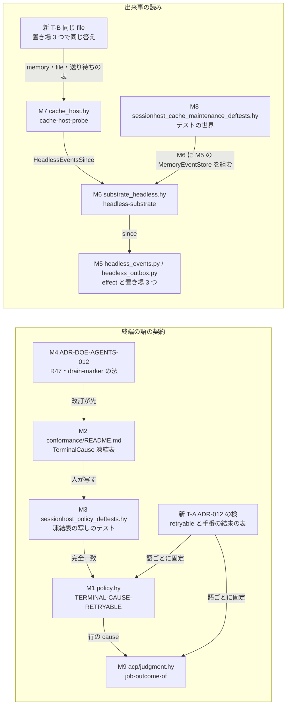

# 依頼書 P の設計検証 — 凍結表の host_drained と cache 維持のテストの世界

依頼: lt-8VE8M7SAMSXSDVCRVWS033AGJD(agora-redesign#639 実装依頼書 P)・設計者 = 会話 c-H1T2C9QC9RY2X86MFDJ0356MV4(claude-opus-5-5)

## 1. 完了の範囲と順序

- 完了の範囲: **実装完了まで**。
- 依頼書の本体(README の凍結表・2 本のテスト)は本線 c98fd834913104c2026ef8e78f309b1c3ab90b30 に着地済み(land L392・2026-09-26 07:37 JST)。
- **順序の逸脱**: この設計検証は本体の着地の**後**に行った。依頼文に設計検証の節が無く、完了の検査で要ると知ったため。
  事前の主張(`design-before-blind.md`)は盲検の前に固定したが、実装を見た後で書いたものである。
- 盲検 A・B の反例を受けて足したテスト 2 本(T-A = ADR-012 の検・T-B = cache 維持のテスト)と、テストの世界の直し 2 つと、
  検査資産の台帳の更新(137 → 138)は、この記録と同じ branch `wt/639-P-design-check` で着地する(本書 6 節)。
  検の commit(本線 a492bd01 の上で 0fed5c44)が先、この記録の commit が後。着地の列が本線の上へ当て直すと sha は変わる。
  本番の source は変えていない。

## 2. 全体の図

M9(`job-outcome-of`)と T-A・T-B は、盲検の後に足した(事前の主張には無い)。

## 3. 事前の主張(盲検の前に固定)

- `design-before-blind.md` sha256 = `c2d714960b9646b924650675a806ee66df049e27136fc0cd128e55bf6d36e156`
- 盲検 A・B に渡した入力 `blind/blind-input.md` sha256 = `82cdc8cfba70d007a06170c9ad24b3d34dafc5c1eb4490d96f822ca6275e5a6c`

主張の要旨:

| シナリオ | 変更の例 | 主張 | 予想した波及 |
| --- | --- | --- | --- |
| S1 effects | 終端の語を足す・retryable を変える | M1〜M4 の 4 か所が共同の不変条件として変わり、M5〜M8 は変わらない。doeff 側が持つのは語の表だけ | M1・M2・M3・M4 |
| S2 storage | 出来事の置き場を替える | M5 と host の組み立てだけが変わる。M7 と M8 は置き場を知らない | M5 |
| S3 simulation | 仮想の時計で cache 維持を回す | 時刻は M8 の ClockNow と積む行の at だけから決まる。登記簿の時計は probe の路で読まれない | なし |

不適用: hardware(機体の種類で分かれる判断が無い)・distribution(再配置の判断は ACP 側)・concurrency(テストの世界は単一の thread。append と since の並行は M5 の契約)。

## 4. 責務(盲検の後の形)

| id | 実体 | 責務 | 隠す知識 |
| --- | --- | --- | --- |
| M1 | `sessionhost/policy.hy` `TERMINAL-CAUSE-RETRYABLE`・`make-cause` | 行の終端の語と retryable の対応(session の wire の値) | なし(公開の表) |
| M2 | `conformance/README.md`「TerminalCause 凍結表」 | 事象 → category → retryable の契約の文 | なし |
| M3 | `tests/sessionhost_policy_deftests.hy` `test-terminal-cause-retryable-frozen-table` | M2 の写しと M1 の完全一致 | なし |
| M4 | `docs/adr/defadr_doeff_agents_012_agentd_acp_arms.hy` R47 ほか | 表を変える理由と時機 | なし |
| M5 | `sessionhost/headless_events.py`・`headless_outbox.py` | 出来事の effect と置き場 3 つ | 置き場の物理 |
| M6 | `sessionhost/substrate_headless.hy` `headless-substrate`・`HeadlessRegistry` | effect を登記簿の置き場へ渡す | 置き場の種類 |
| M7 | `sessionhost/cache_host.hy` `cache-host-probe` | cache ping の結果を読み、成功・失敗・不明を決める | 置き場 |
| M8 | `tests/sessionhost_cache_maintenance_deftests.hy` のテストの世界 | 仮想の時計・receipt・応答の台本 | 置き場の物理 |
| **M9** | `sessionhost/acp/judgment.hy` `job-outcome-of` | 行の終端を agent-job の結末(R47 の 5 語 + reason + condition)へ写す。done / host_drained / それ以外の 3 つに分け、retryable は読まない | ACP の配達の予算の分け方 |

## 5. 盲検 A・B

起動の記録は `blind/blind-meta.md`。第 1 候補 gpt-6-astra(low)は A・B とも `401 Unauthorized` で失敗し、
第 2 候補 Opus 5.5(Agent tool・effort は指定できず未確認)で実行した。返答は `blind/blind-a-return.md`・
`blind/blind-b-return.md`(未加工)。

| | 反例 | 設計者の再現 | 成立 |
| --- | --- | --- | --- |
| A | 凍結表の retryable を変えても(M2・M3 を揃えても)agentd の路の手番の結末は変わらない。M9 が category の名だけで結末を決め、retryable を読まない | `evidence/repro-a.log`: context_exhausted・run_failed・cancelled・host_drained の 4 語とも、反転の前後で結末が同じ | 成立 |
| B | cache ping の失敗の理由に子の stderr の尾を足す実装が、`HeadlessEventsSince(locator + STDERR-SUFFIX)` で読む。焦点の 3 file は緑のまま、file の置き場だけ理由が変わる | `evidence/repro-b.log`: 差分を当てても 100 passed。理由は memory = `provider-error`・file = `provider-error: API Error: 529 overloaded`・送り待ちの表 = `provider-error` | 成立 |

## 6. 分類と修正

### A(S1)

- **分類**: 事前の主張の前提「doeff 側が持つのは語の表だけ」が偽だった。行の終端の語は M9 でも読まれ、agentd の路の結末は
  M9 が決める。M9 の分岐は「計画された停止か」という M1 と別の判断で、retryable の写しではない(host_drained は
  retryable かつ計画された停止、vanished は retryable だが運び手の失敗)。だから A の「M1 の知識の持ち直し」は成立しないが、
  **2 つの契約(session の wire の retryable と agent-job の結末)を結ぶテストが無く、M1 だけを変える変更が agentd の路で
  黙って効かない**という強制の穴は成立した。
- **修正(この記録の commit)**: T-A `docs/adr/defadr_doeff_agents_012_agentd_acp_arms.hy::test-adr-doe-agents-012-every-session-category-pins-its-retryable-next-to-its-job-outcome`
  (R47 (3) の針・検査資産の台帳 `adr_deftest_enforcements` 137 → 138)。M1 の語ごとに、行の retryable と、
  その語の行の session の眺め(SessionView)を job-outcome-of に通した(結末の category, reason, condition)を組み、固定の表と
  完全一致で比べる。語を足す・retryable を変えると、M3 を揃えても T-A が赤になり、agentd の路の結末をその場で決めることになる。
- **置き場の理由**: 初めは agentd のテスト(`test_sessionhost_acp_ended_cause.py`)に置いたが、変更箇所の品質検査が
  `dependency-not-allowed` で断った(module 契約 `agentd-tests` は sessionhost の policy・store に依存してよいと宣言していない)。
  M1(sessionhost-policy)と M9(agentd-judgment)の両方を読んでよいと契約が宣言している検の module は `adr-agents-012` だけで、
  R47 は M9 の写しの規則を持つ法なので、その針として置いた。契約の許可を広げる形と、契約に登録されていない file へ置いて検査を
  逃れる形は取らなかった。
- **再検証**: `evidence/negative-a.log`。A-1(M1 と M3 を揃えて context_exhausted を true)= M3 は緑・T-A だけ赤
  (「行の終端の語の retryable と agentd の路の結末の表が食い違う」)。A-2(M1 と M3 に新しい語 host_retired を足す)= T-A だけ赤。
  戻すと 3 passed。

### B(S2)

- **分類**: 隠すはずの知識の漏洩(M5 の file の置き場の物理 `<locator>.stderr` が M7 へ出る)と、強制の欠け
  (M7 を置き場ごとに走らせるテストが無い)。根は、locator が型の無い文字列で、置き場ごとに解き方が違うこと
  (memory・送り待ちの表は `key_of_locator` で解き `op = 'ping-err.stderr'` になる・file は生の path として開く)。
- **修正(この記録の commit)**: T-B `packages/doeff-agents/tests/sessionhost_cache_maintenance_deftests.hy::test-cache-probe-answers-the-same-on-every-event-store`。
  同じ出来事(stdout の行と stderr の行)を package の 3 つの置き場(`MemoryEventStore`・`FileEventStore`・`OutboxEventStore`)に
  積み、成功と失敗の 2 つの台本で `cache-host-probe` の答え(state・reason・reply)が同じことを検める。
  あわせて M8 の locator を M5 の定数(`EVENTS-SUFFIX`・`CACHE-MARK`)から組むように直した(A の補足が指摘した綴りの写し)。
- **再検証**: `evidence/negative-b.log`。B の差分を当てた作業樹に T-B を入れると、T-B だけ赤
  (`置き場で答えが変わった(failed)` — file だけ stderr が混ざる)。
- **この変更の範囲の外に残すもの**: locator を閉じた型にし、正規の 2 形の外を全ての置き場で断る根の修正は、M5 の契約
  (094424fc)の変更になる。`cache_host.hy` の `(+ events-path ".cache-" suffix)`・`headless.hy`・`acp/fake.py` の綴りの写しも同じ。
  依頼者へ引き継ぐ(8 節)。

### S3

- 盲検はどちらも S3 の反例を出さなかった(A はコードを読んで主張どおりと述べた)。反例が出なかったことを合格の根拠にせず、
  次の実験を行った。
- **修正(この記録の commit)**: `test-clock-swapped-idle-cleanup-ping-and-next-cycle` の登記簿に「読まれたら落ちる時計」を持たせた
  (以後、probe の路が登記簿の時計を読むとこのテストが赤になる)。
- **実験**: `evidence/experiment_s3.py`・`evidence/experiment-s3.log`。正常例 = 落ちる時計を持つ登記簿とテストの世界で probe が成功。
  反例 = テストの世界を外すと `ClockNow` が未処理で止まる(package の handler は壁時計で黙って答えない)。

## 7. 強制の方法(実装後)

| 守る責務 | 強制方法 | 実装箇所 | 実行経路 | 限界 |
| --- | --- | --- | --- | --- |
| M1 の黙った変更を赤にする | M3 の完全一致 | `tests/sessionhost_policy_deftests.hy::test-terminal-cause-retryable-frozen-table` | 焦点の pytest・日次の `make test-packages` | M2(README の文)と M3 の一致は人が写す。README は CamelCase のラベルと複数の事象の行を持つ文の表で、機械では比べていない |
| M1 の変更が M9 の結末の判断を通る | T-A(語ごとの retryable と結末の完全一致) | `docs/adr/defadr_doeff_agents_012_agentd_acp_arms.hy::test-adr-doe-agents-012-every-session-category-pins-its-retryable-next-to-its-job-outcome` | 焦点の pytest・日次の根の pytest(testpaths の `docs/adr`) | agentd の路に retryable を運ぶべきか(ACP の配達の予算の設計)は決めていない。T-A は「決めずに変える」を止めるだけ |
| M7 が置き場を知らない | T-B(置き場 3 つで同じ答え) | `tests/sessionhost_cache_maintenance_deftests.hy::test-cache-probe-answers-the-same-on-every-event-store` | 同上 | 置き場 3 つの挙動が偶然そろう読み方は止めない。locator の型は開いたまま(8 節) |
| M8 が置き場の物理を持たない | M8 は M6 に M5 の fake を組み、locator は M5 の定数で組む | `tests/sessionhost_cache_maintenance_deftests.hy` | 同上 | 「テストの中で effect の答えを手で書かない」は規約で、機械の拒否は無い |
| 時刻が仮想の時計だけから来る | 登記簿の時計を落ちる時計に | 同じ file の `test-clock-swapped-idle-cleanup-ping-and-next-cycle` | 同上 | `cache-host-probe` が壁時計を直接読む形(effect を通さない)は、台本の時刻が揃っている限り止めない |

T-A は ADR-012 の検として置き、検査資産の台帳を同じ commit(検の commit)で 137 → 138 に上げた。T-B は R47 や法の :enforcement の一覧には
足していない(実行経路は pytest の収集と日次の `make test-packages`)。

## 8. 予想と実際の波及

| シナリオ | 予想 | 実際 | 差の理由 |
| --- | --- | --- | --- |
| S1 | M1・M2・M3・M4 | 語の表の変更は M1〜M4 に加え、agentd の路の結末を変えるなら M9 と ACP の契約(R47 の結末の語)も変わる。変えないなら M9 は変わらないが、T-A の表は必ず変わる | 前提「doeff 側が持つのは語の表だけ」が偽(M9 が行の語を読む)。M9 と R47 は公開の契約で、変えるなら正当な契約の拡張 |
| S2 | M5 | M5 と host の組み立てだけ。T-B で M7 の答えが置き場に依らないことを 3 つの置き場で確かめた | なし。ただし B の形の読み手は T-B までは止まらなかった(強制の欠け — T-B で塞いだ) |
| S3 | なし | なし | — |

## 9. 検証の記録

| 何を | 版 | 命令 | 結果 | 記録 |
| --- | --- | --- | --- | --- |
| 直す前の赤 | 294aac38 | `pytest -q -m 'not e2e' -rf --tb=line test_sessionhost_policy.py test_sessionhost_cache_maintenance.py` | 2 failed, 80 passed(M3 の AssertionError・`HeadlessEventsSince` の UnhandledEffect) | `evidence/before-fix.log`・`before-fix.out` |
| 盲検 A の再現 | 72da0ff1 | `uv run --no-sync python evidence/blind-a/retryable_flip_probe.py` | 4 語とも結末が変わらない | `evidence/repro-a.log` |
| 盲検 B の再現 | 72da0ff1 + B の差分 | `evidence/repro_b_probe.py` と焦点の 3 file | 100 passed・file だけ理由が変わる | `evidence/repro-b.log` |
| 正常例(Mac) | 72da0ff1 + この commit の変更 | 焦点の 6 file(ADR-012・台帳・policy・cache_maintenance・acp_ended_cause・headless_events) | 186 passed | `evidence/positive-after.log`・`positive-after.out` |
| 正常例(Linux・zeus) | 同上 | 同上(`remote_check.py --node zeus`) | `remote-check: ran=remote node=zeus rc=0`・186 passed | `evidence/zeus-after.out` |
| A の反例 | 72da0ff1 + T-A + 表の書き換え | `test_sessionhost_policy.py` と ADR-012 を `-k 'frozen_table or pins_its_retryable'` | A-1・A-2 とも T-A だけ赤 | `evidence/negative-a.log`・`negative-a-*.out` |
| B の反例 | 72da0ff1 + B の差分 + T-B | `test_sessionhost_cache_maintenance.py` | 1 failed(T-B)7 passed | `evidence/negative-b.log` |
| S3 | 72da0ff1 + この commit の変更 | `evidence/experiment_s3.py` | 正常例 succeeded・反例 UnhandledEffect ClockNow | `evidence/experiment-s3.log` |
| 正常例(Mac・本線の上) | a492bd01 の上へ載せ直した 0fed5c44 | 焦点の 6 file(上と同じ) | 186 passed | `evidence/positive-after-rebase.out` |
| 正常例(Linux・zeus・本線の上) | 同上 | 同上(`remote_check.py --node zeus`) | `remote-check: ran=remote node=zeus rc=0`・186 passed(出力に本線 1e4e10be の R49 の検の文が出る = 載せ直した版が走った) | `evidence/zeus-after-rebase.out` |

反例の実験は、記録を置いていない作業樹(`doeff-wt-639-P-blind`)で差分を当てて行い、終わった後に HEAD の中身へ戻した。

変更箇所の品質検査(`code-quality --scope changed`・速い段 = 型検査を含まない)は **failed** のまま。
基底 72da0ff1 の版(`evidence/code-quality.log`)で名指しは ADR-012 の 6 行、本線 a492bd01 の上へ載せ直した版
(`evidence/code-quality-after-rebase.log`)で 7 行(163 の `dependency-not-allowed` × 2・5254・5299・5300 の
`dependency-not-allowed`・5323 の `untyped-boundary`・5363 の `dependency-uncontracted`)。どれもこの commit が触っていない
既存の行で(163 は本線の 1e4e10be・残りは f271ae39 と 870066f2 の行)、比べた結果は変更後 7 件・変更前 7 件、増えた違反は無い。
足した検(T-A)は 4158 行から始まり、名指しに入っていない。ADR-012 はこれらの違反を基底の登録簿に持たないので、この file に
触れる変更は今日どれもこの検査で赤になる。合格とは数えない。

## 10. 引き継ぎと未確認

- 引き継ぎ(依頼者へ): (1) agentd の路で手番の結末に retryable を運ぶべきか、M9 の分け方を R47 でどう宣言するか(ACP の配達の予算の設計)。
  (2) locator を閉じた型にし、正規の 2 形の外を全ての置き場で断る(M5・094424fc の契約)。`cache_host.hy`・`headless.hy`・`acp/fake.py` の綴りの写しもその時に 1 点へ寄せる。
  (3) ADR-012 の既存の違反 7 件(上の品質検査)を直すか基底の登録簿へ載せる。
  どれもこの依頼書の範囲(テスト 2 本を契約へ合わせる)の外で、この記録は強制の穴を T-A・T-B で塞ぐところまで。
- 未確認: ACP 側が session の snapshot の retryable を今も読むか(盲検 A の推測。ACP の repo は読んでいない)。
  盲検の第 2 候補の実際のモデルと effort(起動口が返さない)。
