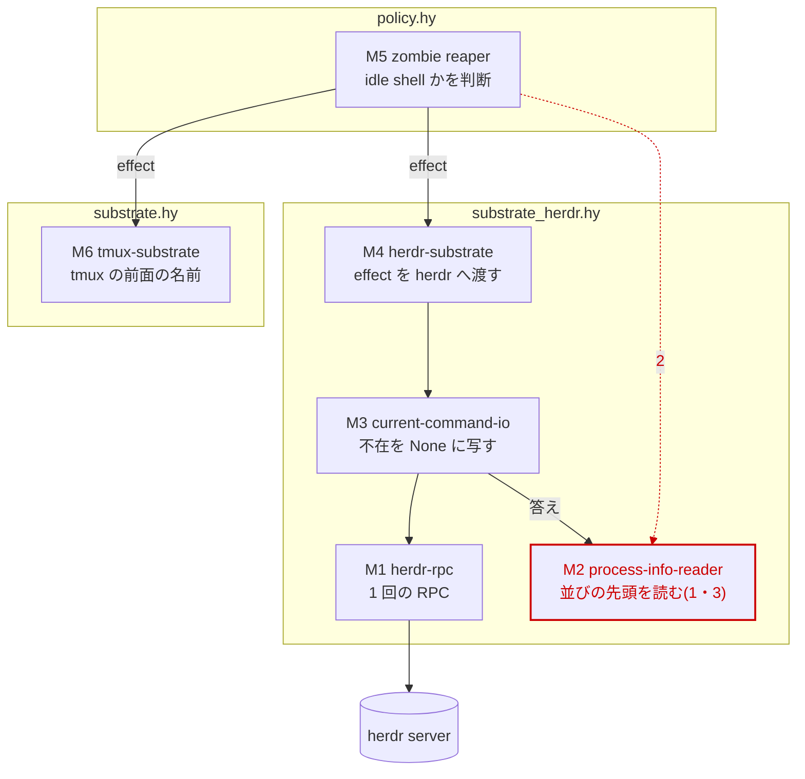
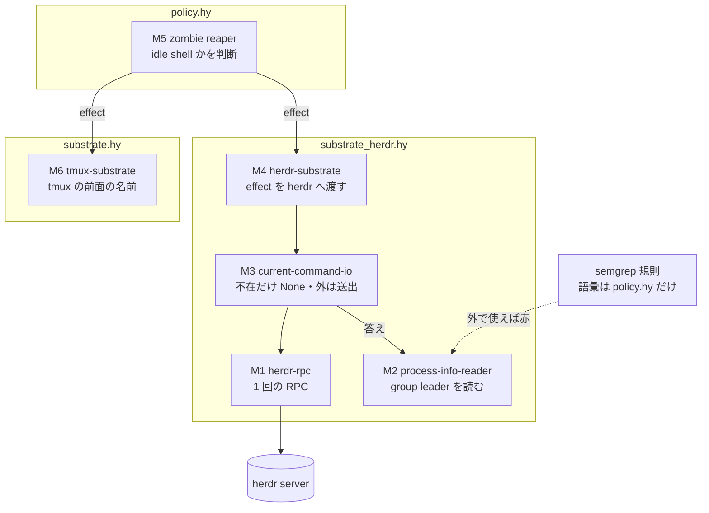

# herdr の前面の command の読み — 設計検証の記録

依頼: lt-8BDJEXK2W793EAYX11SYS9JQXN(agora-redesign#639 実装依頼書 H)
著者: 会話 c-DDDFCJNFJX7VJ1YMB13DPQYPCY・claude-opus-5-5・effort xhigh(自己申告)
作成: 2026-09-26 JST
完了の範囲: **実装完了まで**。本線に着地済み — L393(6fdccb9e 検の先行・72da0ff1 修正)と、設計検証を受けた L394(b57fe3dc 検と規則の先行・7feba2c5 修正)。
基準の版: 変更前の本線 294aac38e5708f400f0fba951a608ca3bf7a8e4a。

## 0. 全体の図(設計検証の前 ⇒ 後)

設計検証の前(72da0ff1 — 盲検 A・B が反例を作った断面)。赤が反例と実測で見つかった所(番号は図の下の表)。

| 番号 | 見つかったこと |
| --- | --- |
| 1 | 実測(盲検 A・B の補足が指した): 前面の job の並びは Linux が pid の昇順、macOS が降順。並びの先頭を読む M2 は同じ job から機体で違う名前を返す(`bash -c 'sleep 30; true'` → Linux = bash・Mac = sleep) |
| 2 | 盲検 B: M2 が policy の `IDLE-SHELL-COMMANDS` を import して「shell でない最初の process」を選ぶ差分は、既存の検査を全部通り、zombie 判定の一部を substrate へ移す |
| 3 | 盲検 A: 答えに答えた herdr の版が載らないので、版ごとに厳しく読むには M2 の外(M1 / M3)から版を渡す必要がある |

設計検証の後(7feba2c5)。同じ配置・同じ名。

| 箱 | 実体 |
| --- | --- |
| M1 herdr-rpc | `substrate_herdr.hy` の `herdr-call`(1 回の RPC・error 封筒を `HerdrApiError` に) |
| M2 process-info-reader | 同 `herdr-foreground-command`(`pane.process_info` の答え → 前面の command 名。契約の外は `HerdrContractError`) |
| M3 current-command-io | 同 `herdr-pane-current-command-io`(`pane_not_found` だけ None) |
| M4 herdr-substrate | 同 `herdr-substrate` の `TmuxPaneCurrentCommand` の腕 |
| M5 zombie reaper | `policy.hy` の zombie 判定と `IDLE-SHELL-COMMANDS` |
| M6 tmux-substrate | `substrate.hy` の tmux の `#{pane_current_command}` |
| semgrep 規則 | `.semgrep.yaml` の `doeff-agents-idle-shell-vocabulary-is-policy-owned` |

## 1. 事前の主張(盲検の前に固定)

`design-before-blind.md`(sha256 29f3a739bb3c71e5a742b6586964cd2e5c3ac68f686c6a35eae20b5a920a0e2a・盲検の起動より前の 07:46 JST に保存)に固定した。要点:

- 要件: `herdr-pane-current-command-io` は herdr の契約で保証された欄から前面の command を読み、欄が無い時に KeyError にも黙った既定値にもせず、契約の外は型のある失敗で名指す。`argv0` の無い答えの単体の検を足し、直す前の形で赤。
- 責務: M1 herdr-rpc・M2 process-info-reader・M3 current-command-io・M4 herdr-substrate・M5 zombie-reaper・M6 tmux-substrate(表は design-before-blind.md の 2 節)。
- S1(hardware): platform の差は M2 で吸収し、M3・M4・M5 は変わらない。前提 = 差は欄の有無と値の形にだけ現れる。
- S2(effects): (a) 保証欄が増えたら M2 だけ、(b) 不在の error code が増えたら M3 だけ。
- S3(simulation): 記録した答えを M2 に dict で渡すか偽の socket から M3 に返すだけで再現でき、本体は変わらない。
- S4(concurrency): 並行に読んでも M1・M2・M3 は変わらない。
- storage・distribution は対象外(理由は design-before-blind.md の 3 節)。
- 強制(事前): M2 の表の検・M3 の偽の socket の検・実 herdr の smoke・`HerdrContractError` と `HerdrApiError` の型の分離・defk の台帳。「process_info を読むのは M2 だけ」「idle shell の判断は M5 だけ」の静的な規則は**無かった**。

## 2. 盲検 A・B

| | A | B |
| --- | --- | --- |
| 依頼文 | 手順書の A の文 + `blind/blind-input.md` | 手順書の B の文 + `blind/blind-input.md` |
| 入力 | `blind/prompt-a.md`(起動時の /tmp/blind-herdr-argv0/prompt-a.md の写し)sha256 5e5b813aa2e6eb0b5ae0725c12e31612799529f30771b3ad49f1bbc1d1fac7e8 | `blind/prompt-b.md`(同じく写し)sha256 dfa2ba8bbb5e77a03476344ce2599de1056262031422ec4441d14e2b5579fa8d |
| 読み取り対象 | doeff 72da0ff1 の写し(`packages/doeff-agents`・`docs/adr`・`.semgrep.yaml`・`tests/semgrep`・`Makefile`・`.pre-commit-config.yaml`)と herdr 0.9.1 の source の抜粋・API 定義 | 同じ |
| 第 1 候補 | gpt-6-astra / effort low・`CODEX_HOME=~/.codex/profiles/personal codex exec -s read-only`・session 01a0dac0-33c4-7221-8c22-d932cef4eb45 → `401 Unauthorized`(`evidence/blind-codex-run-a.log`) | 同じ形・session 01a0dac0-33c9-7e00-b0dc-9a69a3a797ce → `401 Unauthorized`(`evidence/blind-codex-run-b.log`) |
| fallback | Agent tool・general-purpose・model=opus(要求 claude-opus-5-5 / xhigh — 起動口に effort の欄が無く指定できず。観測できたモデルは未確認)・agentId a8e7acbf56fa679eb・748 秒 | 同じ・agentId a3e46403be3507d2e・551 秒 |
| 文脈 | 親の会話を fork・resume せず新しい文脈。A・B は同じ 1 つの返事の中で同時に起動し、互いの返答を見ていない | 同じ |
| 機体・profile | proboscis-mbp(個人の Mac)・personal | 同じ |
| 返答(未加工) | `blind/blind-a-return.md` | `blind/blind-b-return.md` |

codex の personal profile の認証の失敗は、この依頼の範囲外として直していない(資格の置き場に触らない)。

## 3. 再現と修正

### 盲検 B — 成立(修正前)→ 拒否(修正後)

- 修正前: B の差分(`evidence/blind-b-diff.patch`)を 72da0ff1 に当て、B が挙げた検査を走らせた — pytest の M2 / M3 の検 2 passed・policy の zombie の検 1 passed・defk の台帳 1 passed・semgrep 0 findings(`evidence/blind-b-repro-before.log`、すべて exit 0)。違反も実測した: wrapper の job から `claude` を返し(先頭は bash)、同じ答えから policy の語彙を変えると `nu` → `git` に変わる(`evidence/blind-b-violation-before.log`)。**反例は成立した**。
- 修正: 振る舞いと静的の両方で拒否する。
  - M2 は名前で process を選ばず、前面の process group の leader を読む(次節の実測と同じ修正)。表の検が「leader が shell でも leader を返す」「両方の並び順で同じ名前」を求める。
  - semgrep `doeff-agents-idle-shell-vocabulary-is-policy-owned`: `IDLE-SHELL-COMMANDS` を sessionhost の中で policy.hy の外から使うと ERROR。検体 `tests/semgrep/fixtures/python/packages/doeff-agents/src/doeff_agents/sessionhost/idle_shell_vocabulary_outside_policy_forbidden.hy` と検体の検 `tests/semgrep/test_vm_failfast_semgrep_rules.py::test_idle_shell_vocabulary_rule_detects_substrate_side_judgement`(発火 = 9 行目・13 行目)。台帳 `docs/adr/enforcement-ledger.json` の規則の数 274 → 275。
  - B の「別の抜け道」(M3 が `HerdrContractError` を None に畳む)も、M3 の偽の socket の検に契約の外の答えを 1 通足して拒否する。
- 修正後: 同じ B の M2 を当てると、semgrep が 3 か所で ERROR(exit 1)・M2 の表の検が並び順の行で赤(`evidence/blind-b-repro-after.log`)。**拒否を観測した**。

### 実測 — 並び順の platform 差(A・B の補足が指した)

Mac と zeus の実 herdr 0.9.1 で、作業用の workspace を作り前面の job を 2 通り立てて読んだ(作った workspace は閉じた)。

| 前面の job | Linux(zeus)の並び | Mac の並び | group id |
| --- | --- | --- | --- |
| `sleep 30 \| cat` | sleep, cat | cat, sleep | sleep の pid |
| `bash -c 'sleep 30; true'` | bash, sleep | sleep, bash | bash の pid |

記録 = `evidence/order-probe-mac.log`・`evidence/order-probe-zeus.log`(`evidence/order_probe.py`)。事前の S1 の前提「差は欄の有無と値の形にだけ現れる」は**偽**だった。修正は M2 の 1 定義で済んだ(S1 の主張「M2 だけ」は成立): 並びの先頭ではなく `pid = foreground_process_group_id` の leader を読む。tmux の `#{pane_current_command}` も tcgetpgrp の process を読むので、M4 と M6 が同じ effect に同じ意味で答える。leader が答えに居ない・group id が無い時は前面不明(None)。検の先行 b57fe3dc で 72da0ff1 の M2 が赤になり(`evidence/tests-red-leader.log`)、7feba2c5 で緑。

### 盲検 A — 版ごとの厳しさは M2 の契約の外と定めた

- 再現: API 定義(protocol 22)の `PaneProcessInfo` の欄に版は無く、`server.live_handoff` に `expected_protocol` がある。M2 は同じ答え X を版にかかわらず `'zsh'` と読む(`evidence/blind-a-repro.log`)。「protocol 23 の server が X を返したら名指す」は X の関数では書けない — A の主張どおり。
- 判断(戻せる決定・この席で決めた): M2 の契約は **doeff が対応する herdr の版の和集合** とし、docstring に明記した。理由: 答えに版が載らない・Mac と Linux の herdr は別々に上がる・同じ socket の下で版を替える live handoff もある。版ごとの厳しさには M2 の公開の形の拡張(版の引数)と M3(場合によって M1)での版の取り寄せが要り、要件 H の外。版の追随は ADR-DOE-AGENTS-004 R12 の再実測(conformance/herdr-physics.md)が持つ。
- したがって A の例は「前提(契約の読み方)を変える例」で、S2(a) の主張「保証欄が増えたら M2 だけ」は和集合の契約の下で成立する(`evidence/scenarios-after.log` の S2(a)・表の検の「argv0 を埋める版と埋めない版の両方を読む」行)。
- ただし事前の主張(design-before-blind.md の S2)が書いた前提は「封筒の形は変わらない」だけで、「版ごとには読み分けない」は書いていなかった。**前提の書き漏れ**として記録し、予想範囲は広げない。版ごとの厳しさを要求に足せば、変わるのは M2 の公開の形(版の引数)と M3 の配線(版の取り寄せ)で、これは公開契約の意図した変更であり、M2 が隠す知識(欄の読み方)の漏れではない。

## 4. 予測と実測の比較

| シナリオ | 事前の予想 | 実測 | 差の理由 |
| --- | --- | --- | --- |
| S1 hardware | M2 のみ | M2 のみ(leader の読み)。M3・M4・M5・M6 は不変 | 前提が偽だった(並び順も違う)が、直しは M2 に閉じた |
| S2 effects | (a) M2・(b) M3 | (a) 未知の欄を足した答えを今の M2 が読める・読む欄を足すなら M2 の 1 点 (b) 未知の code は HerdrApiError のまま送出 — 足すなら M3 の except の 1 点 | 盲検 A: 版ごとの厳しさを求めると M2 の公開の形と M3 の配線も変わる。事前の主張は「版ごとには読み分けない」前提を書き漏らしていた — 前提として記録し、契約を和集合と定めた |
| S3 simulation | 本体 0 箇所 | 記録した zeus の答えを偽の socket から再生して `'zsh'`・契約の外の答えは HerdrContractError(本体は無改変) | 差なし |
| S4 concurrency | 0 箇所 | 16 並行で 16 件 `'zsh'`・1 通だけ契約の外なら HerdrContractError 1 件と `'zsh'` 15 件 | 差なし |
| 盲検 B(S1 の M2 の独立) | — | 修正前は検査を全部通って M5 の判断が M2 へ移った | 静的な規則が無かった。規則と振る舞いの検を足して拒否 |

実験 = `evidence/experiments_scenarios.hy`(修正後)・`evidence/experiments_scenarios-72da0ff1.hy`(修正前)、記録 = `evidence/scenarios-after.log`・`evidence/scenarios-72da0ff1.log`。

## 5. 強制の方法(修正後)

| 守る責務 | 強制 | 実装箇所 | 実行経路 | 限界 |
| --- | --- | --- | --- | --- |
| M2 が保証欄から leader を読み、契約の外を名指す | 振る舞いの検(契約の中 16 通りの答え・契約の外 11 通り)・`:pre (: result dict)`・`:post (: % (| str None))` | `packages/doeff-agents/tests/sessionhost_substrate_herdr_deftests.hy::test-herdr-foreground-command-follows-the-process-info-contract` | pytest(名指し・日次) | herdr の API 定義と検の表を突き合わせる自動の検は無い(版が上がっても検は気づかない — R12 の再実測が持つ)。leader が 2 度載る答えを名指す腕には検が無い |
| M3 の不在の写像と、契約の外を None に畳まない | 偽の herdr socket の検(zeus の実物・鍵の省略・pane_not_found・別の code・契約の外) | 同 file `test-herdr-pane-current-command-reads-answers-without-argv0` | pytest | 偽の socket は実物ではない(実物は smoke) |
| idle shell の判断は M5 だけ | semgrep `doeff-agents-idle-shell-vocabulary-is-policy-owned`(sessionhost の中で policy.hy の外の `IDLE-SHELL-COMMANDS` / `IDLE_SHELL_COMMANDS` を ERROR) | `.semgrep.yaml`・検体と検体の検(上記) | pre-commit の semgrep hook(変更 file)・`make lint-semgrep`・pytest の検体の検 | 語彙の集合を**写して**書く(`#{"zsh" "bash" …}` を substrate に置く)形は名前の regex では捉えない。振る舞いの検(leader が shell でも leader を返す)が補う |
| `pane.process_info` の答えを読むのは M2 だけ | **静的な規則は無い**(事前の表と同じ)。実験の走査で、欄の名と正規化の語が M2 の定義の外に 0 件・`substrate_herdr.hy` の外で `process_info` を読む source が 0 件であることを見た | `evidence/experiments_scenarios.hy` の走査 | 設計検証の実験だけ(通常の変更の経路からは呼ばれない — 未接続) | 別の関数が `foreground_processes` や `argv0` を直に読んでも、どの検査も拒否しない |
| 前面 = group leader(tmux と同じ意味) | 振る舞いの検(両方の並び順・wrapper の job・leader 不在・group id 無し) | 表の検 | pytest | tmux の側(M6)が leader を返すことは tmux の定義に頼る(検は無い) |
| 実 herdr での寿命 | smoke の検(実 herdr が無ければ skip) | `test-herdr-lifecycle-smoke` ほか | pytest(Mac・zeus で実走) | herdr の無い機体では skip |
| 契約の外は `HerdrApiError` と別の型 | 型(`HerdrContractError` は `HerdrApiError` の子ではない) | `substrate_herdr.hy` | 検が `except [HerdrContractError]` で受ける | 呼び手が `RuntimeError` で広く受ければ区別は消える |
| 関数は defk | ADR-DOE-HY-004 の台帳 | `docs/adr/defadr_doeff_hy_004_defk_only.hy` | pytest | 本数だけを見る |

pre-commit の semgrep hook 2 本から `tests/semgrep/fixtures/` を外した(`.pre-commit-config.yaml`)。検体は違反をわざと書いた file で、外さないと発火すべき検体を足す commit が毎回止まる(この作業で実際に止まった)。検体は pytest の検体の検が極性つきで検める。

## 6. 実装の証拠

| commit | 内容 | 着地 |
| --- | --- | --- |
| 6fdccb9e | 検の先行: argv0 の無い答え(zeus の実物)の検 2 本。本体は 294aac38 と同じ。M3 の偽の socket の検が日次と同じ `KeyError: 'argv0'`(substrate_herdr.hy:444)で赤。M2 の表の検は M2 が未定義のため `ImportError` で赤 — こちらは狙った検出に数えない(`evidence/acceptance-red-before-fix.log`) | L393 |
| 72da0ff1 | M2 を足し、保証欄から読む・`HerdrContractError`・pane_not_found だけ None | L393 |
| b57fe3dc | 検と規則の先行: leader の検(72da0ff1 の M2 で赤 — `evidence/tests-red-leader.log`)・M3 の契約の外の検・semgrep の規則と検体・台帳・pre-commit の検体の除外 | L394 |
| 7feba2c5 | M2 が group leader を読む・読む欄の型の検め・版の和集合の明記・physics の追補 | L394 |

名指しの実行(受入):
- Mac: `uv run --no-sync pytest -q packages/doeff-agents/tests/test_sessionhost_substrate_herdr.py tests/semgrep/test_vm_failfast_semgrep_rules.py::test_idle_shell_vocabulary_rule_detects_substrate_side_judgement` → 21 passed・skip 無し(`evidence/acceptance-green-mac-leader.log`)。72da0ff1 の時点の 20 passed は `evidence/acceptance-green-mac-rebased.log`。
- zeus(Linux): `remote_check.py --node zeus … pytest -q -m 'not e2e' <同じ 2 つ>` → 21 passed・skip 無し・rc=0(`evidence/acceptance-zeus-leader.log`)。72da0ff1 の時点の 20 passed は `evidence/acceptance-zeus-green-rebased.log`。
- 隣の検: ADR-004 の `test_adr_doe_agents_004_herdr_identity_pure_rules` と policy の zombie の検 → 2 passed(`evidence/acceptance-adjacent.log`)。
- semgrep の規則: 検体の検 2 passed・規則を src へ当てて 0 findings(81 規則・82 file — `evidence/semgrep-rule.log`)。
- 変更箇所の品質検査: `code-quality --scope changed --base 294aac38` → passed。ただし触った file は検査の対象に未登録で、中身は測られていない。型検査もこの段では走らない(`evidence/code-quality.log`)。

## 7. 決めたこと(戻せる決定の記録)

| 決定 | 採った案と理由 | 戻す手順 |
| --- | --- | --- |
| 前面の command = 前面の process group の leader | tmux と同じ定義・platform の並び順に依存しない(実測)。leader 不在は None | M2 の `(lfor proc procs :if (= (get proc "pid") pgid) proc)` を先頭の読みに戻し、表の検の並び順の行を外す |
| M2 の契約 = 対応する版の和集合 | 答えに版が載らず、版ごとの厳しさには M2 の公開の形と M3(場合によって M1)の拡張が要る(盲検 A) | 版を渡す引数を M2 に足し、M3 で `ping` を撃つ(A の返答の 2 節) |
| idle shell の語彙を policy の外で使うと ERROR | 盲検 B の差分が既存の検査を全部通った | `.semgrep.yaml` の規則・検体・検体の検を外し、台帳を 274 に戻す |
| pre-commit の semgrep から検体の dir を外す | 発火すべき検体を足す commit が止まる | `.pre-commit-config.yaml` の `exclude` 2 行を外す |

決めた席: 会話 c-DDDFCJNFJX7VJ1YMB13DPQYPCY・2026-09-26 JST。

## 8. 範囲の外で見つけたこと(申し送り)

- **wrapper で起動した agent の zombie 判定**(盲検 B の機能要求の側): 前面の job が `bash ./run-agent.sh`(leader = bash)の下で claude を子に持つ時、tmux も herdr も前面を `bash` と答え、M5 は生きた session を idle shell とみなしうる。これは M5 の判断の定義(tmux と共通)で、この依頼の変更で生まれたものでも変わったものでもない(修正前は Linux の herdr では同じく bash、Mac の herdr では並びの先頭の子 claude を返し、機体で食い違っていた)。wrapper の起動が実際にあるかは未確認。直すなら effect を job の構成まで広げて M5 が判断する形(両 substrate 共通)。
- personal profile の codex(gpt-6-astra)が `401 Unauthorized` で撃てない。
- zeus の herdr に以前の赤の実行が残した workspace が 2 つ(wC `doeff-herdr-smoke-3732204`・wN `doeff-herdr-smoke-794345`)。この作業では作っていないので閉じていない。smoke の検の後片付けは 6fdccb9e で足した。
