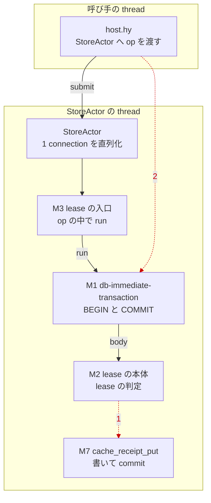
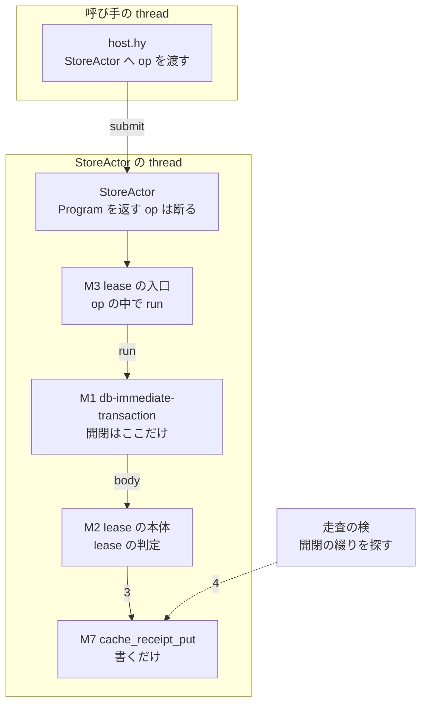

# sessionhost の store の transaction と lease — 設計検証の記録

依頼: lt-A5KGD83R9HQJ2K172V61A6VMG9(agora-redesign#639 実装依頼書 3)
著者: 会話 c-H7GK32T2PAMKR2TH41P5B1N834・claude-opus-5-5・effort xhigh(自己申告)
作成: 2026-09-26 JST

## 0. 全体の図(修正前 ⇒ 修正後)

修正前(a3f34bb6 — 盲検 A・B が反例を作った断面)。赤の点線が反例の路(番号は図の下の表)。

| 番号 | 反例 |
| --- | --- |
| 1 | 盲検 A: 本体から既存の helper を呼ぶと、helper の `conn.commit()` が本体の途中で transaction を終わらせる |
| 2 | 盲検 B: op が transaction の Program を実行せずに返し、呼び手の thread が actor の connection で実行する |

修正後(7d397f23)。同じ配置・同じ名。

| 番号 | 意味 |
| --- | --- |
| 3 | 本体は transaction の中で書くだけ。確定(COMMIT)は M1 が行う |
| 4 | `test_sessionhost_transaction_owner.py` が sessionhost の source を走査し、M1・`db-migrate`・`db-seed-from` の外に開閉の綴りが在れば赤にする |

StoreActor は op の戻りが Program / effect なら TypeError で断る。M1 は本体が transaction を閉じていたら名指して落とす。

## 1. 完了の範囲

**実装完了まで**。本線に入った変更は 2 回に分かれる。

| 着地 | 本線の commit | 中身 |
| --- | --- | --- |
| L380 | a3f34bb68d394c4153c7c7351f07801ebf2827ab | 依頼書 3 の本体: `store-write-failure-limit`(host.hy)と `db-immediate-transaction`(store.hy)を deff から defk へ。lease の 3 関数の本体をトップレベルの defk へ移す |
| L387 | d6fa0e044661f511aa19f9de5eba9f7f3809183f(テスト先行)・7d397f239efe363dbf70ff35ddb75c058b04e521(修正) | 盲検 A・B の反例を受けた境界の修正(本書 5 節) |

基準の版(変更前の本線): 7ef0fa772afca54684d5b75b51f286e6e1bb367d。

予定のまま残した物は無い。全体のテストは実行していない(日次の検証が行う — 本書 8 節)。

## 2. 固定した要件(受入条件)

1. host.hy の `store-write-failure-limit` と store.hy の `db-immediate-transaction` を deff から defk へ変え、呼び出し側を直す(ADR-DOE-HY-004 R1・R3)。deff の本数の上限の台帳(DEFF-ROSTER)は増やさない(host.hy 35・store.hy 35)。
2. `db-immediate-transaction` は transaction の本体を受け取る高階の形。本体を 1 度だけ実行し、ROLLBACK が元の失敗を隠さない性質(ADR-DOE-AGENTS-004 R15 の法 `store-transactions-surface-the-original-failure`)を保つ。
3. 受入の検: `docs/adr/defadr_doeff_hy_004_defk_only.hy::test_adr_doe_hy_004_deff_ratchet` の違反から host.hy・store.hy が消える。R15 の法 2 本の検と 331af8e2 の SQLITE_FULL の検が緑。

## 3. 事前の主張(盲検の前に固定)

盲検の反例を依頼する前に、責務・変更シナリオ・予想する波及・強制の方法を `design-before-blind.md` に固定した。

- `design-before-blind.md` sha256 = `d0a6707dc9c33d0da3a46d874ec628d209204c614adc56c0df45adcce2a21256`
- 盲検 A・B に渡した入力 `blind/blind-input.md` sha256 = `e3e5a0697f4f5d3a8f2120bf659ea1ac70ca168afaaae59eb7f95776fc4eed30`(事前の主張に、読む材料と検査の実行方法の節を足した物。設計者の自己評価・既知の反例・望む結論は入れていない)

主張の要点(逐語は上の file):

| シナリオ | 軸 | 変更 | 予想した波及 |
| --- | --- | --- | --- |
| S1 | storage | transaction の開き方を変える(BEGIN EXCLUSIVE・SQLITE_BUSY の時に本体を 1 度やり直す) | M1 のみ |
| S2 | effects | lease の本体が doeff の effect を出す(時刻を ClockNow で読む等) | M2・M3 |
| S3 | concurrency | transaction の操作を新しく足し、StoreActor の thread から呼ぶ | M2・M3(追加)。Program は actor の thread の中で値になる |
| S4 | simulation | lease の失効判定を固定の時刻の handler で決定的に試す | M2・M3 |
| — | hardware | 対象外(sqlite3 で 1 file を開くだけで、機体で分かれる判断が無い) | — |
| — | distribution | 対象外(host ごとに 1 file・1 connection。機体をまたぐ排他は R10 と配置側の責務) | — |

## 4. 責務(反例を受けた後の形)

事前の M1〜M6 に、盲検 A が示した M7 を足した。変更点は太字。

| id | 実体 | 責務 | 持つ知識 | 隠す知識 | 公開の形 |
| --- | --- | --- | --- | --- | --- |
| M1 | store.hy `db-immediate-transaction`(defk) | 明示の transaction を**開き、閉じる**唯一の点 | BEGIN IMMEDIATE・COMMIT・「transaction が残る時だけ ROLLBACK」・元の例外をそのまま出す・巻き戻しの失敗は note・**本体が閉じた時の名指し** | SQLite が SQLITE_FULL 等で自分で巻き戻す事情 | `(db-immediate-transaction conn body)` — body は Program。戻り = body の値。Program でない body は `:pre` で断る。**本体が transaction を閉じたら、成功の路は RuntimeError、失敗の路は元の例外に note** |
| M2 | store.hy `db-acquire-lease-body` / `db-heartbeat-lease-body` / `db-release-lease-body`(defk) | lease の判定 | lease の行の形・TTL・owner の比べ方 | transaction の開き方・閉じ方 | `(…-body conn owner-pid)` → Program |
| M3 | store.hy `db-acquire-lease` / `db-heartbeat-once` / `db-release-lease`(deff・台帳のまま) | StoreActor の thread の中で transaction の Program を値にする境界 | `run` を実行する位置(と、本体が effect を出す時の handler) | 本体の判定・transaction の開き方 | 名前・引数・戻り・例外は変更前と同じ |
| M4 | store.hy `StoreActor` | 単一の書き込み connection の直列化・書き込みの健康の数え | queue・thread・total_changes | SQL の中身 | `.submit actor op`。**op の戻りが Program / effect なら TypeError で断る(何も書かず、保管の失敗に数えない)** |
| M5 | host.hy `store-write-failure-limit`(defk)・`dispatch-method` の daemon.status | 書き込みの失敗が続いた時に readiness を落とす | 上限の設定(env `DOEFF_AGENTD_STORE_WRITE_FAILURE_LIMIT`) | 数え方(store_health) | daemon.status の ready / not_ready_reason |
| M6 | docs/adr/defadr_doeff_hy_004_defk_only.hy | 関数の語彙を defk へ寄せる台帳 | DEFF-ROSTER と走査 | — | file ごとの deff の本数 <= 台帳 |
| **M7** | cache_host_store.py `cache_receipt_put` 等 | 専用操作(cache ping)の記録の読み書き | 記録の状態遷移の規則 | **確定(commit)の時機 — 呼び手の connection に任せる** | `cache_receipt_put(conn, record)`。**commit しない** |

## 5. 盲検 A・B

### 起動の記録

| | A | B |
| --- | --- | --- |
| 役 | 現実的な将来の変更で複数の責務へ波及する反例 | 検査を通りながら責務分離を破る反例 |
| 識別子 | agentId a15d8ef679f1a673c | agentId a1510c7de7d77eb77 |
| 起動口 | Claude Code の Agent tool・subagent_type=general-purpose・model=opus | 同じ |
| 要求したモデル | claude-opus-5-5・effort xhigh(起動口に effort の欄が無く指定できなかった。実際のモデルは観測していない) | 同じ |
| 第 1 候補を使わなかった理由 | gpt-6-astra(low)は codex の実行ファイルがこの pod に無い(`codex --version` → command not found) | 同じ |
| 機体・profile | この pod(incarnation 20260925T055424Z)・この会話と同じ profile | 同じ |
| 文脈 | 親の会話を fork・resume せず新しい文脈で起動。相手の返答は見せていない(同じ返事の中で同時に起動) | 同じ |
| 起動 | 2026-09-25T20:51:07Z 頃 | 同じ |
| 所要 | 634003 ms・tool 42 回 | 1998434 ms・tool 84 回 |
| 入力 | `blind/blind-input.md` | 同じ |
| 返答(未加工) | `blind/blind-a-return.md` | `blind/blind-b-return.md` |

### 返された反例

- **A(S3 に対する波及)**: lease を持つ host だけが専用操作の送信前の記録を書けるようにする本体(M2)を足すと、既存の helper `cache_receipt_put` の `conn.commit()` が本体の途中で transaction を終わらせる。成功の路は `cannot commit - no transaction is active` になり、失敗の路はそれまでの書き込みが確定したまま残る。M1 は「transaction が無い = SQLite が自分で巻き戻した」と読むので、この 2 つを区別できない。直すには M7(専用操作の記録)の契約を変える必要があり、隠すはずの「transaction をいつ終えるか」が M7 へ漏れていた。
- **B(S3 に対する検査の素通り)**: actor の op が transaction の Program を実行せずに返す形(`(.submit actor (fn [conn] (db-immediate-transaction conn …)))` を `<-` で束ねる)は、deff の本数の検査・R15 の検・semgrep・doeff-hy-check・code-quality のすべてを通る。Program は actor の thread の外で actor の connection を使って走り、直列化・書き込みの健康の数え・journal の合図を素通りする。deff を増やさないための defk の形が、むしろこの誤りへ実装者を押す。
- B が指摘した「入力の基底の SHA `0e7a5aa6dd559a…` は存在しない」は確かめたが成り立たない。入力の 5 行目は 40 桁の `0e7a5aa6f6dd559a35448d33c08a97ed9786021d` で、この commit は repo に在る(B が 16 進の 2 文字を読み落としたと見る)。
- B は作業樹の `.venv/lib/python3.14t/site-packages/pytest/__pycache__/__main__.cpython-314.pyc` を 1 つ書いたと申告した。git の管理外で、HEAD と `git status` は変わっていない。消していない。

## 6. 再現と修正

### 反例の再現(設計者が実行)

- 再現の検体: `evidence/repro_counterexamples.hy`(共有の source は変えず、作業樹の module を import するだけ)。
- 修正前(`evidence/repro-before.log`・32a7cf1d の上): A の成功の路 = `OperationalError: cannot commit - no transaction is active`・記録は残る。A の失敗の路 = 元の RuntimeError だが記録は残る。B = op の戻りが `Expand`、actor の thread では何も書かれず、呼び手の thread で実行すると lease が書かれ、書き込みの健康は 0 のまま。**2 つとも成り立った。**

### テスト先行(d6fa0e04)

足した検と、修正前の結果(`evidence/tests-red.log` — 3 本赤・2 本緑):

| 検 | 修正前 |
| --- | --- |
| `packages/doeff-agents/tests/test_sessionhost_transaction_owner.py::test_only_the_transaction_type_opens_and_closes_transactions` — sessionhost の source を走査し、transaction を開閉する綴り(BEGIN / COMMIT / END / ROLLBACK / SAVEPOINT / RELEASE の SQL・commit・rollback・executescript)を、許した定義(`db-immediate-transaction`・`db-migrate`・`db-seed-from`)の外で見つけたら赤 | 赤(`cache_host_store.py:106 (cache_receipt_put)`) |
| `…transaction_owner.py::test_every_owner_still_exists` | 緑 |
| `…transaction_owner.py::test_scanner_finds_each_spelling` | 緑 |
| `test_sessionhost_store.py::test_transaction_refuses_a_body_that_closes_the_transaction` | 赤(OperationalError) |
| `test_sessionhost_store.py::test_store_actor_refuses_an_op_that_returns_a_program` | 赤(断らない) |

### 修正(7d397f23)

- M7: `cache_receipt_put` の `conn.commit()` を除く。本番の actor の connection は autocommit なので、transaction の外での振る舞いは変わらない。
- M1: 本体が transaction を閉じたら名指す(成功の路は RuntimeError・失敗の路は元の例外に note)。元の失敗をそのまま出す規則は変えない。
- M4: op の戻りが Program / effect なら TypeError で断る。
- ADR-DOE-AGENTS-004 R15 の法の文を「開く」から「開き、閉じる」と「actor の thread で走る」へ広げ、反例 2 つと検 3 本を `:enforcement` に足した(法・deftest・defsemgrep の増減は無いので enforcement-ledger.json は変わらない — `evidence/adr004.log`・`evidence/ledger.log`)。

### 修正後の再検証

- 反例の再現(`evidence/repro-after.log`・7d397f23): A の成功の路 = 戻る・記録は確定。A の失敗の路 = 元の RuntimeError・記録は巻き戻る。B = `TypeError: StoreActor op returned an unexecuted doeff Expand …`。
- 本線へ rebase した後の名指しの実行(`evidence/postrebase-1.log` 31 本・`evidence/postrebase-2.log` 45 本 — すべて緑)。受入の deff の本数の検査・R15 の検・SQLITE_FULL の検・新しい検 5 本を含む。
- semgrep 0 件(`evidence/semgrep-fix.log`)・ruff 緑(`evidence/ruff-fix.log`)・doeff-hy-check は変更の前後で同じ 7 件(`evidence/hycheck-fix-before.log` / `hycheck-fix-after.log`)・code-quality(changed)違反 0 件。結果は incomplete で、理由は既存の store.hy:256(`db-migrate` の型の契約が文書だけ)と登録の案内だけ(`evidence/code-quality-fix.log`)。

## 7. 予測と実測の比較

| シナリオ | 予想 | 実測 | 差の理由 |
| --- | --- | --- | --- |
| S1 | M1 のみ | M1 の写しだけで足りた。M2 の本体 3 つを 1 文字も変えずに、BEGIN EXCLUSIVE と「SQLITE_BUSY なら同じ Program をもう 1 度束ねる」写しへ渡せた。本体は束ねるたびに最初から走り(2 回)、1 回目の書きは巻き戻った(`evidence/scenarios.log`) | 差なし |
| S2 | M2・M3 | M2(本体が ClockNow を出す)と M3(run の位置に handler を差す)。M1 は変えずに effect が外の handler へ届いた。handler が無い時は UnhandledEffect が出て巻き戻った(`evidence/scenarios.log`) | 差なし |
| S3 | M2・M3 | **修正前は M7 も変える必要があった(A)。また M4 が Program を返す op を受け取り、「Program は actor の thread の中で値になる」が成り立たなかった(B)** | 隠すはずの知識の漏洩(A: 確定の時機が M7 に在った)と、強制の欠け(B: M4 が op の戻りを見ていなかった)。どちらも正当な契約変更ではない。M1・M4・M7 の境界と R15 の法を直し、修正後は M2・M3 の追加だけで足りることを再現の検体で確かめた |
| S4 | M2・M3 | S2 と同じ路。固定の時刻の handler で、失効の 1 秒後は奪還・1 秒前は元の RuntimeError のまま拒否、を 3 回とも同じ答えで再現した(`evidence/scenarios.log`) | 差なし |

実験の検体 `evidence/experiments_scenarios.hy` の最初の 2 回の実行は、検体の書き方の誤りで落ちた(1 回目は `defk` の戻り値の型の契約が無い、2 回目は Hy の核に無い `unless` を関数呼び出しとして書き、引数の `(raise)` が先に評価された)。設計の反例ではない。`unless` の件は、同じ Program を 2 度束ねると本体が 2 度走ることを最小の検体で確かめてから直した。記録している `evidence/scenarios.log` は直した後の実行。

## 8. 強制の方法(実装済み)

| 守る責務 | 強制の方法 | 実装箇所 | 実行経路 | 限界 |
| --- | --- | --- | --- | --- |
| transaction を開閉するのは M1 だけ(と許した 2 定義) | source の走査の検(Hy は reader でトップレベルの定義の範囲を取り、Python は AST)。許しの行の実在と、走査器が各綴りを拾うことの検も置く | `packages/doeff-agents/tests/test_sessionhost_transaction_owner.py` | 日次の packages の処理ステージ(`make test-packages` → `pytest packages/doeff-agents/tests -m "not e2e"`)・名指しの実行。R15 の法の `:enforcement` に名前を載せた | 走査は sessionhost の下だけ。SQL を変数で組み立てる形・別 module から connection を受け取る helper は捉えない |
| 本体が transaction を閉じたら名指す(M1) | 実行時の検出 | store.hy `db-immediate-transaction`・`test_transaction_refuses_a_body_that_closes_the_transaction` | 同上 | 検出は後から。閉じた時点までの書き込みは確定してしまう(防ぐのは上の走査の検) |
| Program は actor の thread の中で値になる(M4) | 実行時の拒否 | store.hy `StoreActor`・`test_store_actor_refuses_an_op_that_returns_a_program` | 同上 | 断るのは Program と effect だけ。generator など別の遅延値は見ない |
| 本体を 1 度だけ・transaction の中で走らせる(M1) | defk の `:pre (: body Program)`・振る舞いの検 | store.hy・`test-lease-transaction-surfaces-disk-full-not-the-rollback` | 同上 | — |
| 元の失敗を隠さない(M1・R15) | 振る舞いの検(SQLITE_FULL の実物) | 同上・`test_lease_acquire_and_heartbeat`・`test_lease_release_owner_idempotent_and_successor` | 同上 | — |
| readiness の上限(M5) | 振る舞いの検 | `test_sessionhost_host.py` の 2 本 | 同上 | — |
| deff の新設禁止(M6) | 走査の検 | `docs/adr/defadr_doeff_hy_004_defk_only.hy::test_adr_doe_hy_004_deff_ratchet` | 日次の root の処理ステージ・名指しの実行 | 本数だけを見る(B が示したとおり、defk で書いた誤った形は捉えない — それは M4 の拒否が捉える) |

型で表せなかった物: M4 の `submit` の op の型は `Callable[[object], object]` のままで、「Program を返さない callable」は型では表していない(doeff-hy-check は store.hy の `submit` を型不明として扱う)。代わりに M4 の実行時の拒否と検で守る。

## 9. 未確認・対象外

- 全体のテストは実行していない(日次の検証が行う)。
- 名指しの実行の中で、`test_sessionhost_cache_host.py` の 2 本(`test_host_cache_ping_expiry_never_changes_the_normal_session`・`test_cache_ping_and_normal_send_never_write_same_history_together`)が時々赤になった。修正の無い版でも交互の実行で赤を観測したので、この変更とは無関係の揺れと判断した(`evidence/cache-host-flake-alternating.log`・`cache-host-flake-compare.log`・`flaky-alone.log`)。原因は調べていない。
- `test_sessionhost_policy.py::test_terminal_cause_retryable_frozen_table` は修正の前から赤(`evidence/two-reds-without-fix.log`)。この変更の範囲の外。
- 盲検の実験の環境は Python 3.14(free-threading 版)・SQLite 3.50.4 だけ。
- hardware・distribution の軸は対象外(3 節の理由)。
