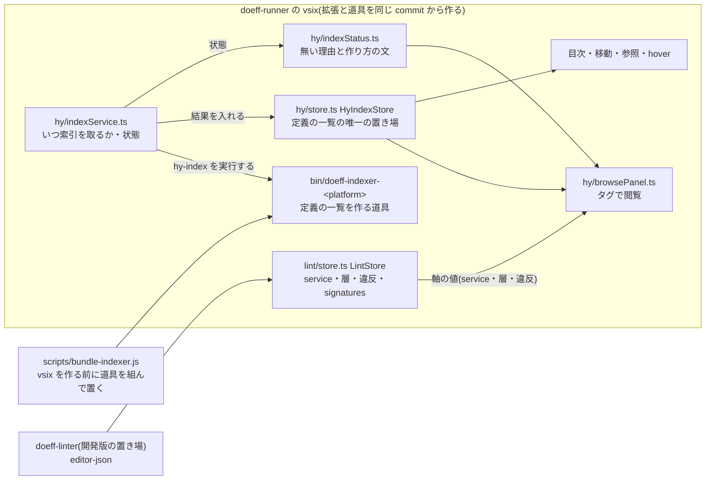

# Hy の定義の一覧の正本 — doeff-runner の「タグで閲覧」

版 v1(2026-09-28)。対象 = doeff の `ide-plugins/vscode/doeff-runner`(commit 77c82d09 の直した後の形)。

## 決めたこと

**定義の一覧の正本は hy-index のまま置き、拡張が同梱の doeff-indexer で自分で作る。**
linter の editor-json(signatures・tags)から一覧を作る形には替えない。
その代わりに、欠陥の根だった「同梱の道具が無い vsix が黙って作られる」ことを、vsix を作る処理で止める。

## 何が壊れていたか(観測)

- 0.6.24 の vsix には `bin/doeff-indexer-darwin-arm64` が入っていなかった(0.6.23 には入っていた)。
  `bin/` の binary は git に無く CI が置く。手元の `vsce package` は、前に誰かが手で置いた binary があればそれを、
  無ければ無いまま vsix を作っていた。
- 拡張は `DOEFF_INDEXER_PATH`・Python 環境・system の path も探すが、agora-controllers の `.venv` にも
  PATH にも doeff-indexer は無い。結果は `doeff-indexer not found` で、hy-index は 1 度も走らなかった。
- 失敗は Output に 1 file ごとに出るだけ(`.git/dotfiles-run/slots/…` の複製の file まで数百行)。
  パネルは「Hy の索引がまだありません」の 1 行で、なぜ無いのかを言わなかった。
- 同じ道具で agora-controllers の root 全体を索引すると 1.1 秒・1111 file・22963 定義・うち tags 付き 6874。
  道具さえあれば一覧は作れる。

## 構成と責任

| 責務 | 持ち主 | 読む物 |
| --- | --- | --- |
| Hy の file ごとの定義(名・kind・範囲・tags・生の副作用) | `doeff-indexer hy-index`(同梱)→ `HyIndexStore` | タグで閲覧・目次・移動・参照・hover・注記 |
| いつ索引を取るか(開いた時・編集・保存・disk の変化) | `HyIndexService` | — |
| 索引の状態(道具が無い・古い・作れなかった・Hy の file が無い・作っている最中・作れた) | `HyIndexService`(`nextStatus` で決める) | タグで閲覧の空の時の説明 |
| 索引から外す dir | `hy/hyPaths.ts` の `EXCLUDED_DIRS`(1 か所) | 起動時の glob と disk の変化の通知 |
| service・層・違反の判定と defk の型・effect(signatures) | doeff-linter の editor-json → `LintStore` | タグで閲覧の軸の値・defk の見出し |
| 同梱の道具を vsix に入れる | `scripts/bundle-indexer.js`(`vscode:prepublish`) | 手元の `vsce package` と CI |

## 採った案と理由

問い: 定義の一覧の正本をどこに置くか。

| 案 | 良い点 | 代償 |
| --- | --- | --- |
| A. hy-index を正本のまま、拡張が同梱の道具で自分で作る(採用) | 目次・移動・参照・hover と同じ 1 つの置き場を読む。全部の kind(defk・deff・defn・defhandler・defeffect・defrecord…)と範囲を持つ。編集中の内容(stdin)で 0.5 秒後に追う。linter が走っていなくても一覧は出る | 同梱の道具を vsix に確実に入れる仕組みが要る(今回足した) |
| B. linter の editor-json の signatures と tags から一覧を作る | 置き場が 1 つ減るように見える | signatures は defk だけで、deff・defhandler・defeffect 等が一覧から消える。目次・移動は hy-index を読み続けるので、置き場は減らず、同じ定義の複製が 2 つになる。linter の設定の読めないキー 1 つで一覧まで消える(2026-09-28 の夜に 4 回あった止まり方)。保存の後の linter の走行を待つので編集中は追わない |

理由: 一覧は「どの定義がどこにあるか」という構文の事実で、目次・移動と同じ持ち主に置くのが複製を持たない形。
linter は「その定義が正しいか・どの層か・型と effect は何か」という判定の持ち主で、一覧を linter から作ると
判定の持ち主が一覧の複製も持つことになる。signatures は defk の見出しを描く材料として位置で定義へ結び付けて読む
(一覧の元にはしない)。

選択が変わる条件: linter が全部の kind の定義と範囲を editor-json に出し、しかも編集中の内容を追えるようになり、
目次・移動も同じ出力から読むと決めた時。その時は hy-index 側を消して 1 つにする(2 つを並べて持たない)。

## 同梱の道具が古くならないか(dotfiles の `agentcli.doeff_linter_follow` の対象にするか)

足さない。linter は拡張の外の置き場(`~/.local/share/doeff-linter-dev/`)にあり、拡張と別に古くなる。
hy-index は vsix の中に入り、vsix を作る時にその checkout から組む。拡張の版と道具の版は同じ commit から来るので、
拡張だけ新しく道具が古い、という組み合わせは起きない。古くなるのは vsix 全体で、それは拡張の配り方の問題
(入れ直せば直る)。

## 契約

- `ChildProcessHyIndexer.index(request) → HyIndexOutcome`
  - `ok` / `failed`(道具は在るが作れない・出力を読めない)/ `missing`(道具が見つからない)/ `unsupported`(道具が古い)。
  - 道具の場所は 1 度だけ探す(見つからない時の通知を繰り返さない)。`forget()` の後の依頼で探し直す。
- `HyIndexService.status: HyIndexStatus` と `onDidChangeStatus`
  - root 全体の依頼の成功・失敗だけが `ready`・`failed` を決める。1 file の崩れで一覧の説明を消さない。
  - 道具が無い・古いは、どの依頼で分かっても状態にする。
- 命令 `doeff-runner.hy.reindex`: 道具を探し直し、全 folder の索引を取り直す。`doeff-runner.hy.showOutput`: Output を開く。
- `scripts/bundle-indexer.js`: 手元では `packages/doeff-indexer` を `cargo build --release --no-default-features` で組み、
  `hy-index --help` が通ることを確かめて `bin/<この機体の名>` に置く。CI(`GITHUB_ACTIONS=true`)では 5 本が置かれていることだけを
  確かめる。どちらでも置けなければ失敗で止め、道具の無い vsix を作らない。

## 戻し方

- 一覧の正本の決定を戻す(案 B へ替える)時: browsePanel の `items()` を LintStore の signatures から作る形に替える。
  その時は目次・移動も同じ出力へ移し、hy-index の置き場を消す(2 つを並べない)。
- 同梱の処理を戻す時: `package.json` の `vscode:prepublish` を `npm run compile` に戻し、`scripts/bundle-indexer.js` を消す
  (道具の無い vsix が黙って作られる前の形に戻る)。
- 状態の表示を戻す時: `browsePanel.ts` の空の時の行を 1 行に戻す。`indexStatus.ts` と `hyPaths.ts` は他に読み手が無い。

## どこまで進んだか

| 項目 | 状態 |
| --- | --- |
| 議論 | coordinator の依頼(2026-09-28)の 2 案を比べた。operator との議論はしていない |
| 合意 | 席の判断(戻せる決定・agent/internal)。operator の合意は取っていない |
| 検証 | 実行済み: 単体テスト 217 本(うち新しい 7 本)が通る。vsix 0.6.25 に道具が入ることを確かめた。別の user-data-dir の VS Code で agora-controllers を開き、1111 file の索引・context = kanban の絞り込みが出ることを画面で確かめた。未実行: 盲検の反例による設計の検証 |
| 作業化 | 実装は commit 77c82d09 で済み。本線への着地は land queue に登録する |
