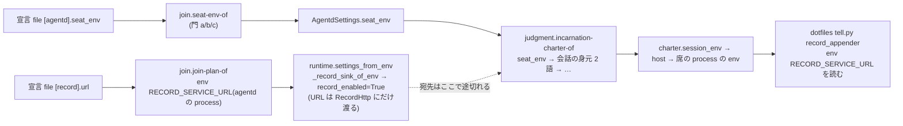

# 席の env に記録サービスの宛先を agentd 自身が置く(card ki-e930b8506201)

- card: `acp:kanban-issue:ki-e930b8506201`(盤 agora-redesign)
- 依頼: `lt-R6BA55GFR7NZG4P7F6F9A0XXDG`(class investigate・計画の段)
- 基準 commit: doeff `4da6ca4a3dd83bdf8bc57e5ecf799365721167be`(origin/main・2026-09-24)
- 盲検の前の主張: `claims-before-blind.md`(書き換えていない)・反例と修正: `counterexamples.md`・§8
- 書いた会話: `c-GZ6PP4BMTNRQ96T4FZJEHN512H`(Opus 5.5)
- 完了の範囲: **設計まで**。実装・配備・実機の受入は実装の依頼(`implementation-request.md`)が持つ。
  この文書の「予定」は未実施。

## 1. 固定した要件

| id | 要件 |
| --- | --- |
| Q1 | agentd が起こすすべての手番の process の env に `RECORD_SERVICE_URL` が在り、値はその agentd 自身が追記に使う宛先(参加の門 `join.record-sink-of` を通った値)と byte 同一。 |
| Q2 | 32,768 byte を超える本文の `ai tell --kind note` が、会社 Mac と pool pod の両方の手番から「本文は記録の service に置いて見出し(bodyRef)で投函した」で通り、`ai tell status` が delivered、宛先の手番の入力に本文が現れる。 |
| Q3 | 上限内のメッセージの振る舞いは変えない。dotfiles の `tell.py` は変えない。 |
| Q4 | 宛先の値の置き場は各機体の宣言 file の `[record].url` の 1 か所のまま。席向けの写し(`seat_env` の `RECORD_SERVICE_URL`)を作らせない。 |
| Q5 | 席は agentd の env を継がない(ADR-DOE-AGENTS-012 R30 (4)・継承の名簿 `policy.SPAWN-INHERITED-ENV-KEYS` は 1 語も開けない)。 |

## 2. 現状(実測と読んだコード)

実測(`evidence/pod-measurement.log`・pool pod `agentd-pool-0`・2026-09-24T15:48Z):

- 手番の env に `RECORD_SERVICE_URL` の行は 0。同じ pod の `/etc/agentd/agentd.toml` には
  `[record] url = "http://agora-record.herdr-hud.svc.cluster.local.:8874"` が在る。`seat_env` の名は
  `ACP_BASE / AGORA_BRAIN_URL / HERDR_HUD_STATE_BACKEND / AGORA_CUSTODY_URL / AGORA_IMAGE_TOOLS`。
- 34,077 byte の本文の `ai tell` は、env が無いと段 record で断られ(郵便は作られない)、
  `RECORD_SERVICE_URL` を `[record].url` と同じ値で明示すると通った(郵便 `lt-SAGPVFCCQ31D6D2W5746B1STXA`・delivered)。
  ⇒ pod の席の札で記録サービスは追記を受ける。**欠けているのは宛先の値だけ**で、認証の問題は無い。
- 会社 Mac は card 本文の実測(2026-09-21)で同じ形: 手番の env は `AGORA_CONVERSATION_ID / AGORA_SEAT_OPENER` の 2 語だけ、
  明示した実行は通った(郵便 `lt-GE29J8QV1VTVBNZZE508NWMQXJ`)。

コードの経路:

- `effects.AgentdSettings` は `record_enabled: bool` だけを持ち、宛先の URL を持たない。URL は
  `runtime.bundle` の `RecordHttp(record_url, token)` にだけ渡る。だから charter を組む純粋な判断
  (`judgment.incarnation-charter-of`)からは宛先が見えない。
- 席に届く env は `charter.session_env` だけ(`charter-with-seat-env` → `charter-with-conversation-env`)。
- 名 `RECORD_SERVICE_URL` は doeff 自身の語(`effects.RECORD_URL_ENV`)で、dotfiles の `tell.py` は
  「doeff の agentd と同じ 1 つの綴り」として同じ名を読む。

## 3. 設計(案 A)

**agentd は、自分が追記に使う記録サービスの宛先を、起こす手番の env に自分で置く。**
会話の身元(`AGORA_CONVERSATION_ID` / `AGORA_SEAT_OPENER`)と同じ「走行者が持つ名」として扱う。
既知の形 = kubelet が全 pod に API server の所在(`KUBERNETES_SERVICE_HOST` 等)を自分の設定から注入する形。
workload ごとの宣言には書かせない。

### 3.1 責務

| module id | 持つ知識・判断 | 隠す知識 | 変わるか |
| --- | --- | --- | --- |
| `host-declaration` | 宣言 file の `[record].url`(Mac = dotfiles `cron_management/acp-single-mac.toml` の `[agentd-join.record]`・pool = ACP `deploy/acp-control/agentd-pool-join.yaml`) | 席がこの値を使うこと | 変わらない |
| `join-gate` | `join.hy`: 宣言の解釈と参加の門(`record-sink-of`・`seat-env-of` の門 (a)(b)(c)) | 席の道具の語彙 | 門 (c) の名の集合を「走行者が持つ名」の集合へ差し替える |
| `runner-env-names` | `effects.py`: 走行者が持つ名の集合(新設の 1 定義点)と各名の綴り | — | 新設 |
| `agentd-settings` | `effects.AgentdSettings` と `runtime.settings_from_env`: 参加の門を通った記録の宛先を判断の層へ運ぶ | env の読み方 | 欄を 1 つ運ぶ(`record_enabled` と食い違える 2 欄にしない) |
| `charter-assembly` | `judgment.incarnation-charter-of` と `charter-with-*`: 席の env を組む順序 | 宛先の由来(宣言 file の形) | 走行者の名に記録の宛先を足す |
| `arm-decision`(§8 で追加) | `judgment.next-arm-for-job` と `session-attribution-of`: 次の手番を send / resume / rehydrate のどれで起こすか・帰属に刻む事実 | host の行の形 | 帰属に機体の env の指紋を刻み、違えば resume |
| `spawn-policy` | `policy.SPAWN-INHERITED-ENV-KEYS` / `headless-spawn-env`: 継承の名簿 | — | 変わらない |
| `seat-tool` | dotfiles `agentcli/tell.py`: `RECORD_SERVICE_URL` を読んで本文を置く | — | 変わらない |
| `record-service` | 記録サービス: 追記の受理と認証 | — | 変わらない |

### 3.2 公開契約(実装者に渡すもの)

- **C1**: agentd が起こす手番(launch / resume / rehydrate / rebuild の 4 経路 — `incarnation-charter-of` が組むすべて)の
  `charter.session_env` に `RECORD_SERVICE_URL` = `record-sink-of` を通った値(前後の空白を落とした値)が在る。
  記録が無効な設定(試験の対照だけ — 実運転では参加の門が宛先の無い agentd を断る)では置かない。
- **C2**: 走行者が持つ名の集合 = `{AGORA_CONVERSATION_ID, AGORA_SEAT_OPENER, RECORD_SERVICE_URL}` を `effects` の 1 か所で宣言する。
  `join.seat-env-of` の門 (c) はこの集合を読み、宣言に 1 つでも在れば参加を断る(ValueError・理由に「置く点は走行者の 1 点」)。
  charter を組む側も同じ集合の名だけを書く(門と書き手が別々の名簿を持たない)。
- **C3**: 順序は seat_env → 走行者の名。走行者の名が後に勝つ(門 (c) と二重の守り)。
- **C4**: 継承の名簿・`tell.py`・上限内のメッセージの経路・記録サービス・host(`headless.hy` / `launch.hy` / `policy.hy`)は変えない。
- **C5**(盲検 A・B を受けて追加 — §8): 機体が席へ渡す env(宣言の seat_env + 走行者の宛先。会話の身元と手番の札は含まない)を
  1 つの関数で組む。charter はその組を書き、同じ組の指紋を起こした session の帰属(`launch_attribution` の agentd の欄・名は `nodeEnv`)に刻む。
  `next-arm-for-job` は、温かい session の帰属の指紋が今の agentd の指紋と違う(または無い)時に send を選ばず、effort が違う時と
  同じ resume(温かい session を片付け、同じ session id で起こし直す・cache は保つ・charter を組み直す)を選ぶ。
  送りの手番の env(`turn-session-env-of`)には走行者の名を足さない。

内部で実装者が自由に決めてよいこと: `charter-with-conversation-env` を広げるか、新しい `charter-with-runner-env` を
足すか / `AgentdSettings` に URL の欄を足して `record_enabled` をそこから導くか、欄を 1 つに畳むか
(ただし「record_enabled が真なのに URL が無い」状態を作れない形にする)。

### 3.3 採らなかった案

- **B(各機体の `seat_env` に写す)**: 同じ値が `[record].url` と `seat_env` の 2 か所になり、機体を足すたびに漏れる。
  pool は ACP の法 11d8cc の検で byte 一致を突き合わせられるが、Mac には同じ検が無い。Q4 に反する。
- **C(`tell.py` が ACP から宛先を探す)**: 宛先は機体ごとに違う(pod = cluster DNS、Mac = tailnet の名)ので、
  機体の宣言が正本。ACP に機体ごとの宛先を載せると第 2 の置き場になる。
- **D(継承の名簿に `RECORD_SERVICE_URL` を足す)**: R30 (4) の「継承では届かない」を破る。agentd の env が
  席へ漏れる経路を 1 語でも開けると、名簿が育つ(実弾 #95)。

### 3.4 ADR R51 (4) との関係

R51 (4) は「doeff-agents の src は席向けの名を綴らない」(semgrep `doeff-agents-does-not-spell-seat-facing-env` =
`ACP_BASE / AGORA_BRAIN_URL / HERDR_HUD_STATE_BACKEND`)。理由は「宛先の定義点が宣言の側(k8s の Service と読み手の
dotfiles)に在るので、doeff が綴ると第 2 の既定が育つ」。`RECORD_SERVICE_URL` はこれと違い、**名も値も doeff が持つ**
(名 = `effects.RECORD_URL_ENV`・値 = doeff の宣言の schema の `[record].url`)。doeff は既定の値を持たず、
宣言された値を運ぶだけなので、R51 (4) の病(第 2 の既定)は起きない。実装はこの区別を ADR の条文に書く。

## 4. 強制の方法

| 守る責務 | 強制方法 | 実装箇所(予定) | 実行経路 | 限界 |
| --- | --- | --- | --- | --- |
| 宛先が席の process まで届く(C1・C5)— K1' | deftest: 記録の宛先を持つ settings で launch / resume / continue の 3 経路を回し、**器が起こした process の env** に byte 同一の値が在る。記録が無効な settings では無い。**手番の間で settings を差し替える**(A で launch → 行 → B の agentd が次の手番を起こす)と、起こした process の env は B の値で、腕は resume。差し替えないなら send(cache を捨てない) | `packages/doeff-agents/tests/sessionhost_charter_reaches_the_seat_deftests.hy`(既存の「4 枚の名簿を渡って席へ届く」検の隣) | 変更時の focused pytest・日次の全体 | 実機の宣言の値そのものは試験で測れない(配備後の実射で測る)。agentd を通らない送り(host の `session.send` を手で撃つ)は生まれた時の env のまま |
| 起こし方の判断(C5)— K6 | deftest(純粋): `next-arm-for-job` — 指紋が同じ → send / 違う → resume + 候補を片付ける / 指紋が無い → resume | `packages/doeff-agents/tests/` の next-arm-for-job の既存の検の隣 | 同上 | — |
| 値の定義点は 1 つ(C2・Q4)— K2・K3 | deftest: `seat-env-of` が `RECORD_SERVICE_URL=…` を含む宣言を ValueError で断る / 契約の検: 門 (c) の集合 == charter が書く走行者の名の集合 ∧ 指紋の材料 == charter が書く組(同じ関数の出力)∧ 送りの手番の env に走行者の名が 1 つも無い | `packages/doeff-agents/tests/test_sessionhost_acp.py`(seat-env-of の既存の検の隣)と上の deftest | 同上 | 集合に名を足さずに charter へ直接書く実装は契約の検が赤にする。集合に足して charter に書かない実装は C1 の検(名ごと)でしか捕まらない |
| 席の settings file を第 2 の定義点にしない — K7 | join が席の settings file を検める同じ点で、`env` ブロックが走行者の名を含めば断る(今日の file に `env` は無い — 実測) | `join.hy` の `claude-settings-file-of` の検 | 同上 | — |
| 順序(C3) | deftest: join を迂回して seat_env に `RECORD_SERVICE_URL=http://bogus` を直接渡しても、charter の値は走行者の値 | 上の deftest | 同上 | — |
| 名の綴りは effects の 1 か所 | semgrep `doeff-agents-runner-owned-seat-env-spelled-once`: `["'](RECORD_SERVICE_URL\|AGORA_CONVERSATION_ID\|AGORA_SEAT_OPENER)["']` を `packages/doeff-agents/src/**` から禁じ、`effects.py` だけ除く(基準 commit で 3 件とも effects.py の定義行だけ — 実測済み) | `.semgrep.yaml`・bad/clean の例 | `make lint-semgrep`・pre-commit | 文字列の組み立て(`"RECORD_" + "SERVICE_URL"`)は捕まらない。実装者が普通に書く形ではない |
| 継承を開けない(Q5) | 既存の `test_sessionhost_headless.py` の継承の検と R30 (4) の法(変えない) | 既存 | 既存 | — |
| 条文 | ADR-DOE-AGENTS-012 に新しい rule(R63 の見込み)+ R51 (1)(c) と R30 (4) の文の改め。`docs/adr/enforcement-ledger.json` を同じ commit で更新(ADR-DOE-ENFORCE-001 R5) | `docs/adr/defadr_doeff_agents_012_agentd_acp_arms.hy` | `make hooks-install` の commit 時の検 | — |

## 5. 配備と測り方(予定)

1. doeff main に着地(personal の口座の会話)。
2. **pool**: 新しい doeff を焼いた image を建て、ACP `deploy/acp-control/acpcluster.yaml` の pin を上げて排水つきで roll する
   (pool の doeff は image に焼かれる — `acpcluster.yaml` の realign は image の `doeff-revision` へ HEAD を合わせる)。
   `agentd-pool-join.yaml` の `seat_env` は触らない。
3. **会社 Mac**: Mac の agentd を新しい doeff で起こし直す(`acp_single_mac.hy` の `--install-from` の経路)。宣言 file は触らない。
4. 受入は **配備の後に起こした手番**で測る。C5 により、配備前に生まれた温かい session は帰属に指紋が無いので、各会話の次の手番が
   1 度だけ resume になり(cache は保つ)、その手番から新しい env で走る。Mac の host を起こし直す必要は無い。
   各機体で (a) `env | grep RECORD_SERVICE_URL` の値と宣言 file の `[record].url` の byte 比較、
   (b) 33 KB 超の `ai tell --kind note` → `ai tell status` delivered → 宛先の手番の入力に本文。
   (c) 上限内のメッセージが今日どおり ACP の行に本文を載せる(bodyRef が付かない)。

## 6. 後続(この実装に含めない・two-way door で決めた)

- **預かり所の宛先(`AGORA_CUSTODY_URL`)が同じ形**: 名は doeff の `effects.CUSTODY_URL_ENV`、値は `[custody].url`。
  2026-09-24 に card `ki-18d6c4851b21` が pool の `seat_env` へ写して ACP 法 11d8cc で byte 一致を検める形(案 B の形)で直した。
  この設計の集合に 1 行足せば同じ形に畳めるが、(1) 門 (c) が今の pool の宣言(`seat_env` に `AGORA_CUSTODY_URL` が在る)を断るので
  ACP の宣言と法 11d8cc の改めを同じ便で当てる必要があり、(2) 会社 Mac の席は今日 `ai lease` の既定(127.0.0.1)で動いていて、
  注入すると Mac の席の行き先が変わる。⇒ 別 card にする(この依頼の報告で起票する)。
- 人が開いた対話の会話(herdr の pane で起こした `cc`)の env にも `RECORD_SERVICE_URL` は無い。card の範囲(agentd の手番)の外。

## 7. 未確認

- 会社 Mac の手番の env と記録サービスへの追記は card 本文の 2026-09-21 の実測に依る(この会話は pool pod で走っていて、
  会社 Mac の機体に入れない)。実装の受入で測り直す。
- 会社 Mac の agentd を新しい doeff で起こし直す正確な手順は dotfiles `cron_management/ACP-SINGLE-MAC.md` が持つ。
  実装の会話が会社 Mac に結ばれない場合、Mac の受入は Mac に結ばれた会話へ頼む必要がある。

## 8. 修正の履歴

- 2026-09-24T16:1xZ — 盲検 A・B が独立に同じ穴を示した(`counterexamples.md` §1): 温かい session の続きの手番は host の行に
  保存した生まれた時の env を再生するので、`[record].url` を変えて agentd だけを起こし直すと席は古い宛先を使う。主張 S2 と
  要件 Q1 を破る(設計者が `counterexamples/B_witness_continue.py` で再現)。
  ⇒ C5 を足した(機体が席へ渡す env の指紋を帰属に刻み、違えば send でなく resume)。host は変えない。
  ⇒ 試作(`evidence/proto_arm_on_node_env_change.diff`)で起こし方の判断と charter の組み直しを本物の関数で確かめた
  (`evidence/proto_arm_on_node_env_change.log`・5 件 OK)。試作は戻した。
  ⇒ 検査を K1'・K6・K7 と K3 の拡張へ直した(§4)。

## 9. 戻せる決定の記録(2026-09-24・会話 c-GZ6PP4BMTNRQ96T4FZJEHN512H・Opus 5.5)

| 決めたこと | 採った推奨と理由 | 戻す手順 |
| --- | --- | --- |
| 案 A(agentd が自分の宛先を席の env に置く)を採り、案 B(各機体の `seat_env` に写す)を採らない | card 本文の推奨。値の置き場が `[record].url` の 1 か所のまま・全機体が同じ変更で直る・名も値も doeff が持つので R51 (4) の病を起こさない | 着地の commit を revert して配備し直す |
| 盲検の反例を受けて C5(帰属の指紋が違えば send でなく resume)を足す | 温かい session の続きの手番が生まれた時の env を再生するため(再現済み)。寿命の知識を起こし方の判断の 1 点に置き、host に語彙を漏らさない | 同上(C5 の部分だけ戻すと S2 が破れた状態に戻る) |
| 預かり所の宛先(`AGORA_CUSTODY_URL`)の移行はこの実装に含めず別 card にする | 移行には ACP の宣言と法 11d8cc の改めを同じ便で当てる必要があり、会社 Mac の席の行き先も変わる。record の修理を待たせない | 別 card を閉じる |
| 席の settings file の `env` ブロックも門で断る(K7) | 盲検 B の指摘。今日は `env` が無いので既存の配備を壊さない | K7 の検と門の 1 条を消す |
