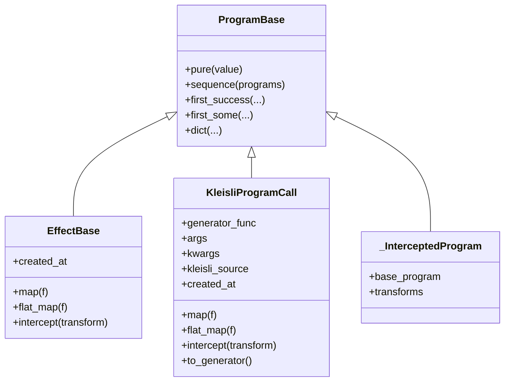

# Program Architecture Overview

This document summarises the refactored runtime architecture that powers `doeff`. It complements the more detailed notes in `specs/program-architecture/` and focuses on the concrete code that now ships in the repository.

## High-Level Summary

- **Program = Effect | KleisliProgramCall** – every executable computation is either an `EffectBase` instance or a `KleisliProgramCall` (bound generator call).
- **ProgramBase** – the single runtime base class (`doeff/program.py`) that exposes helper combinators such as `pure`, `sequence`, `first_success`, etc.
- **Interpreter** – `_execute_program_loop` handles effects directly, runs nested Kleisli calls by pushing/popping `CallFrame` entries, and records call-stack snapshots on every observation.
- **Interception** – `_InterceptedProgram` subclasses `KleisliProgramCall`, preserving original metadata while layering transforms.
- **Effect Observation & Reporting** – each `EffectObservation` carries a `call_stack_snapshot`. These snapshots feed `EffectCallTree`, RunResult reports, and the CLI `--report` flag.

## Core Types



Key points:

- `Program` is just an alias for `ProgramBase`. All helper combinators now live here and always return either an `EffectBase` or `KleisliProgramCall`.
- Effects are first-class `Program` values because `EffectBase` (`doeff/types.py`) inherits from `ProgramBase` and implements `map/flat_map/intercept`.
- `_InterceptedProgram` is a frozen dataclass that extends `KleisliProgramCall`. It copies the underlying call metadata and delegates execution through `_intercept_generator`.

## Interpreter Loop

```mermaid
flowchart TD
    A[ProgramInterpreter.run_async(program, ctx)] --> B{program instance}
    B -->|EffectBase| C[_handle_effect]
    C --> D[RunResult(ctx, Ok(value))]
    B -->|KleisliProgramCall| E[push CallFrame]
    E --> F[gen = program.to_generator()]
    F --> G{next(gen)}
    G -->|EffectBase| C
    G -->|KleisliProgramCall| H[run_async(sub_program, ctx)]
    H --> G
    G -->|Other| I[TypeError]
    H --> J[pop CallFrame]
    G --> J
    J --> D
```

Implementation details:

- `CallFrame` objects (in `doeff/types.py`) are appended before entering a `KleisliProgramCall` with metadata. They are always popped in a `finally` block.
- `_handle_effect` records `EffectObservation` entries, including the call-stack snapshot, via `_record_effect_usage`.
- The interpreter never wraps or unwraps legacy `Program` objects; the helper `Program.from_program_like` has been removed.

## Effect Call Tree

`EffectCallTree` (`doeff/analysis/call_tree.py`) aggregates observations into a hierarchical tree. Each node is either a program call (`function_name(args...)`) or an effect label (`EffectType(key)`), and repeated effects are collapsed (`WriterTell x3`).

RunResult includes a new section when observations exist:

```
🌳 Effect Call Tree:
└─ outer()
   └─ inner()
      └─ Ask('value')
```

The CLI provides `--report`/`--report-verbose` flags to print the same information after executing a program, and JSON output includes `"report"` and `"call_tree"` fields when requested.

## CLI Overview

```mermaid
flowchart LR
    A[doeff run] --> B[Load program symbol]
    B --> C{Interpreter?}
    C -->|ProgramInterpreter| D[run(program)]
    C -->|callable| E[call(program)]
    E --> F{Result}
    D --> F
    F -->|Program| G[run_async]
    F -->|RunResult| H[unwrap]
    F -->|Value| I[final-value]
    G --> H
    H --> J[report/call-tree]
    I --> J
    J -->|format=text| K[print text]
    J -->|format=json| L[emit JSON]
```

Steps:

1. Auto-discovery services (interpreter/env) run before execution with profiling instrumentation.
2. The program is optionally wrapped with local environments and user-supplied `--apply`/`--transform` functions.
3. Interpreter callable executes, producing either a value, a `Program`, or a `RunResult`.
4. The CLI finalises the value while preserving the `RunResult` (if produced), then prints text/JSON. When `--report` is active a full RunResult report and effect call tree are emitted.

## Call Stack & Observations

- Every effect observation stores `call_stack_snapshot=tuple(CallFrame, ...)`.
- `CallFrame` captures `kleisli_source`, `function_name`, positional/keyword arguments, depth, and creation context if available.
- Snapshots feed the call tree, RunResult display, and CLI reports, enabling post-run introspection without affecting the runtime execution flow.

## Tests & Validation

Key regression tests include:

- `tests/test_kleisli_program_call.py` – metadata preservation and generator invocation.
- `tests/test_call_frame.py` – call stack snapshot correctness and cleanup.
- `tests/test_intercept_recursion.py` – intercept transforms that return programs or effects without recursion.
- `tests/test_runresult_display.py::test_display_includes_call_tree` – verifies the new display section.
- `tests/test_cli_run.py::test_doeff_run_json_report_includes_call_tree` – ensures CLI reports capture the call tree and RunResult report.

Full suite: `uv run pytest`

---

For deeper planning rationale refer to `specs/program-architecture/architecture.md` and `specs/program-architecture/todo.md`.