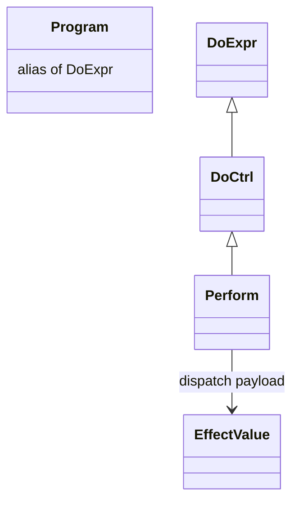

# Program Architecture Overview

This document describes the current execution model defined by:

- `specs/core/SPEC-TYPES-001-program-effect-separation.md`
- `specs/vm/SPEC-008-rust-vm.md`

## Core Model

- `Program[T]` is `DoExpr[T]`.
- `DoExpr` is control IR evaluated by the Rust VM.
- `DoCtrl` is the concrete instruction set (`Pure`, `Call`, `Map`, `FlatMap`, `Perform`, ...).
- `EffectValue` is user-space operation data.
- `Perform(effect)` is the only effect-dispatch boundary.

At API and lowering boundaries, execution accepts either control IR or effect payload:

```text
program input / yielded value = DoExpr | EffectValue
EffectValue is normalized to Perform(effect) before dispatch
```

## Type Hierarchy and Perform Boundary



`EffectValue` is data. It does not dispatch by itself. Dispatch happens only when wrapped by
`Perform(effect)`.

Source ergonomics stay simple:

```python
value = yield Ask("key")
```

Lowered control form:

```python
value = yield Perform(Ask("key"))
```

## Handler Stack Model

`run(..., handlers=[h0, h1, h2])` installs nested handler scopes:

```text
WithHandler(h0,
  WithHandler(h1,
    WithHandler(h2, program)))
```

- `h2` is innermost and sees effects first.
- `h0` is outermost and sees effects delegated outward.
- Handler contract is `(effect, k) -> DoExpr`.

## Rust VM Stepping Engine

The step engine is a mode/state machine that repeatedly executes one transition at a time.
The same engine is used by both `run` and `async_run`.

```mermaid
flowchart TD
    A[run / async_run] --> B{Input kind}
    B -->|DoExpr| C[Use as root control node]
    B -->|EffectValue| D[Normalize to Perform(effect)]
    D --> C
    C --> E[Install handler stack as nested WithHandler]
    E --> F[VM step loop]

    F --> G{Yield classification}
    G -->|DoCtrl| H[Evaluate DoCtrl]
    G -->|EffectValue| I[Normalize to Perform(effect)]
    I --> J[Dispatch through handler stack]

    H --> K{DoCtrl variant}
    K -->|Perform(effect)| J
    K -->|Other control node| L[Update VM mode/state]

    J --> M{Handler action}
    M -->|Resume / Return / Transfer / Throw| L
    M -->|Delegate| N[Try next outer handler]
    N --> L

    L --> O{StepEvent}
    O -->|Continue| F
    O -->|NeedsPython| P[Driver executes PythonCall and feeds result]
    P --> F
    O -->|Done / Failed| Q[Build RunResult]
```

## Effect Observation (`trace=True`)

`run(..., trace=True)` and `async_run(..., trace=True)` enable VM step tracing in `RunResult.trace`.
Each entry records step-level execution state:

- `step`
- `event`
- `mode`
- `pending`
- `dispatch_depth`
- `result`

Example:

```python
result = run(program, handlers=default_handlers(), trace=True)
first = result.trace[0]
# {'step': 1, 'event': 'enter', 'mode': 'Deliver', ...}
```

This trace shows when execution enters `Perform` dispatch and how handler-dispatch depth changes
during stepping.

## Async Boundary

`PythonAsyncSyntaxEscape` is the VM escape for Python async integration.

- `run(...)`: synchronous stepping path.
- `async_run(...)`: same step semantics plus async escape/await/resume handling.

## Summary

- `Program[T] = DoExpr[T]`.
- Control and effect payloads are separated.
- `Perform(effect)` is the sole dispatch boundary.
- Handlers are a nested stack (`WithHandler`) with deterministic inner-to-outer dispatch.
- Rust VM stepping is the execution core for both sync and async runners.
