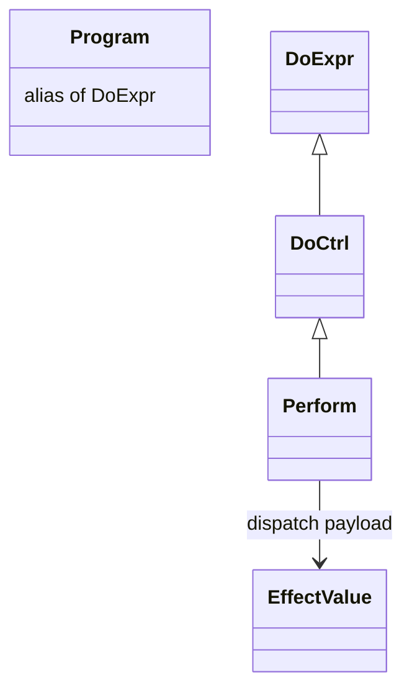
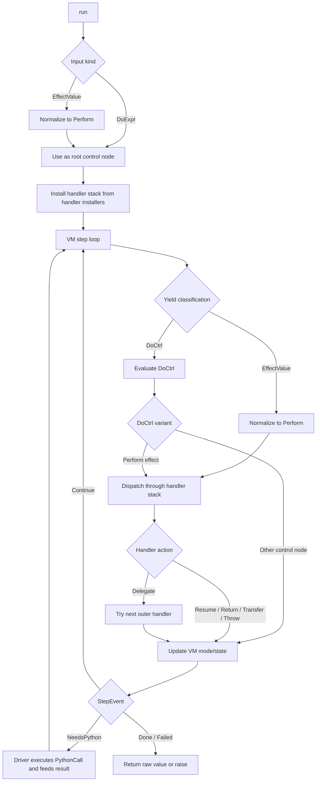

# Program Architecture Overview

This document describes the current execution model defined by:

- `specs/core/SPEC-TYPES-001-program-effect-separation.md`
- `specs/vm/SPEC-008-rust-vm.md`

## Core Model

- `Program[T]` is `DoExpr[T]`.
- `DoExpr` is control IR evaluated by the Rust VM.
- `DoCtrl` is the concrete instruction set (`Pure`, `Call`, `Map`, `FlatMap`, `Perform`, ...).
- `EffectValue` is user-space operation data.
- `Perform(effect)` is the only effect-dispatch boundary.

At API and lowering boundaries, execution accepts either control IR or effect payload:

```text
program input / yielded value = DoExpr | EffectValue
EffectValue is normalized to Perform(effect) before dispatch
```

## Type Hierarchy and Perform Boundary


```mermaid
classDiagram
direction TB

class Program
class DoExpr
class DoCtrl
class Perform
class EffectValue

Program : alias of DoExpr
DoExpr <|-- DoCtrl
DoCtrl <|-- Perform
Perform --> EffectValue : dispatch payload
```

`EffectValue` is data. It does not dispatch by itself. Dispatch happens only when wrapped by
`Perform(effect)`.

Source ergonomics stay simple:

```python
value = yield Ask("key")
```

Lowered control form:

```python
value = yield Perform(Ask("key"))
```

## Handler Stack Model

Handler installers are Program -> Program functions. Calling them nests handler scopes:

```text
h0(h1(h2(program)))
```

- `h2` is innermost and sees effects first.
- `h0` is outermost and sees effects delegated outward.
- Handler contract is `(effect, k) -> DoExpr`.
- User-facing custom composition should call handler installers directly.

## Rust VM Stepping Engine

The step engine is a mode/state machine that repeatedly executes one transition at a time.


```mermaid
flowchart TD
    A[run] --> B{Input kind}
    B -->|DoExpr| C[Use as root control node]
    B -->|EffectValue| D[Normalize to Perform]
    D --> C
    C --> E[Install handler stack from handler installers]
    E --> F[VM step loop]

    F --> G{Yield classification}
    G -->|DoCtrl| H[Evaluate DoCtrl]
    G -->|EffectValue| I[Normalize to Perform]
    I --> J[Dispatch through handler stack]

    H --> K{DoCtrl variant}
    K -->|Perform effect| J
    K -->|Other control node| L[Update VM mode/state]

    J --> M{Handler action}
    M -->|Resume / Return / Transfer / Throw| L
    M -->|Delegate| N[Try next outer handler]
    N --> L

    L --> O{StepEvent}
    O -->|Continue| F
    O -->|NeedsPython| P[Driver executes PythonCall and feeds result]
    P --> F
    O -->|Done / Failed| Q[Return raw value or raise]
```

## Call Stack Tracking

Call-stack introspection is tracked at `Call` boundaries, not rebuilt from Python traceback state.
During yielded-value classification, the driver extracts `CallMetadata` (function name, file, line)
and attaches it to the `Call` node before handing control to the VM.
When `Call` invokes a generator-producing callable, the VM pushes `Frame::PythonGenerator` with
that metadata attached.
`GetCallStack` then walks VM segments and frames, collecting `CallMetadata` from active
`Frame::PythonGenerator` entries.
This keeps stack reconstruction deterministic in VM state while Python object access remains in the driver.

## Effect Observation (`WithObserve`)

Effect observation is done by wrapping a program with `WithObserve(observer, body)`.
The observer callback receives each effect dispatched within the body. There is no `trace=True`
parameter on `run()` — observation is composed into the program like any other handler.

Example:

```python
from doeff import run, WithObserve

observations = []

def my_observer(effect):
    observations.append(effect)

result = run(WithObserve(my_observer, program))
# observations now contains each effect that was dispatched
```

## Async Boundary

For async programs, use `run(scheduled(program))` where `scheduled` comes from
`doeff_core_effects.scheduler`. The `scheduled` handler enables cooperative scheduling
of async tasks within the VM's synchronous step loop.

## Summary

- `Program[T] = DoExpr[T]`.
- Control and effect payloads are separated.
- `Perform(effect)` is the sole dispatch boundary.
- Handlers are a nested stack with deterministic inner-to-outer dispatch.
- Rust VM stepping is the execution core.
- `run(doexpr)` takes a single argument and returns the raw value (or raises on error).
- Observation uses `WithObserve(observer, body)`, not a trace parameter.
- Async execution uses `run(scheduled(...))`.
