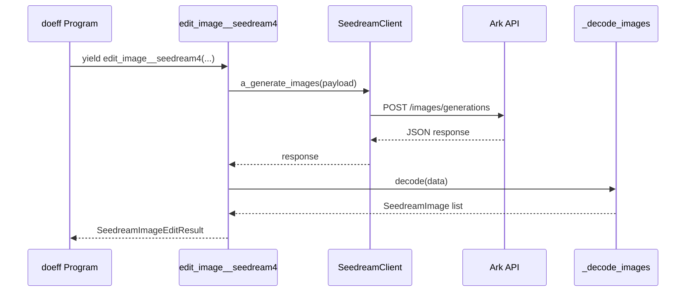

# Seedream Integration

This document explains how to work with the ``doeff-seedream`` package, which
wraps the [Seedream 4.0 image generation API](https://www.volcengine.com/docs/82379/1541523)
from ByteDance's Ark platform.

## Installation

The package lives inside this monorepo, so once you install the workspace with
`uv sync --group dev` it will be available for import as ``doeff_seedream``.

If you are vendoring the package independently, add it to your project using:

```bash
uv add doeff-seedream
```

## Configuring credentials

Seedream uses Ark API keys for authentication. Provide the key to the doeff
program in one of two ways:

- populate `seedream_api_key` in the Reader environment or State before running
  the program; or
- construct a ``SeedreamClient`` manually and store it under the
  `seedream_client` key.

```python
import asyncio

from doeff import ExecutionContext, ProgramInterpreter, do
from doeff_seedream import edit_image__seedream4

@do
def main():
    result = yield edit_image__seedream4(
        prompt="A watercolor illustration of a quiet harbour at dusk",
        generation_config_overrides={"size": "2K", "watermark": False},
    )
    result.images[0].save("harbour.png")

engine = ProgramInterpreter()
context = ExecutionContext(env={"seedream_api_key": "YOUR_ARK_KEY"})
run_result = asyncio.run(engine.run(main(), context=context))
run_result.value
```

## Controlling the request payload

``edit_image__seedream4`` mirrors the Gemini helper's signature, so existing
callers can switch providers without churn. Seedream-specific configuration can
be supplied through ``generation_config_overrides``. Common keys include:

- ``size`` – set to ``"1K"``, ``"2K"``, ``"4K"`` or a ``"WIDTHxHEIGHT"`` pixel
  string.
- ``response_format`` – ``"url"`` (default direct download) or ``"b64_json"``
  (inline bytes suitable for in-memory decoding).
- ``watermark`` – toggle the "AI generated" watermark.
- ``sequential_image_generation`` and ``sequential_image_generation_options`` –
  enable or configure group generation scenarios.

Reference images can be supplied via the ``images`` argument. Each ``PIL`` image
is automatically encoded as a data URI that satisfies the Ark API requirements.

## Observability

Calls to the Ark API are wrapped with ``track_api_call``. The resulting
``Step`` entries include latency, number of images generated, and a sanitized
copy of the request payload so you can inspect program traces produced by the
interpreter's graph utilities.

## Cost tracking

Set ``seedream_cost_per_image_usd`` in the Reader environment (or keep the
default USD 0.03) to enable estimated spend calculations. Optionally provide a
mapping under ``seedream_cost_per_size_usd`` where keys are ``"1K"``, ``"2K"``,
``"4K"`` or explicit resolutions such as ``"2048x2048"``. Each request writes to
atomic shared state keys:

- ``seedream_total_cost_usd`` – running total across the interpreter session.
- ``seedream_cost_<model>`` – model-specific totals.
- ``seedream_api_calls`` – append-only list capturing per-call cost metadata.

Every execution also logs the cost via ``Log`` so that ledger entries surface in
``RunResult.log``.

## Request flow diagram

ASCII overview:

```text
+------------------+       +---------------------+       +------------------+
| doeff Program    | ----> | edit_image__seedream4 | ---> | SeedreamClient   |
| (@do generator)  |       | builds payload       |       | posts to Ark API |
+------------------+       +---------------------+       +------------------+
                                                                |
                                                                v
                                                       +------------------+
                                                       | Ark /images/...  |
                                                       +------------------+
                                                                |
                                                                v
+------------------+       +---------------------+       +------------------+
| RunResult / Step | <---- | _decode_images(...) | <---- | JSON response    |
+------------------+       +---------------------+       +------------------+
```

Mermaid sequence:



## Further reading

- [Seedream 4.0 image API specification](https://www.volcengine.com/docs/82379/1541523)
- [Seedream prompt guide](https://bytedance.larkoffice.com/docx/PBvldM6Xlo5OHKxsRNVcyAq4nFe)
