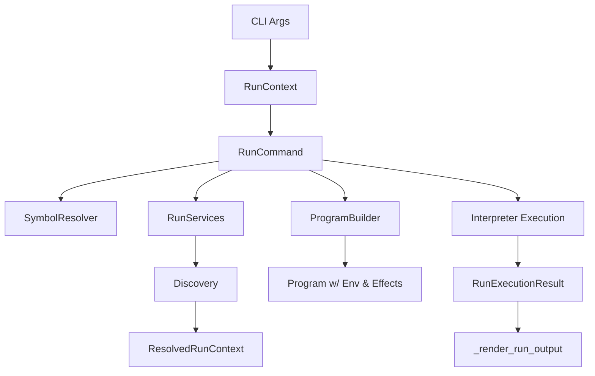
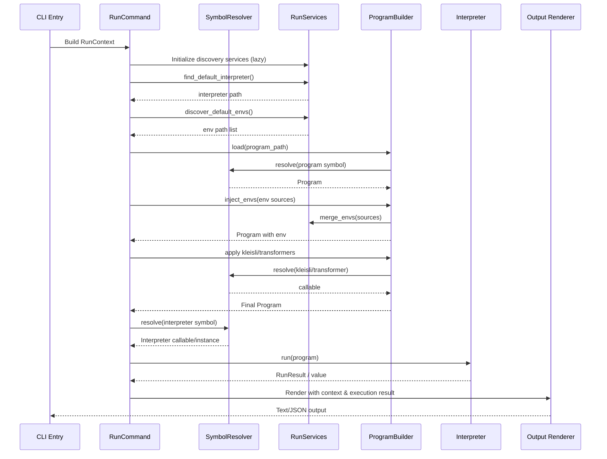

# doeff run Command Architecture

This note captures the refactored structure of the `doeff run` command introduced with the class-based CLI pipeline. Use it as a map when navigating or extending the workflow.

## Execution Flow

- **RunContext**
  - Collects the raw CLI arguments into a single data object.
- **RunCommand**
  - Orchestrates the entire run lifecycle.
  - Lazily initializes shared services (discovery, mergers) and the helper classes below.
- **SymbolResolver**
  - Centralises cached imports and wraps validation helpers for programs, Kleisli transforms, and program transformers.
- **ProgramBuilder**
  - Loads the target program.
  - Merges environments and injects them with `Local`.
  - Applies optional Kleisli and transformer stages sequentially.
- **RunServices**
  - Hosts CLI discovery dependencies (`IndexerBasedDiscovery`, `StandardEnvMerger`, `StandardSymbolLoader`).
- **Interpreter Execution**
  - Runs the interpreter, coercing callables into `RunResult` values when necessary.
- **_render_run_output**
  - Emits user-facing output in text or JSON while handling optional reports and call-tree visuals.

## Mermaid Overview

## Communication Diagram

## Extension Guidance

- Add new pre-run manipulations inside `ProgramBuilder` to keep run composition coherent.
- Extend auto-discovery logic via `RunServices` so dependent subsystems remain injectable.
- New output formats should be funneled through `_render_run_output` to share reporting logic.
- Maintain reusability: `SymbolResolver` should remain the single importer to avoid redundant module loads.
