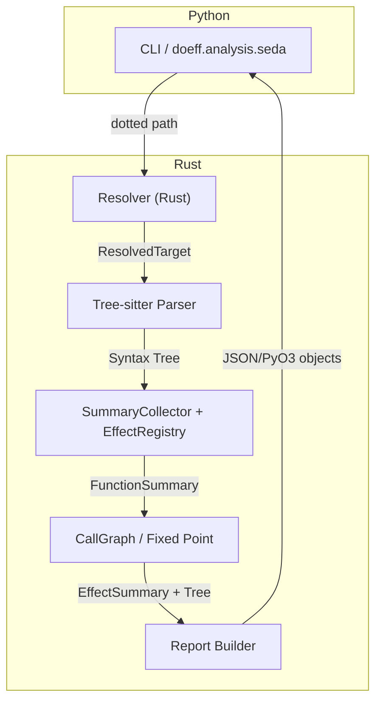
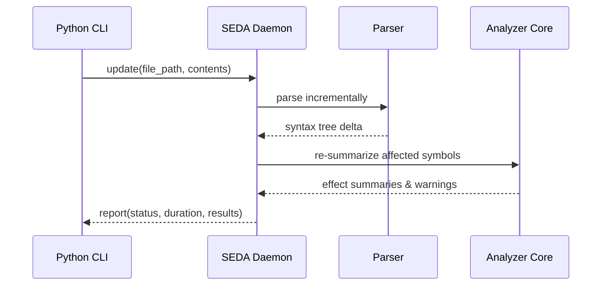

# SEDA Architecture Overview

```mermaid
graph TD
    subgraph Python
        CLI["CLI / doeff.analysis.seda"]
    end

    subgraph Rust
        Resolver["Resolver (Rust)"]
        Parser["Tree-sitter Parser"]
        Summaries["SummaryCollector + EffectRegistry"]
        Graph["CallGraph / Fixed Point"]
        Reporter["Report Builder"]
    end

    CLI -->|dotted path| Resolver
    Resolver -->|ResolvedTarget| Parser
    Parser -->|Syntax Tree| Summaries
    Summaries -->|FunctionSummary| Graph
    Graph -->|EffectSummary + Tree| Reporter
    Reporter -->|JSON/PyO3 objects| CLI
```

# Message Passing & Incremental Workflow

```mermaid
sequenceDiagram
    participant CLI as Python CLI
    participant Daemon as SEDA Daemon
    participant Parser as Parser
    participant Analyzer as Analyzer Core

    CLI->>Daemon: update(file_path, contents)
    Daemon->>Parser: parse incrementally
    Parser-->>Daemon: syntax tree delta
    Daemon->>Analyzer: re-summarize affected symbols
    Analyzer-->>Daemon: effect summaries & warnings
    Daemon-->>CLI: report(status, duration, results)
```
