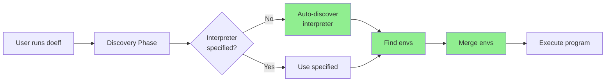
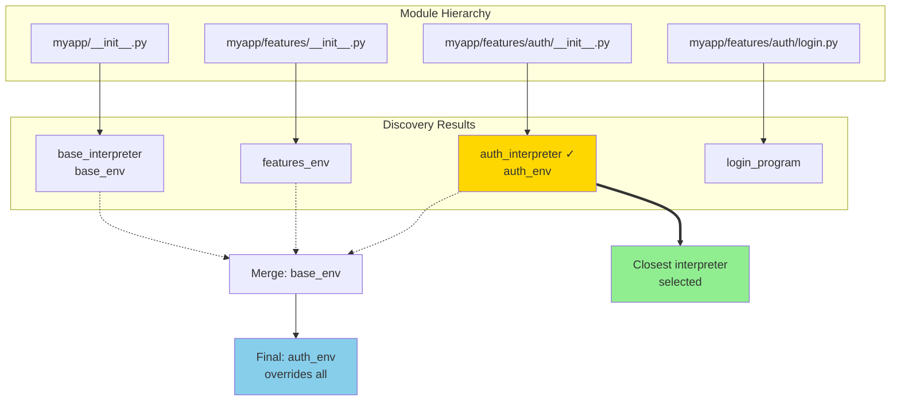

# CLI Auto-Discovery Feature

**Feature**: Automatic discovery of default interpreters and environments for `doeff run` command.

## Status

✅ **COMPLETE** - All phases implemented, tested, and documented.

## Documents in This Directory

### Planning & Architecture
- **[architecture.md](./architecture.md)** - Comprehensive feature specification and implementation plan (Phase 0-7)
- **[class_architecture.md](./class_architecture.md)** - Protocol-based class design and data flow
- **[todo.md](./todo.md)** - Original implementation checklist

### Implementation Notes
- **[indexer_findings.md](./indexer_findings.md)** - Analysis of existing doeff-indexer capabilities
- **[COMPLETION_SUMMARY.md](./COMPLETION_SUMMARY.md)** - Phase-by-phase completion summary

### Status & Results
- **[IMPLEMENTATION_STATUS.md](./IMPLEMENTATION_STATUS.md)** - Final implementation status, test results, and usage examples

## Quick Overview



### What Was Implemented

1. **ProgramInterpreter Sync API** (Phase 1)
   - Changed `run()` from async to sync
   - Breaking change but minimal impact

2. **Indexer Enhancement** (Phase 2)
   - PyO3 Python bindings for Rust indexer
   - Variable indexing for environments
   - Docstring marker parsing

3. **CLI Discovery** (Phase 3)
   - `IndexerBasedDiscovery` service
   - `StandardEnvMerger` for environment composition
   - Protocol-based extensible architecture

4. **E2E Testing** (Phase 4)
   - 5 comprehensive CLI tests
   - Full workflow verification

5. **Documentation** (Phase 5)
   - README CLI Auto-Discovery section
   - Usage examples and marker syntax

### Key Features



#### Interpreter Discovery
```python
def my_interpreter(prog: Program[Any]) -> Any:
    """# doeff: interpreter, default"""
    return ProgramInterpreter().run(prog).value
```

Finds closest interpreter in module hierarchy.

#### Environment Accumulation
```python
# doeff: default
base_env: Program[dict] = Program.pure({
    'db_host': 'localhost',
    'timeout': 10
})
```

Discovers and merges all environments from root → program module.

### Test Results

- **271 tests passing** (266 original + 5 new E2E)
- All linters clean
- Manual CLI verification successful

### Usage

```bash
# Auto-discovers interpreter and environments
doeff run --program myapp.features.auth.login_program

# Manual override still works
doeff run --program myapp.features.auth.login_program \
  --interpreter myapp.base_interpreter
```

## Related Code

- **Implementation**: `doeff/cli/discovery.py` (Python discovery services)
- **Indexer**: `packages/doeff-indexer/src/python_api.rs` (PyO3 bindings)
- **CLI**: `doeff/__main__.py` (CLI integration)
- **Tests**: `tests/test_discovery.py`, `tests/test_cli_run.py`

## References

- Main README: CLI Auto-Discovery section
- Indexer SPECIFICATION.md: Marker syntax and behavior
